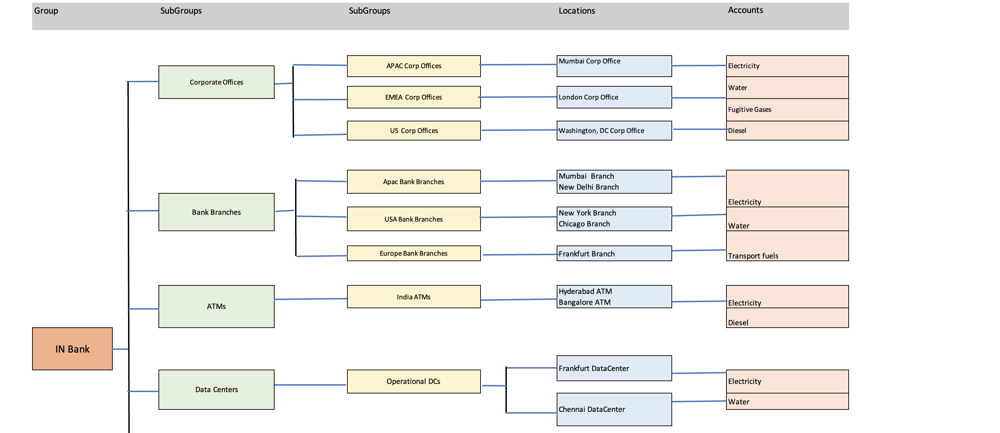
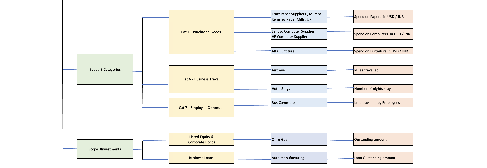

# Create Industry Specific Organization Hierarchy

In this lab exercise we will create Industry Specific organization hierarchy in an excel file to understand how normally the organization hierarchy looks for the different Industry.

## 1. Download the Template

1. Download the sample Organization Hierarchy `Org-Hierarchy-IN-Bank.xlsx` from [here](./files/Org-Hierarchy-IN-Bank.xlsx) or from the shared Box folder.

## 2. Understand the template

The content of the template looks like the following. This is an organization hiearchy of Bank.
    
    

## 3. Populate Template with Organization Hierarchy Data

You can create a similar Org Hiearchy in the excel template for any of the industry you think of like Manufacturing, Oil & Gas and etc.

#### Note: 
The created Hiearchy will be used in the next lab [Create Groups/Locations/Accounts and load data in Envizi using UI](../111-1-using-ui-to-create-groups-location-accounts-and-data)
