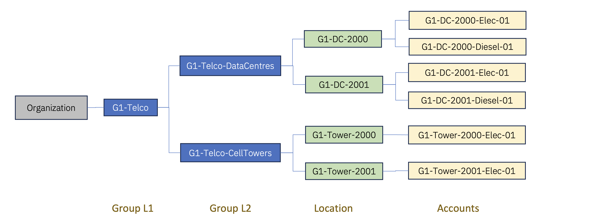

# Create Groups/Locations/Accounts and load data in Envizi using UI

In this lab exercise we will create Groups/Locations/Accounts and loading data in Envizi using UI.

You can go for any of the below options.

## Option 1

We will use the below Telco sample to create Org Hierarchy.

The resultant Hierarchy in Envizi would be like this.

## Option 2

We can use the Org Hierarchy that you created in the previous lab [ Create Industry Specific Organization Hierarchy](../110-Create-Industry-Specific-Org-Hierarchy)

## Lab

#### Pre-Requisite

1. Get your `Prefix-Id` from your Instructor. This id to be prefixed in all your data to avoid duplicate records. Your `Prefix-Id` could be in the format `MU11`, `MU12` ...

| S.No  | Topic             | Link                                               |
|-------|-------------------|-------------------------------------------------   |
| 1     | Create Groups     | [Link](../111-2-using-ui-create-groups)              |
| 2     | Create Locations  | [Link](../111-3-using-ui-create-location)            |
| 3     | Create Accounts   | [Link](../111-4-using-ui-create-accounts)            |
| 4     | Capture Data      | [Link](../111-5-using-ui-capture-data-in-accounts)   |