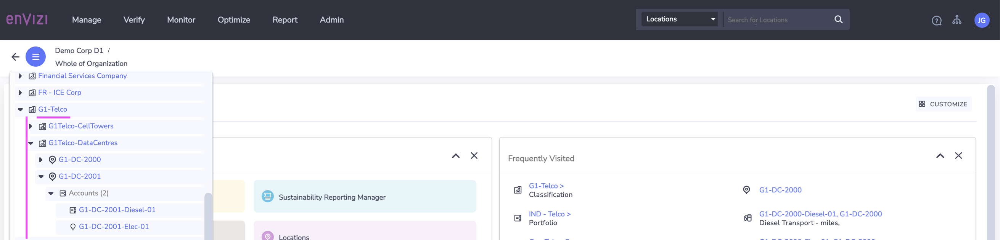
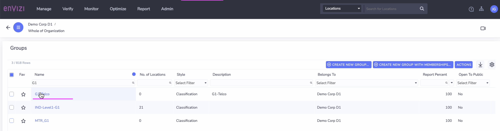

# Create Groups in Envizi using UI

In this lab exercise we will create Groups in Envizi using UI.

#### Pre-Requisite

1. Get your `Prefix-Id` from your Instructor. This id to be prefixed in all your data to avoid duplicate records. Your `Prefix-Id` could be in the format `MU11`, `MU12`.

#### Objective

The Objective is to create the following group and sub groups Or you can use the organization hierarchy you created in your previous lab [ Create Industry Specific Organization Hierarchy](../110-Create-Industry-Specific-Org-Hierarchy).
- G1-Telco
- G1Telco-CellTowers
- G1Telco-DataCentres

**Note :** Please note that in all the steps below, replace `G1` with your `Prefix-Id`.

## 1 Create Group

1. Click on `Manage > Groups` 

It shows the Groups page.

2. Click on `Create New Group` button.

3. Fill in the details as below. 

- Group Type :  `Classification`
- Belongs To : The Org name of the account. Here it is `Demo Corp D1`. You should use the Organization name you obtained as a prerequisite.
- Name :  Give any name for the Group. Ex: `G1-Telco`
- Report Percent :  100

4. Click on `Save` button.

A new Group called `G1-Telco` got created.

## 2 Create Sub Group 1

Here are we are going to create a new SubGroup called `G1-Telco-CellTowers` under the group `G1-Telco`

1. Fill in the details as below. 

- Group Type :  `Classification`
- Belongs To : The Org name of the account. Here it is `Demo Corp D1`. You should use the Organization name you obtained as a prerequisite.
- Part Of :  `G1-Telco` (the parent group)
- Name :  Give any name for the Group. Ex: `G1-Telco-CellTowers`
- Report Percent :  100

2. Click on `Save` button.

A new Sub Group called `G1-Telco-CellTowers` got created.

## 3 Create Sub Group 2

Here are we are going to create a new SubGroup called `G1-Telco-DataCentres` under the group `G1-Telco`

1. Fill in the details as below. 

- Part Of :  `G1-Telco` (the parent group)
- Name :  Give any name for the Group. Ex: `G1-Telco-DataCentres`
- Belongs To : The Org name of the account. Here it is `Demo Corp D1`. You should use the Organization name you obtained as a prerequisite.

A new Sub Group called `G1-Telco-DataCentres` got created.

