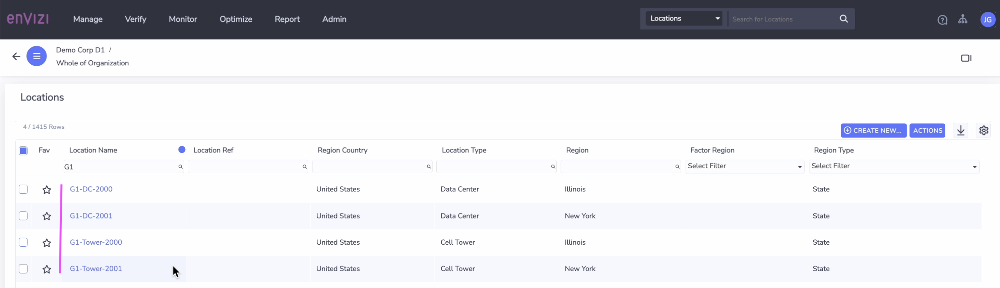

# Create Locations in Envizi using UI

In this lab exercise we will create Locations in Envizi using UI.

#### Pre-Requisite

1. Get your `Prefix-Id` from your Instructor. This id to be prefixed in all your data to avoid duplicate records. Your `Prefix-Id` could be in the format `MU11`, `MU12`.
2. Get the `Organization` name from Instructor.

#### Objective

The Objective is to create the following locations Or you can use the organization hierarchy you created in your previous lab [ Create Industry Specific Organization Hierarchy](../110-Create-Industry-Specific-Org-Hierarchy).
- G1-Tower-2000
- G1-Tower-2001
- G1-DC-2000
- G1-DC-2001

**Note :** Please note that in all the steps below, replace `G1` with your `Prefix-Id`.

### 1. Create Location 1

1. Click on `Manage > Locations` 

It shows the Locations page.

2. Click on `Create New Location` button.

3. Fill in the details as below. 

- Location Type :  `Cell Tower`
- Name :  Give any name for the Location. Ex: `G1-Tower-2000`
- Country :  `United States`
- Region :  `illinois : state United States`
- Group :  Choose the sub group created before. Ex:  `G1-Telco-CellTowers`

4. Click on `Save` button.

A new Location called `G1-Towers-2000` got created.

### 2 Create Location 2

Similarly create a new location called `G1-Tower-2001` under the group  `G1-Telco-CellTowers`

### 2.3 Create Location 3

Similarly create a new location called `G1-DC-2000` under the group  `G1-Telco-DataCenters`

### 3 Create Location 4

Similarly create a new location called `G1-DC-2001` under the group  `G1-Telco-DataCenters`

### 4 Location List

All the above crated Locations got listed here.

