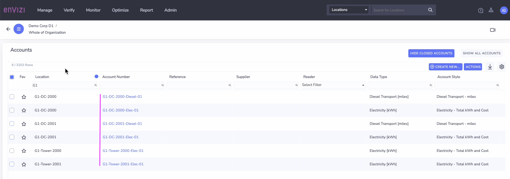

# Create Accounts in Envizi using UI

In this lab exercise we will create Accounts in Envizi using UI.

#### Pre-Requisite

1. Get your `Prefix-Id` from your Instructor. This id to be prefixed in all your data to avoid duplicate records. Your `Prefix-Id` could be in the format `MU11`, `MU12`.
2. Get the `Organization` name from Instructor.

#### Objective

The Objective is to create the following Accounts  Or you can use the organization hierarchy you created in your previous lab [ Create Industry Specific Organization Hierarchy](../110-Create-Industry-Specific-Org-Hierarchy).

**Note :** Please note that in all the steps below, replace `G1` with your `Prefix-Id`.

<table>
<tr>
<th>Location</th>
<th>Account Name</th>
<th>Account Style</th>
</tr>
<tr>
<td>G1-Tower-2000</td>
<td>G1-Tower-2000-Elec-01</td>
<td>Electricity - kWh  (Electricity - Total kWh and Cost)</td>
</tr>
<tr>
<td>G1-Tower-2001</td>
<td>G1-Tower-2001-Elec-01</td>
<td>Electricity - kWh  (Electricity - Total kWh and Cost)</td>
</tr>
<tr>
<td>G1-DC-2000</td>
<td>G1-DC-2000-Elec-01</td>
<td>Electricity - kWh  (Electricity - Total kWh and Cost)</td>
</tr>
<tr>
<td>G1-DC-2001</td>
<td>G1-DC-2001-Elec-01</td>
<td>Electricity - kWh  (Electricity - Total kWh and Cost)</td>
</tr>
<tr>
<td>G1-DC-2000</td>
<td>G1-DC-2000-Diesel-01</td>
<td>Transport Diesel - L  (Diesel Transport - miles)</td>
</tr>
<tr>
<td>G1-DC-2001</td>
<td>G1-DC-2001-Diesel-01</td>
<td>Transport Diesel - L   (Diesel Transport - miles)</td>
</tr>
</table>

## 1. Create Account

### 1.1. Create Account 1

1. Click on `Manage > Account` 

It shows the Account page.

2. Click on `Create New Account` button.

3. Fill in the details as below. 

- Location : Choose the above created location. Ex: `G1-Tower-2000`
- Account Style :  Choose an electricy type : `Electricity - Total kWh and Cost`
- Name :  Give any name for the Group. Ex: `G1-Tower-2000-Elec-01`

4. Click on `Save` button.

A new Account called `Electricity - Total kWh and Cost` got created under the location `G1-Tower-2000`

The newly created account looks like this in the Org Hiearchy section

### 1.2 Create Account 2

1. Fill in the details as below. 

- Location : Choose the above created location. Ex: `G1-Tower-2001`
- Account Style :  Choose an electricy type : `Electricity - Total kWh and Cost`
- Name :  Give any name for the Group. Ex: `G1-Tower-2001-Elec-01`

2. Click on `Save` button.

### 1.3 Create Account 3

1. Fill in the details as below. 

- Location : Choose the above created location. Ex: `G1-DC-2000`
- Account Style :  Choose an electricy type : `Electricity - Total kWh and Cost`
- Name :  Give any name for the Group. Ex: `G1-DC-2000-Elec-01`

2. Click on `Save` button.

### 1.4 Create Account 4

1. Fill in the details as below. 

- Location : Choose the above created location. Ex: `G1-DC-2001`
- Account Style :  Choose an electricy type : `Electricity - Total kWh and Cost`
- Name :  Give any name for the Group. Ex: `G1-DC-2001-Elec-01`

2. Click on `Save` button.

### 1.5 Create Account 5

1. Fill in the details as below. 

- Location : Choose the above created location. Ex: `G1-DC-2000`
- Account Style :  Choose an electricy type : `Diesel Transport - miles`
- Name :  Give any name for the Group. Ex: `G1-DC-2000-Diesel-01`

2. Click on `Save` button.

### 1.6 Create Account 6

1. Fill in the details as below. 

- Location : Choose the above created location. Ex: `G1-DC-2001`
- Account Style :  Choose an electricy type : `Diesel Transport - miles`
- Name :  Give any name for the Group. Ex: `G1-DC-2001-Diesel-01`

2. Click on `Save` button.

## 2. Account List

All the above created Accounts got listed here..

## 3. Org Hiearchy 

Here is the Org hiearchy showing the above created accounts under the corresponding locations.

## 4. Group Summary Before loading Data

Here is the group summary of the above created group `G1-Telco`. before loading the data.

## 5. Location Details

Here is the location details of the above created location `G1-DC-2000` that shows emissions data as empty. 

