# Load Data into Accounts in Envizi using UI

In this lab exercise we will be capturing/loading data into Accounts in Envizi using UI.

We have already created the below accounts and going to capture the data in these accounts.  Or you can use the organization hierarchy you created in your previous lab [ Create Industry Specific Organization Hierarchy](../110-Create-Industry-Specific-Org-Hierarchy).

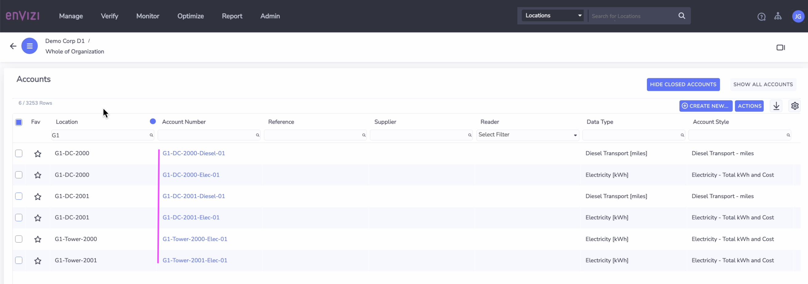

## 1. Loading Data into Account 1

### 1.1 Capture Data

1. Select the account from the left panel. 

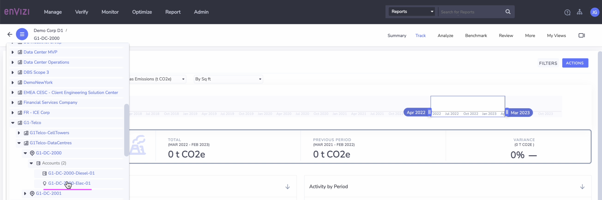

Account summary get displayed as below.

2. Click on `Track > Records` 

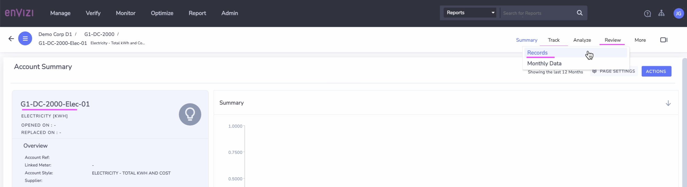

3. Click on `Capture > Data` 

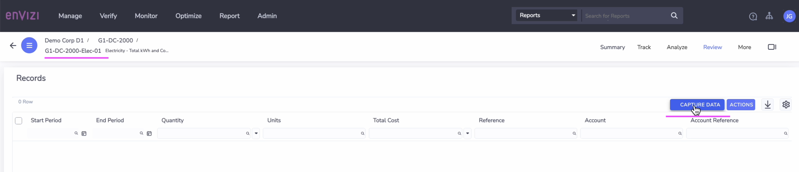

4. Fill in the details as below. 
- Start Period : Enter the starting period of the data  (01-Jul-2013)
- End Period : Enter the ending period of the data      (31-Dec-2013)
- Total Electricity :  Enter the total electricity
- Total Cost :  Enter the total cost

The total value would split across each month available in between the given period.

5. Click on `Save` button.

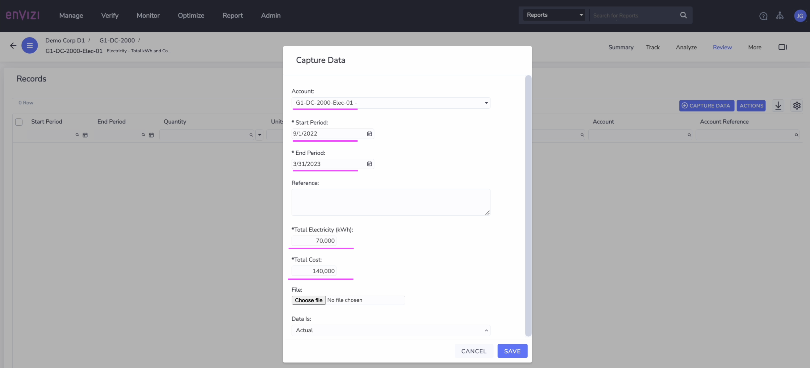

The record saved successfuly as below.

6. Click on `Monthly Data` button.

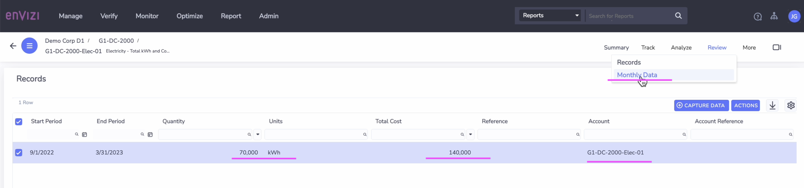

The total value split across each month is shown here.

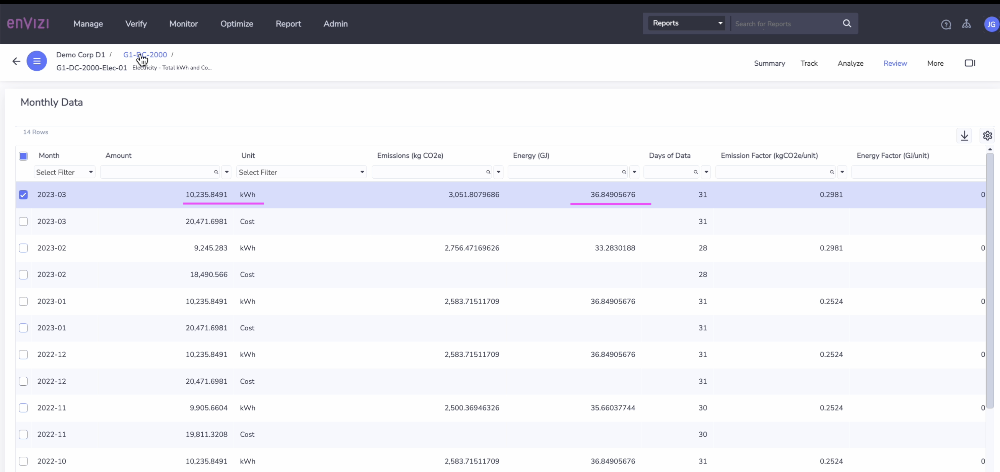
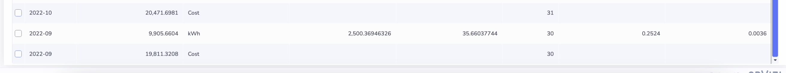

### 1.2. View Location Performance

1. Open the location `G1-DC-2000` from the Org Hierarchy.

2. Click on the `Performance` menu.

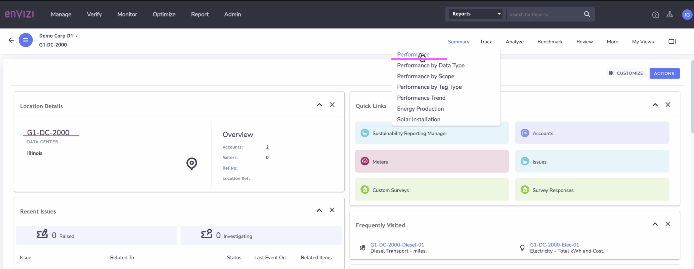

The location performance details is displayed.
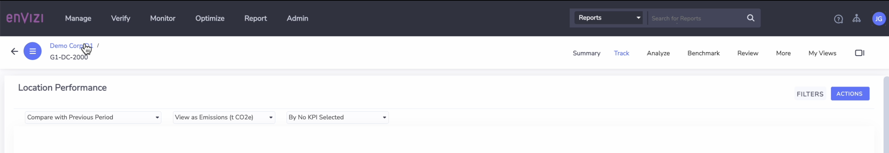
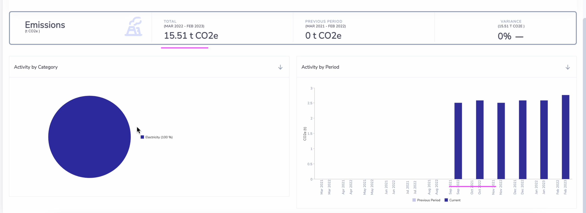

## 1.3. View Account Summary

1. Open the Account `G1-DC-2000-Elec-01` from the Org Hierarchy.

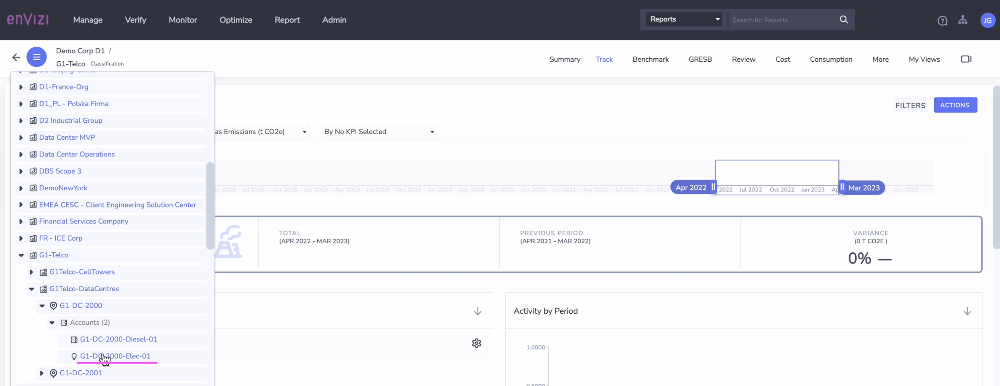

The `Account Summary` page is displayed.

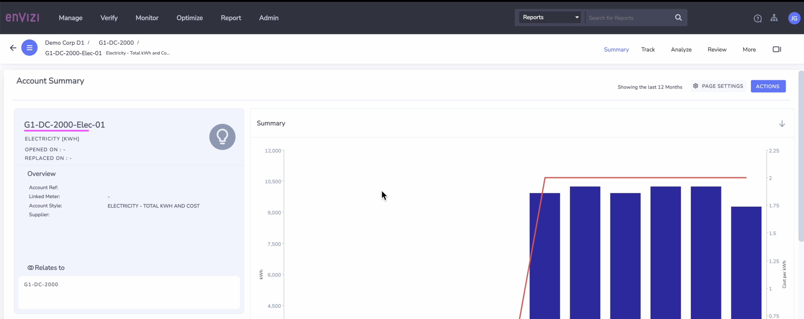
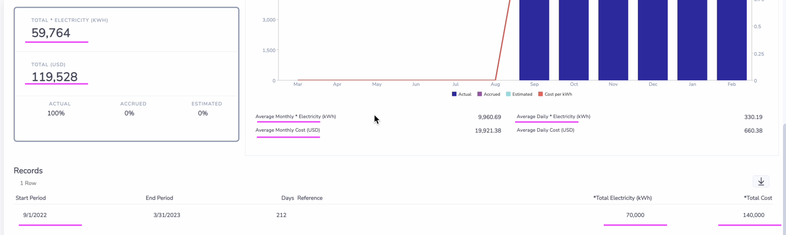

## 2. Loading Data into Account 2

1. Open the Account from the Org Hierarchy.

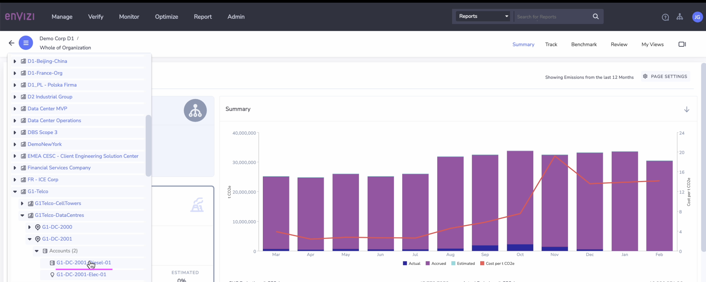

2. Click on the `Actions > Capture Data` menu.

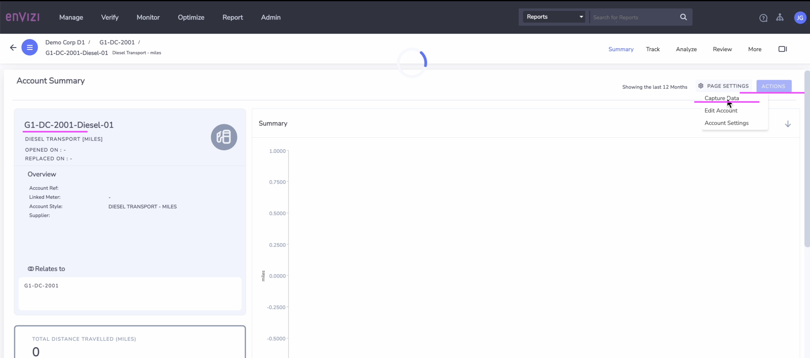

3. Fill in the details as below. 
- Start Period : Enter the starting period of the data
- End Period : Enter the ending period of the data
- Distance Travelled :  Enter the distance travelled
- Total Cost :  Enter the total cost

4. Click on `Save` button.

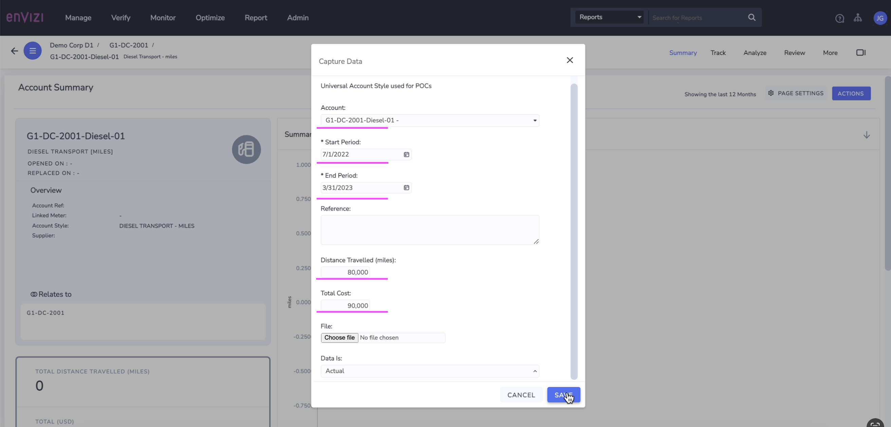

The data is saved and here is the `Account Summary` details.

5. Click on `Records` button.

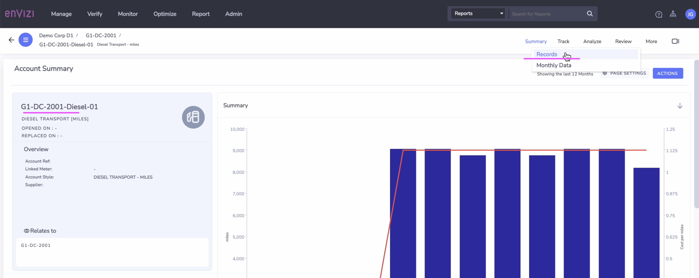
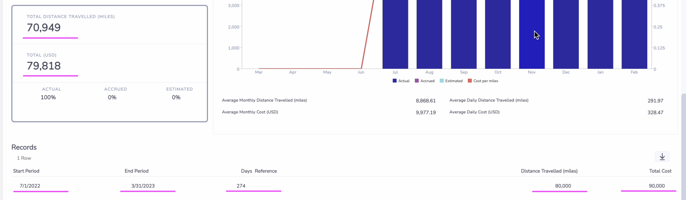

The `Records` list is displayed.
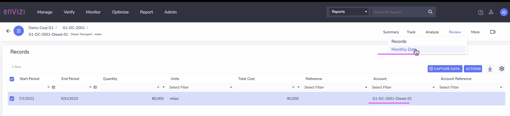

6. Click on `Monthly Data` button.

The `Monthly Data` list is displayed.

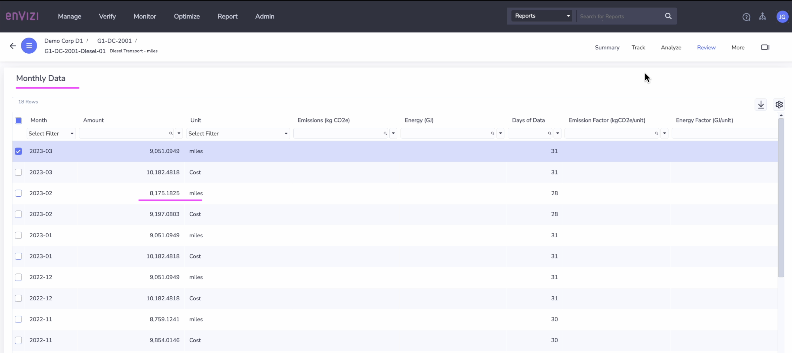
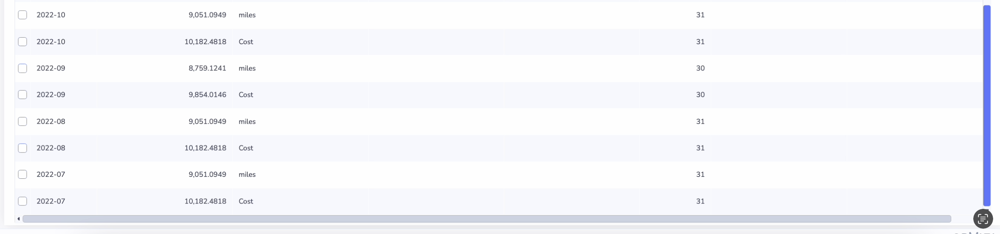

## 3. Loading Data into Account 3

1. Open the Account from the Org Hierarchy.

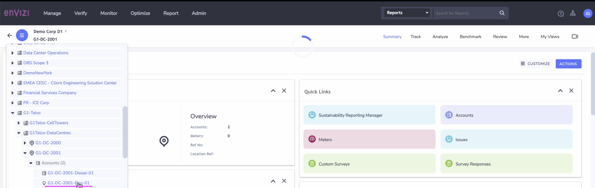

2. Click on the `Actions > Capture Data` menu.

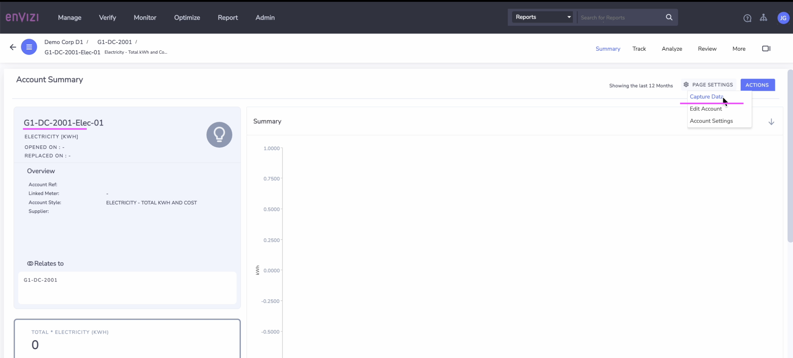

3. Fill in the details as below. 
- Start Period : Enter the starting period of the data
- End Period : Enter the ending period of the data
- Total Electricity :  Enter the total electricity value
- Total Cost :  Enter the total cost

4. Click on `Save` button.

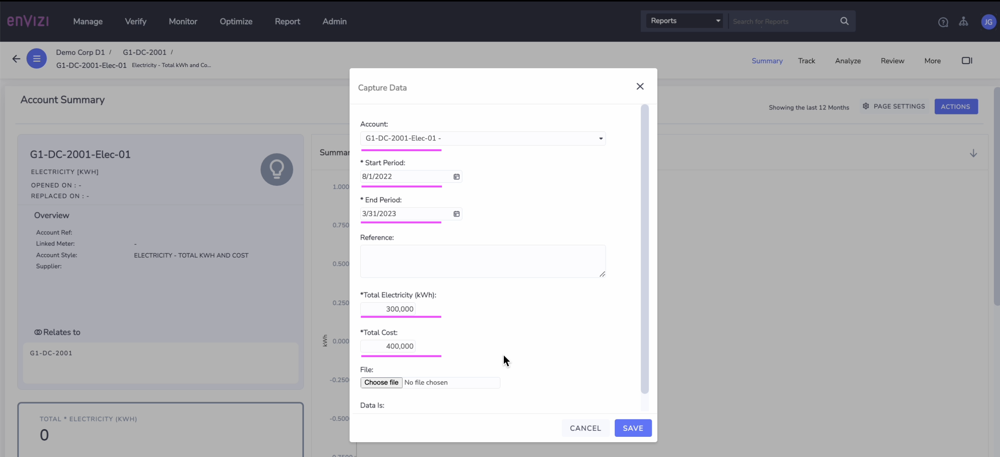

The data is saved and here is the `Account Summary` details.

5. Click on `Records` button.

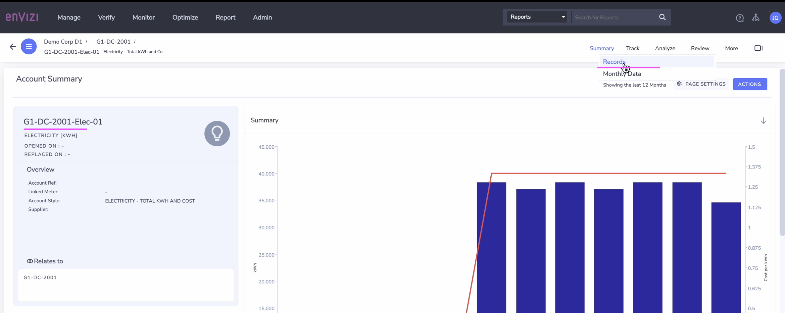
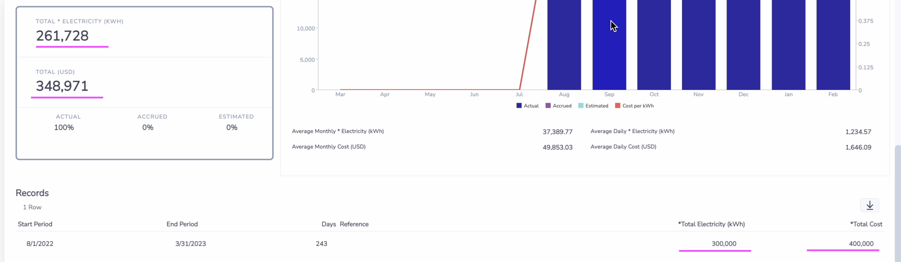

The `Records` list is displayed.

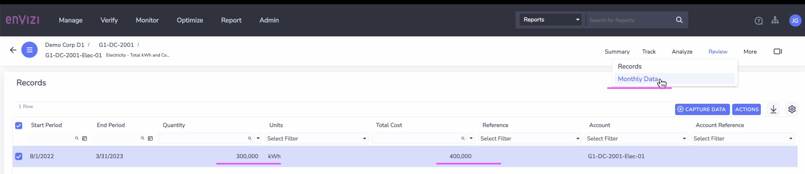

6. Click on `Monthly Data` button.

The `Monthly Data` list is displayed.

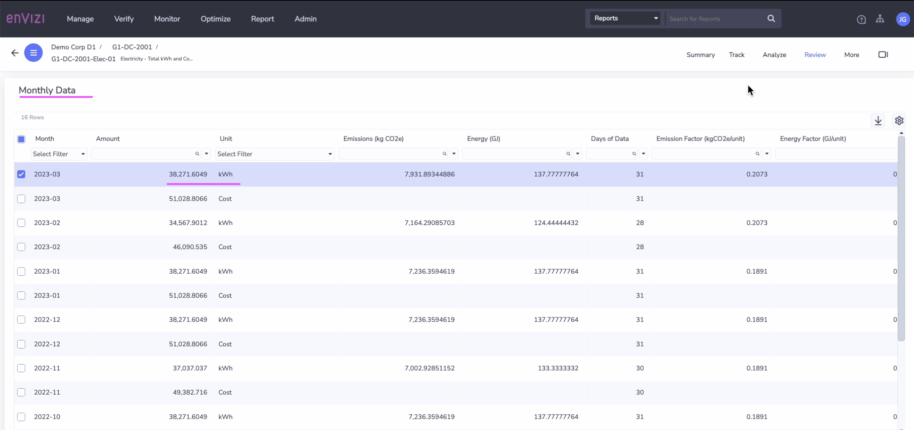
