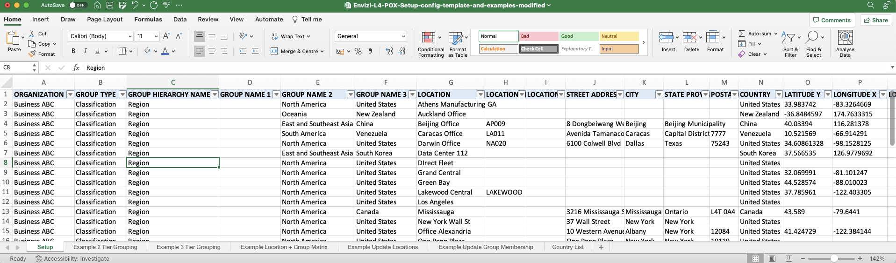
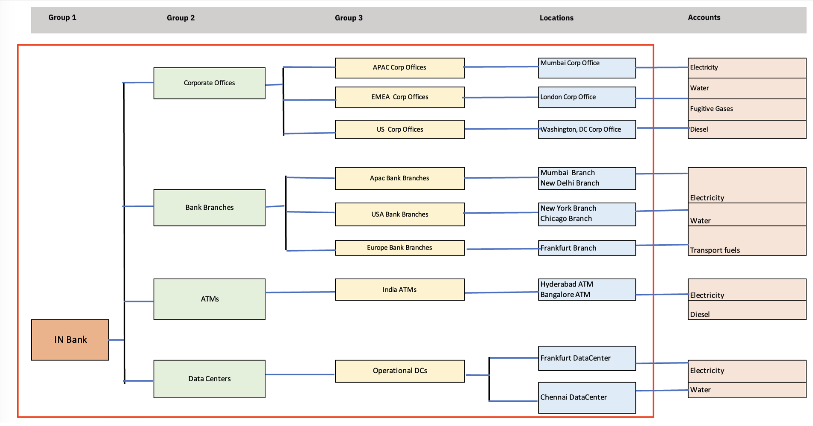
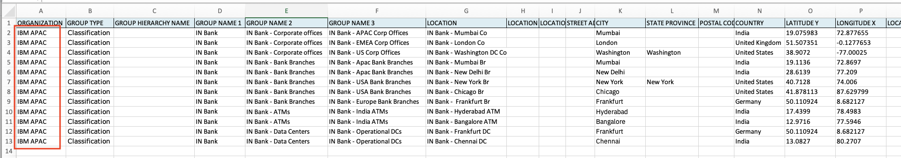
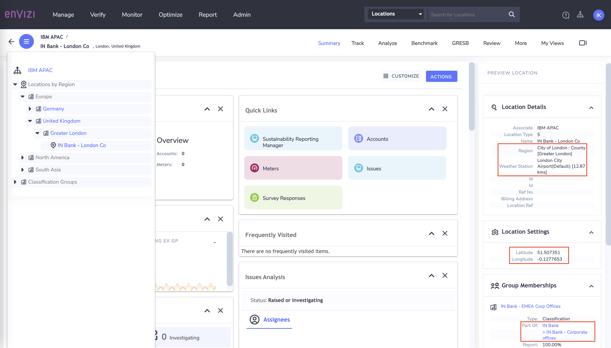
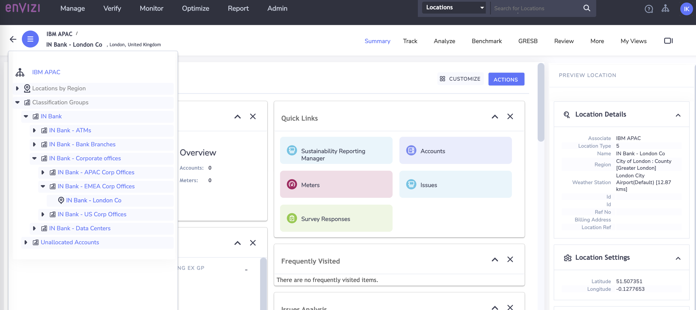

# Create Organization Hierarchy using Config Connector

In this lab exercise we will create a organization hierarchy in Envizi for a given organization using Envizi Config Connector.

#### Pre-Requisite

1. Get your `Prefix-Id` from your Instructor. This id to be prefixed in all your data to avoid duplicate records. Your `Prefix-Id` could be in the format `MU11`, `MU12`.
2. Get the `Organization` name from Instructor.

#### About Config Connector
The Config Connector enables performing the following operations via an Excel template.

- Create grouping structure (up to 3 levels)
- Create and update locations
- Assign Locations to multiple group structures
- Move locations between existing groups

This document explains about how to perform all those operations.

#### Key steps

Here are the key steps in this process:
1. Download the Envizi excel template called `Setup config`
2. Update the template according to the provided organizational hierarchy.
3. Upload the template file into Envizi to create the hierarchy in Envizi.

## 1. Download the Template

1. Download the config connector excel template `Envizi-L4-POX-Setup-config-template-and-examples-modified.XLSX` from [here](./files/Envizi-L4-POX-Setup-config-template-and-examples-modified.XLSX) or from the shared Box folder. 

**Note:** This template is the modified version of the template  [Envizi L4 POX - Setup config template + examples.XLSX](https://ibm.seismic.com/Link/Content/DCT9JP7FQMfq2GTGFQGRfc4cbpJB) available in `Seismic`.

## 2. Understand the template

The content of the template looks like the following.

1. Go through the template and understand the various information given in each sheet. 

- Setup : Actual data that gets processed by Envizi.
- Example 2 Tier Grouping : To understand about 2 tier grouping.
- Example 3 Tier Grouping : To understand about 3 tier grouping.
- Example Location + Group Matrix : To understand about Unique Locations
- Example Update Locations : To understand about Update Locations
- Example Update Group Membership : To understand about Group Membership using Group Hierarchy Name

## 3. Populate Template with Organization Hierarchy Data

Now, Lets Populate the template with the below organization hierarchy data.
    

1. Take a copy of the template `Envizi-L4-POX-Setup-config-template-and-examples-modified.XLSX` 
2. Rename the file in the format `Envizi_SetupConfig_xxxxx.xlsx`. Here xxxxx could be anything. You can replace it with your `Prefix-Id`.
3. Following the organization hierarchy above, go to to the `Setup` sheet and add records. Fill in values for the columns listed here.
   - **Organization** : Enter the `Organization` name obtained as a prerequisite.
   - **Group Type** : Enter the value `classification`
   - **Group Name1, Group Name2, Group Name3** :  Enter group names as per the organization hierarchy
   - **Location** : Enter location as per the organization hierarchy
   - **City, State Province, Country** : Enter information based on the Location column.
   - **Latittued Y, Longitued X** : Enter information based on the Location column. Could be dummy too.

**Note:** 

City, Country, Latittuted and Longitued will be assigned to Location to identify the Geography/Region. Location (Geography/region, etc) is one of the criteria when deriving the appropriate emission factors for the given data type, hence providing accurate location details / location co-ordinators is important.

4. Verify that the content of your file appears as shown below.

#### Important
To stay aligned with the subsequent labs, we recommend using the Prepopulated template file discussed in the following section for the upcoming steps.

## 4 Preparing the Prepopulated Template

Lets download the Prepopulated Template file and do the required changes.

1. Download the Prepopulated Template data file `Envizi_SetupConfig_1_INBank.xlsx` from [here](./files/Org-Hierarchy-IN-Bank.xlsx) or from the shared Box folder. 
2. The file name format should be `SetupConfig_xxxxx.xlsx`. Replace xxxx with your preferred text. But it is better to use your `Prefix-Id`.
3. Replace the `ORGANIZATION` column values with Organization name you obtained as a prerequisite.
4. To prevent naming conflicts, add prefix `Prefix-Id` for `GROUP NAME 1`, `GROUP NAME 2`,	`GROUP NAME 3` and `LOCATION` columns. For example, transform `IN Bank - Data Centers` to `A12-IN Bank - Data Centers`.

The Prepopulated Template file is ready for upload now.

## 5 Upload the template file into Envizi

Lets us upload the above updated template file into Envizi for to create Organization Hierarchy.

### 5.1 Upload the file

1. Navigate to Envizi UI. 

2. Click on `Manage > Upload files` to upload the file.

4. Click on `Create New uploads` .
5. Upload the file. Click on `Save` .

File is uploaded

### 5.2 Verify Upload Status

1. Navigate to `Manage > Files Processed - Accounts & Setup` 

2. View  the status of the file.  If its is in `Loading` status , wait for few seconds and refresh browser. 

3. You should see the file status changed to `Loaded` 

4. Observe  `Records In ` and `Records Out` fields on the same page. Although you have 12 data rows in the file, Envizi will process the file for each column with respect to groups, location related parameters and create each of them in the system.  Hence we will notice `Records Out` as different than `Records In`

Note: If the file doesn't appear in the Files Processed page, then please review the file - check tab name (Setup), organization name, etc.

## 6 View the Organization Hierarchy created

Lets navigate to Envizi to view the locations and groups created as per our Organization Hierarchy 

### 6.1 Verify Location 
1. Click on `Show Organization Hierarchy` on left side of the Envizi UI and expand `Location by Region`

2. Click on the specific location in the Organization Hierarchy.
3. Right side Click on `Show / Hide Preview Panel` . 
4. Expand `Location Details` and check whether weather Station and Region are auto assigned
5. Expand `Location Settings` and check whether Latitude and Longitude are updated 
6. Expand `Group Membership` and check whether Location is added to the group as we have defined in our config template. 

### 6.2 Verify Groups

Lets look into the Group Hierarchy.

1. Click on `Show Organization Hierarchy` on left side of the Envizi UI 
2. Expand the `Classification Groups`
3. Drill down on a group to view the sub groups and the locations attached. 

## 7 Next steps

In this lab, you have learned how to use config connector to create an  Organization Hierarchy with the relevant groups and associated locations. 

In the next lab, you will learn how to capture different types of data for these locations. 