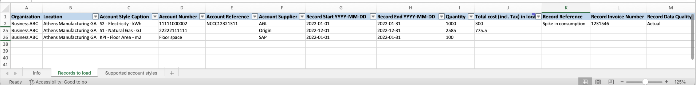
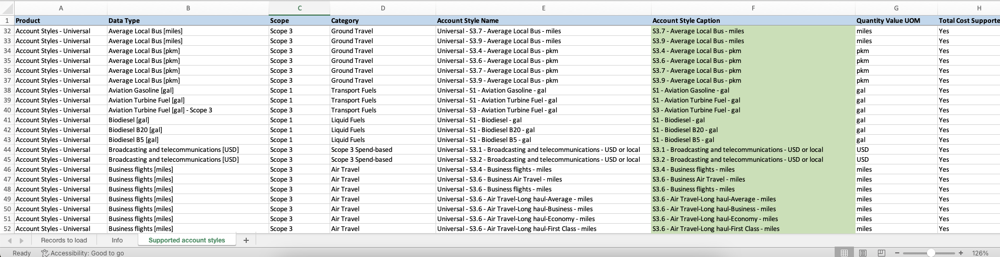
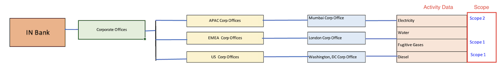
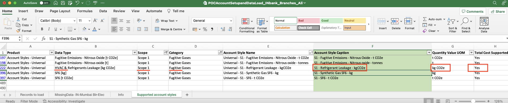
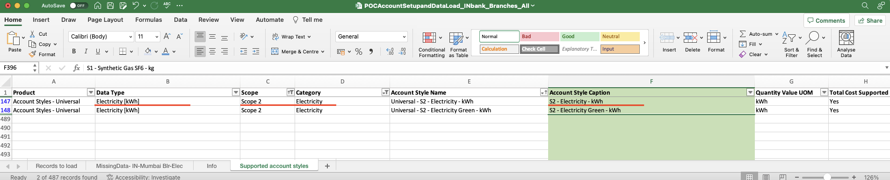
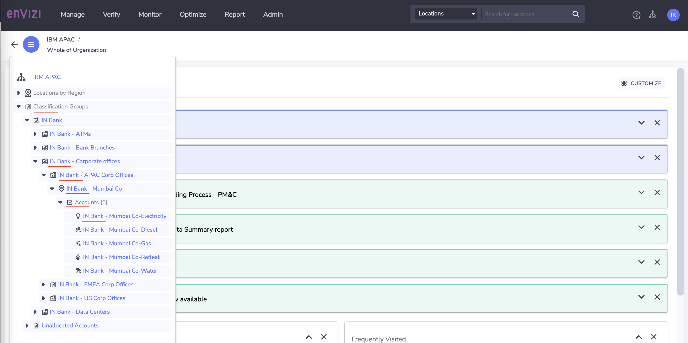
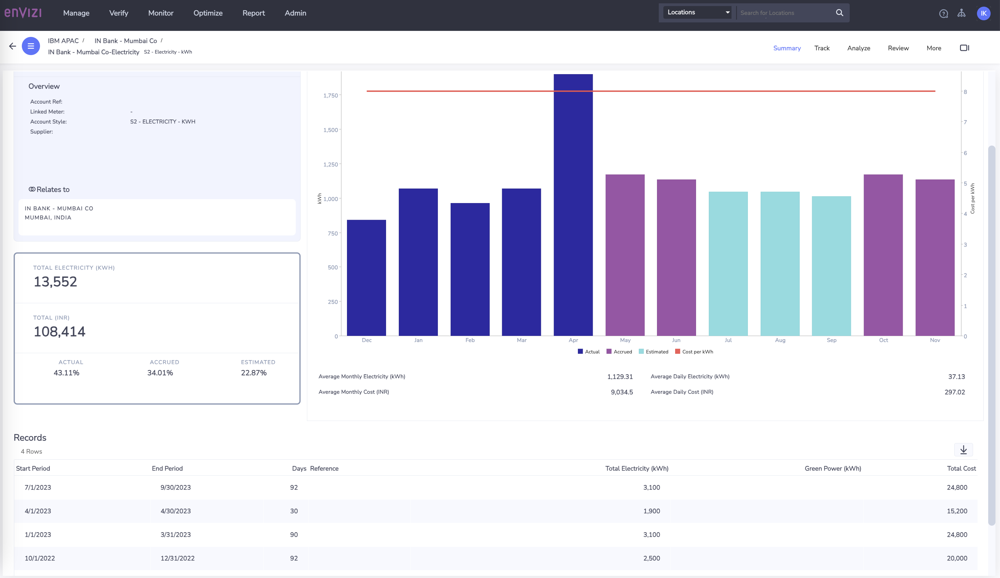
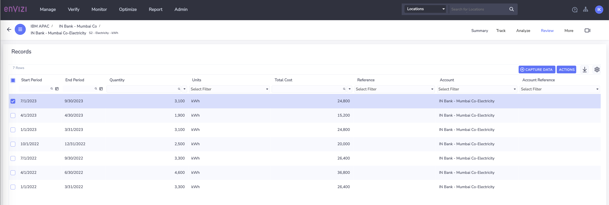
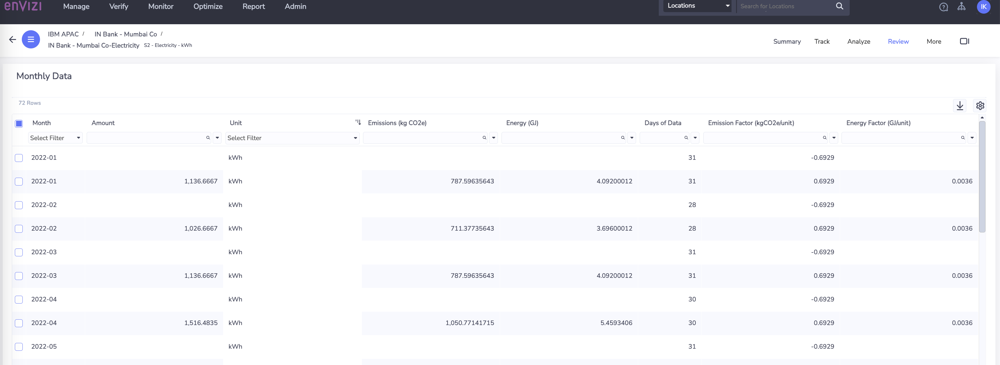

# Load data using Universal Data Connector (UDC)

In this lab exercise we will `capture the data` of various data types related to `Scope 1, Scope 2 and others` using the Universal Data Connector.

Refer to the organization hierarchy defined in our previous labs. As part of defining the hierarchy, we also need to identify the relevant data to capture from each location. For instance, `capturing electricity, water and gas` from the locations of bank corporate offices and branches.

#### Pre-Requisite

1. Get your `Prefix-Id` from your Instructor. This id to be prefixed in all your data to avoid duplicate records. Your `Prefix-Id` could be in the format `MU11`, `MU12`.
2. Get the `Organization` name from Instructor.

#### About Universal Data Connector

An Envizi Universal Data Connector is a built in program which process the uploaded data files, validates (name, extension and column headings) , process each row , extract the relevant fields from the row and store it as record.

The Universal  Data Connector requires the input data available in the certain format via spreadsheet-based approach. The template for this input format is provided through reporting templates - `Universal Account Setup and Data Loading` reports, which can also be downloaded from Envizi UI. For more information on this templates you can refer [Envizi knowledgebase](https://knowledgebase.envizi.com/home/universal-account-setup-and-data-loading)

#### Key steps

Here are the key steps in this process:

- Download the Envizi excel template called Universal Data Connector template
- Update the template and prepare with data to load
- Upload the template file into Envizi to load data into  Envizi Accounts

## 1. Download the Template

1. Download the `Universal Data Connector` (UDC) template `Envizi-L4-POX-POC-account-setup-and-data-load-template_17_11_23.xlsx` from [here](./files/Envizi-L4-POX-POC-account-setup-and-data-load-template_17_11_23.xlsx) or from the shared Box folder .

## 2. Understand the template

Let us understand about this template.

If you want to prepare the template with your own data then only this section is required. Otherwise directly you can skip this and go to next section.

### 2.1 The template

1. The content of the template looks like the following. 

2. The sheet `Records to load` is the one to fill with data which has 13 columns.

3. Here are the list of columns available in the template.

##### Mandatory Columns
- Organization	- Enter the `Organization` name obtained as a prerequisite.
- Location	- Location from which the data being captured.
- Account Style Caption	-  Type of the data to be captured. Refer to the next section  `Choose Account Style Caption`. 
- Account Number - (alphanumeric) - Provide any name. Account is where the activity data is recorded. 
- Record Start YYYY-MM-DD - Should be in the format of YYYY-MM-DD.
- Record End YYYY-MM-DD	 -  Should be in the format of YYYY-MM-DD.
- Quantity	- Quantity of activity data. Units of the Quantity is depends on the `Account Style Caption`.

##### Optional Columns
- Account Reference	- Provide if the account already exists.
- Account Supplier	- Provide supplier name of the data being capture
- Total cost (incl. Tax) in local currency	- Refer to  `Supported account styles` 
- Record Reference	  Provide if the record  already exists. 
- Record Invoice Number	Invoice number of the purchase of the activity data 
- Record Data Quality - Provide the data being loaded is actual data or estimated data. Values: `Actual` or `Estimated`. 

### 2.2 How to Choose Account Style Caption

To derive correct emission factor for the activity data in Envizi, it is very important to choose an appropriate Account Style for an account. To do that, we need to know what are the available account styles in the system and then choose the correct one. 

The Account Styles are available in the `Supported account styles` sheet of the template. 

Next step, is to pick the right account style.  

Let's  start with our bank example as shown below. Here, each Corporate  office location captures the activity data such as - `Electricity, Water, Fugitive Gases and  Diesel`

#### Example 1 - Pick an Account Style for `Fugitive Gases`

Let’s find out the account style for an activity data - `Fugitive Gases`

In our example, Fugitive gases captured are Leakages from `HVAC & Refrigerant systems` under `Scope 1` category.

1. Navigate to `Supported account styles` sheet
2. Apply below filters in the sheet
    - Scope - `Scope 1`
    - Category - `Fugitive Gases`

3.  Selecting the appropriate account style record.
    - Select the records where the `Datatype` column contains the value `HVAC & Refrigerants Leakages`
    - If more than one record found then pick the Account style associated with correct `Units of Measure`. Here it is `S1 - Refrigerant Leakage - kgCO2e`

4.  Enter the selected account style value in `column C` (Account Style Caption) of the `Records to load` sheet.

5.  If the `Total Cost Supported` column value is Yes, then you can enter the cost corresponding to activity data in `column J` of `Records to load` sheet.

#### Example 2 - Pick an Account Style for `Electricity`

Let’s find out the account style for an activity data - `Electricity`

In our bank example, the bank is `purchasing electricity` for their own operations and hence it comes under `Scope 2`.

1. Navigate to `Supported account styles` sheet
2. Apply below filters in the sheet
    - Scope - `Scope 2`
    - Category - `Electricity`

3.  Selecting the appropriate account style record.
    - Select the records where the `Datatype` column contains the value `Electricity`

4.  Enter the selected account style value in `column C` (Account Style Caption) of the `Records to load` sheet.

5.  If the `Total Cost Supported` column value is Yes, then you can enter the cost corresponding to activity data in `column J` of `Records to load` sheet.

## 3. Populate Template with activity Data

Now, Let's populate the template with data for all the locations we created in the previous lab.

1. Take a copy of the template `Envizi-L4-POX-POC-account-setup-and-data-load-template_17_11_23.xlsx` 
2. Rename the file in the format `POCAccountSetupandDataLoad_xxxxx.xlsx`. Here xxxxx could be anything. You can replace it with your `Prefix-Id`.
3. Following the organization hierarchy above, go to to the `Records to load` sheet and add records. Fill in values for the columns listed here.
   - **Organization** : Enter the `Organization` name obtained as a prerequisite.
   - **Location** : Refer Lab1 organization hierarchy template loaded
   - **Account Style Caption** :  Enter Account style caption as we know how to retrieve account style.
   - **Account Number** : Provide unique account name. Account is where the activity data is recorded. 
   - **Record Start YYYY-MM-DD** - Record Start YYYY-MM-DD	 -  Should be in the format of YYYY-MM-DD
   - **Record End YYYY-MM-DD** - Record End YYYY-MM-DD	 -  Should be in the format of YYYY-MM-DD
   - **Quantity** - Quantity of activity data. 
   - **Total cost (incl. Tax) in local currency** - Amount spend for the activity.

Once prepared, you can upload the files following instructions from Section 3. However we recommend you to load the sample files given in Sample data section which also covers other scenarios for subsequent labs.

#### Important

Once prepared, you can upload the files following instructions to upload. However
To stay aligned with the subsequent labs, we recommend using the Prepopulated template file discussed in the following section for the upcoming steps.

## 4 Preparing the Prepopulated Template

Lets download the Prepopulated Template files and do the required changes.

1. Download the Prepopulated Template data files 
`POCAccountSetupandDataLoad_INbank_Co_All.xlsx` and `POCAccountSetupandDataLoad_INbank_Branches_All.xlsx` from [here](./files/POCAccountSetupandDataLoad_INbank_Co_All.xlsx) and [here](./files/POCAccountSetupandDataLoad_INbank_Branches_All.xlsx) or from the shared Box folder.

2. Rename the files in the format `POCAccountSetupandDataLoad_xxxxx.xlsx` , here xxxxx could be anything just uniquely identify your file. You can replace it with your `Prefix-Id`.
3. Replace the `ORGANIZATION` column values with name of Organization configured in your Envizi instance
4. To prevent naming conflicts, replace the prefix `IN Bank` with your `Prefix-Id` in the `Location`, and `Account Number` columns. For example, transform `IN Bank - Mumbai Co-Diesel` to `A12-IN Bank - Mumbai Co-Diesel`.

The Prepopulated Template files are ready for upload now.

## 5 Upload the template file into Envizi

Lets upload the file to load data into  Envizi Accounts

1. Follow the steps given [here](../201-uploading-a-file) to upload the file into Envizi.
2. Repeat the steps for both the files related loading data related to locations for both IN Bank Corporate offices and Branches.

## 6. View the Accounts and Data in Envizi

Let us take a look at the data loaded into various accounts of our bank locations. 

1. In the Organization Hierarchy of Envizi UI, drill down to the account `IN Bank - Mumbai Co-Electricity`

Different types of accounts created each corresponding to activity data loaded `Electricity, Diesel, Gas, Refleak and Water`. 

 

2. The `Account Summary` page is displayed.

Account Summary page shows account details, last 12 months data of as bar chart,   associated account style, location and Total consumptions & cost , Records loaded in different wizards.

3. On Account Summary page, click on `Review -> Records`, to view the `actual / estimated data` loaded using spread-sheet to this account

4. Finally, navigate to  `Review -> Montly Data`, to view the `normalized data` on montly basis and the calcuated emissions for each monthly record.

   

Review all other accounts data as and when its loaded into the System. 

This completes the data loading exercise for Scope 1, 2 activity data identified for different locations in our banking examples.

## 7 Next steps
In this lab, you have learned how to capture the data into Envizi system using the Universal data connector and Universal Account Setup and Data load templates. Stay tuned to learn more on how to capture scope 3 data, get insights using dashboards, what emission factors applied, etc in the subsequent lab exercises.