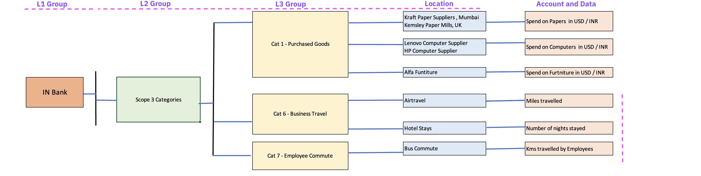

# Create Scope 3 Groups, Locations, Accounts and data using Config Connector and Universal Account Connector

In this lab exercise we will do the followings.

- Create groups and locations for Scope 3 Categories identified for our Bank example. 
- Capture the data using the Universal account connector (UDC). 

    

You have already learnt how to use Config connector and UDC in Lab 1 and Lab 2 respectively. 

## 1 Create Groups and Locations for Scope 3

Follow the lab content available [here](../122-2-Create-Scope3-hierarchy-using-ConfigConnector)

## 2 Create Accounts and Load Data for Scope 3

Follow the lab content available [here](../122-3-Create-Scope3-data-using-AccountConnector)

## Next steps

In this lab, you have learned how to create the groups and locations identified for Scope 3 Categories using Config connector and capture Scope 3 activity data into the accounts using the Universal account connector and Universal Account Setup. 

In this next exercises, we will learn how to use Envizi AI-Assit feature for Scope 3 Purchased goods, emission factors, data monitoring and etc.