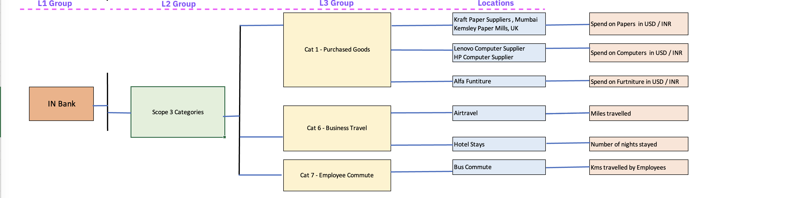
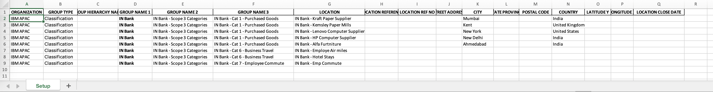
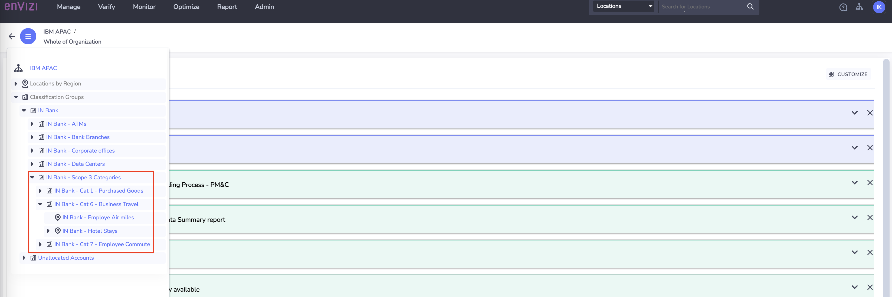

# Create Scope 3 Groups, Locations using Config Connector

In this lab exercise we will Create groups and locations for Scope 3 Categories identified for our Bank example. 

You have already learnt how to use Config connector in the previous lab. 

#### Pre-Requisite

1. Get your `Prefix-Id` from your Instructor. This id to be prefixed in all your data to avoid duplicate records. Your `Prefix-Id` could be in the format `MU11`, `MU12`.
2. Get the `Organization` name from Instructor.

#### Key steps

Here are the key steps in this process:

- Download the Envizi excel templates for Config Connector and UDC
- Create Organization Hierarchy for Scope 3
- Capture data into Scope 3 Accounts

# 1. Download the Template for Config Connector

1. Download the config connector excel template `Envizi-L4-POX-Setup-config-template-and-examples-modified.XLSX` from [here](./files/Envizi-L4-POX-Setup-config-template-and-examples-modified.XLSX) or from the shared Box folder. 

# 2. Create Organization Hierarchy using Config Connector for Scope 3 (Optional)

Now, Let's create the Scope 3 grouping structure as we have defined in our organization hierarchy. 
    

## 2.1. Populate Template with Organization Hierarchy for Scope 3 Grouping structure (Optional)

CLICK ME

You already familiar with the Config Connector as you have performed the lab exercise to create part of the Org hierarchy.

Let's Populate the template with the below organization hierarchy data.

1. Take a copy of the template `Envizi-L4-POX-Setup-config-template-and-examples-modified.XLSX` 
2. Rename the file as  `Envizi_SetupConfig_xxxxx.xlsx`. Here xxxxx could be anything. You can replace it with your `Prefix-Id`.
3. Following the organization hierarchy above, go to the `Setup` sheet and add records. Fill in values for the columns listed here.
   - **Organization** : Enter the `Organization` name configured in the Envizi instance.
   - **Group Type** : Enter the value `classification`
   - **Group Name1, Group Name2, Group Name3** :  Enter group names as per the organization hierarchy
   - **Location** : Enter name of the location to capture the data. 
   - **City, State Province, Country** : Enter information based on the Location column.

4. Verify that the content of your file appears as shown below.
    
    
#### Important
To stay aligned with the subsequent labs, we recommend using the Prepopulated template file discussed in the following section for the upcoming steps.

## 2.2 Preparing the Prepopulated Template

Let's download the Prepopulated Template file and do the required changes.

1. Download the Prepopulated Template data file `Envizi_SetupConfig_INbank-S3.xlsx` from [here](./files/Envizi_SetupConfig_INbank-S3.xlsx) or from the shared Box folder. 
2. The file name format should be `Envizi_SetupConfig_xxxxx.xlsx`. Replace xxxx with your preferred text. But it is better to use your `Prefix-Id`.
3. Replace the `ORGANIZATION` column values with Organization name you obtained as a prerequisite.
4. To prevent naming conflicts, replace the prefix `IN Bank` with your `Prefix-Id` in the `GROUP NAME 1`, `GROUP NAME 2`,	`GROUP NAME 3` and `LOCATION` columns. For example, transform `IN Bank - Data Centers` to `A12-IN Bank - Data Centers`.

The Prepopulated Template file is ready for upload now.

## 2.3 Upload the template file into Envizi

Lets us upload the above updated template file into Envizi for to create Organization Hierarchy.

1. Follow the steps given [here](../201-uploading-a-file) to upload the file into Envizi.

## 2.4 View the Scope 3 Groups in Envizi

Once verified that the files are uploaded and processed successfully without any errors, navigate to Envizi UI to view the newly created groups and locations for our Bank hierarchy

We have completed creating groups and locations using the Config Connector.  

Lets move on to next section to create accounts and load the data.
