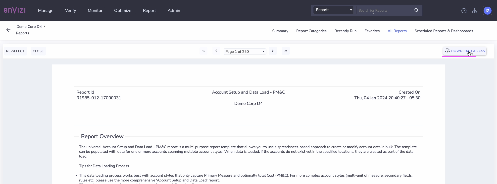

# Create Scope 3 Accounts and Load data using Universal Account Connector

In Our Bank example, we have identified 3 different Scope 3 Categories - `Business Travel, Employee Commute` and `Purchased Goods`.

In this exercise, we will capture the data for locations
- `IN Bank - Employe Air miles` :  Business Travel data
- `IN Bank - Emp Commute` : Employee Commute data

In the next exercise, you will learn how to use Envizi new AI Assist feature to load the data into accounts of `Purchased Goods`

In the previous exercise, we have already learnt how to use POC Template of Universal Account Connector which is provided to you which also comes with the Supported Universal Account Styles. You can very well use the same for this exercise also. 

However we will use a different template which aligns to the same PoC template,  which you can directly download from Envizi instance itself. Understanding this template will helps you in your client project implemenations where Envizi instance  especially account styles are configured to cater various project requirements.  In such cases, it is always a best practice and recommended approach to download the templates from Envizi instance directly along with the  supported account styles configured. 

Envizi provides two different templates to load data using Universal Account Connector. Read more [here](https://knowledgebase.envizi.com/home/universal-account-setup-and-data-loading)
- Universal Account Setup and Data Load PM&C :  Bulk loading supporting multiple account styles with data for only two columns (Primary measure and cost)
- Universal Account Setup and Data - Bulk loading for Single account style with all the supported fileds including secondary fields

As we only have the quantity and cost fileds to capture for our 2 different Scope 3 datatypes, we will leverage template - `Universal Account Setup and Data Load PM&C`in this lab exercise.

## 1 Extract the Account Styles 

 

CLICK ME

To load the data into Envizi, the first step is identify the appropriate account style relevant to the data which we are loading into the system.   

We have two different Scope 3 data identified -  Business Travel and Employee Commute. 
Business Travel data could be relate to -   Air travel, (class: first / business / economy class ), Long-haul / short-haul. All these parametes impact the emissions calculations. Hence it is important to chose appropriate Account style which plays important role in deriving emission factor. 

1. In Envizi Global Search >  Reports > search for  `Account Setup and Data Load - PM&C`

2. Open the report

3. Choose the following filters to extract the account styles with corresponding values for all data type categories
- **Filter By #1:**  Export account style supported values

- **Filter By #2:**  All Data Type Categories

If you are interested in specific data type, you can chose the same in Filter By #2.
Leave the other fields as it is.

4. Click on `Submit`

Report is displayed on the screen.

5. Click on `DOWNLOAD AS CSV`

6. Save the csv to local system.

7. Open the file downloaded above 

8. From this file, identify relevant account styles for the data type - `Business Travel`

9. Filter on `Account Style Caption` filed for `travel`. Results looks like below

You can see there are multiple account styles for `Air Travel` representing various scope 3 categories. Understanding the naming convention of the Account Style helps us to easily find the appropriate one. 

For example, Account style caption starts with S3.x - represents Scope 3. Category x.

- **S3.4 - Air Travel - Domestic - pkm**  : Air travel  represents `Scope 3  Category 4 - Upstream Transportation and Distribution`
- **S3.6 - Air Travel-Long haul-Business - miles** :   Air travel  represents  `Scope 3  Category 6 - Business travel`
- **S3.7 - Air Travel - Domestic - pkm** : Air travel  represents  `Scope 3  Category 7 - Employee commuting`
- **S3.9 - Air Travel - Long-haul International - pkm**: Air travel  represents  `Category 9 - Downstream transportation and distribution`

In our example, `Business travel` is basically representing the employess travel for the various conferences,client meetings, etc on business purpose. Hence our data belongs to `Category 6 - S3.6`. 

Now, narrow down on S3.6 account styles, and based on the additional parameters like class - businesss/ economy, etc and long-haul/ short-haul , chose the appropriate account style from the list and take a note of values of the fields 

- `Account Style Caption` - `S3.6 - Air Travel-Long haul-Business - miles`
- `Account Style Link` - `14359` 

10. Similarly, identify the account style for `Employee Commute` 
    You can see various account styles, based on the data available for type of commute , chose the appropriate account style.
    

- `Account Style Caption` - `S3.7 - Employee Commute - Car - miles`
- `Account Style Link` - `14450` 

## 2 Download the template to load data

 

CLICK ME

Using the same `Account Setup  and Data Load - PMC` report, we can download the template specific to Groups / locations only for which the data capture is planned.

  
1. In Envizi Global Search >  Reports > search for  `Account Setup and Data Load - PM&C`

2. Open the report

3. Choose the following  

- **Select Group:**  Group which the location belongs to. Select parent Group `IN Bank`

- **Select Locations:**  Select the locations identified to capture the data and click on plus to add to the selected items  
  - Business Travel : `IN Bank - Employe Air miles`
  - Employee commute : `IN Bank - Emp Commute`

Click on `Confirm`
 

- **Filter By #1:**  Export selected locations with or without records

- **Filter By #2:**  All Data Type Categories
  
- Leave rest all fields to defaults

4. Click `Submit`
   
5. Click on `Download as CSV` and Save the file to local system
   
6. Open the file and observe the columns 

Based on our selection of filters and parametes, the report is pulled. As there is no data captured for these locations so far, the records are empty as you see in the file. 

In the next section, lets populate this template with required columns and upload the data. 

## 3 Populate Template with activity Data

 

CLICK ME

Now, Let's populate the template with data for all the locations we created in the previous lab.

1. The downloaded file name is  `Account_Setup_and_Data_Load_-_PM&C.xlsx`  
   
2. Add any  suffix to the file name  `Account_Setup_and_Data_Load_-_PM&C_xxxxx.xlsx` , replace xxxx with any value  to easily identify. But it is better to suffix your `Prefix-Id`.

3. Fill in the values for the below columns
   - **Account Style Link** : Enter the  account style link obtained for the data type in section #3.1.9 
   - **Account Style Caption** :  Enter Account style caption obtained for the data type in section #3.1.9 
   - **Account Number** : Provide unique account name. Account is where the activity data is recorded. 
   - **Record Start YYYY-MM-DD** - Record Start YYYY-MM-DD	 -  Should be in the format of YYYY-MM-DD
   - **Record End YYYY-MM-DD** - Record End YYYY-MM-DD	 -  Should be in the format of YYYY-MM-DD
   - **Quantity** - Quantity of activity data. 
   - **Total cost (incl. Tax) in local currency** - Amount spend for the activity.

4. The file looks like below.

5. You can refer the sample file `Account_Setup_and_Data_Load_-_PM&C-Temp.xlsx` from [here](./files/Account_Setup_and_Data_Load_-_PM&C-Temp.xlsx) or from the shared Box folder to pick the values to pouplate into this file.

Make sure that you prefix the columns `Location` and `Account Number` with your Prefix-Id.

## 4 Upload the template file into Envizi

 

CLICK ME

Lets upload the above updated template file into Envizi to load data into Envizi Accounts

1. Follow the steps given [here](../201-uploading-a-file) to upload the file into Envizi.

## 5 View the Accounts and Data in Envizi

 

CLICK ME

Let us take a look at the data loaded into various accounts of our bank locations. 

1. In the Organization Hierarchy of Envizi UI, drill down to the account `IN Bank - Employe Air miles -Business`

 

2. The `Account Summary` page is displayed.

Account Summary page shows account details, last 12 months data of as bar chart,  associated account style, location and Total consumptions & cost.

3. On Account Summary page, click on `Review -> Records`, to view the `actual / estimated data` loaded using spread-sheet to this account

4. Finally, navigate to  `Review -> Monthly Data`, to view the `normalized data` on monthly basis and the calculated emissions for each monthly record.

Review the data loaded into other accounts through the spread-sheet. 

This completes the data loading exercise for Scope 3 activity data identified for different locations in our banking examples.

