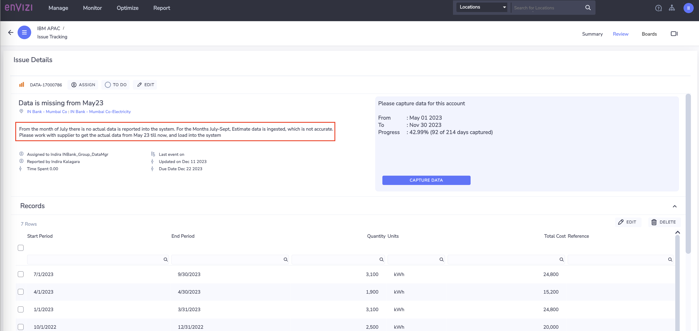
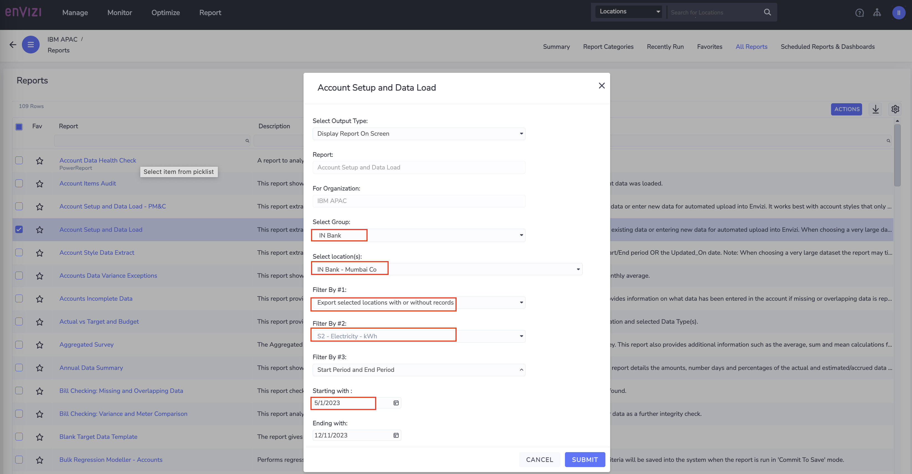
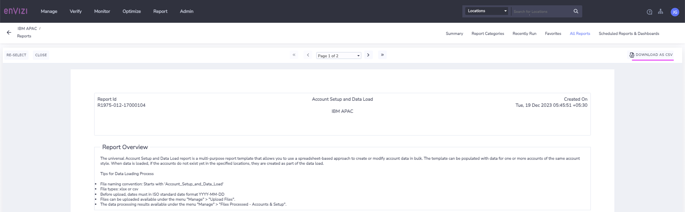
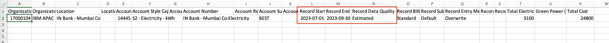
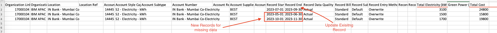
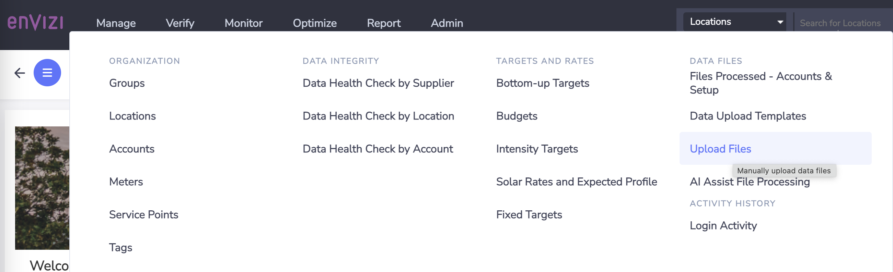
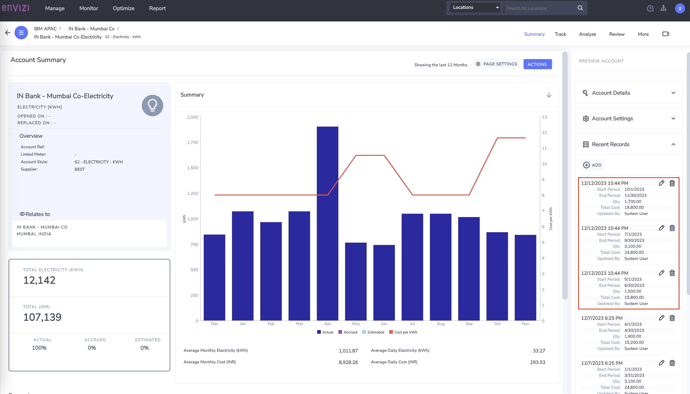

# Update the existing data in the Accounts or ingest new data

In this exercise we will learn how to `update the existing data` of the accounts using the `Account Setup and Data Load` templates which can be downloaded from Envizi UI.

In the `Data Monitor` lab, we have observed the data quality issue with data ingested into accounts. We have also identified an account which is  missing data for more than 7 months and some of the data captured in between is Estimated. Hence we raised an issue and assigned to the user who should address the data quality issue by capturing the actual data. 

#### Key steps

The Key steps which we follow in this exercise are :

1. User finds the data issue assigned to him/her 
2. Extract the corresponding account data which needs to be updated.
3. Update the extracted file with actual data
4. Upload the file and verify the account records

## 1. View Issue Details (optional)

The User finds the data issue assigned to him/her.

This step is basically showcase how users with different roles and responsibility interact with the system to address the data quality issue using issue management. You can skip this step and go to the next section (2. extract the existing Account data)

1. Navigate to Envizi UI  -> `Monitor` -> `All issues` 
2. Select the issue and click on `view issue`
3. View the description of the issue and other details.

To address this issue, users has to update the existing data. The user can use `Capture data` to edit / load  the data record by record. But it would be a tedious task if there are more records to update or load. Hence user will be going with template based approach, following the instructions from next section.

## 2. Extract the existing Account data

To update the existing data of a particular account, get the existing account data from Envizi first. Envizi provides template to extract and load the data into the accounts. 

Lets extract the data for the  `electricity` account `IN Bank - Mumbai Co-Electricity`  belongs to location `IN Bank - Mumbai Co` for which the issue is raised

#### Extract the Data

1. Envizi UI -> `Report` -> `All Reports` -> click on `Account Setup and Data Load`
   
2. In the `Account Setup and Data Load` filter window select the following.
   - **Group :** `IN Bank`
   - **Location :**  `IN Bank - Mumbai Co`
   - **Filter By #1 :** `Export Selected locations with or without Records` 
   - **Filter By #2 :** Chose the account style of the account `S2 - Electricity - kWh` 
   - **Starting with :** Choose from which date the data has to be extracted. In the issue raised above, it calls out data is missing from May'23. So get the data starting from May 1st 
    - **Ending with :** Leave to defaults which sets to today's date.
    
3. Click on `Submit`

4. Download the report generated as csv by clicking on `DOWNLOAD AS CSV`  and save to local

#### Observe the Data

5. Open the downloaded file `Account_Setup_and_Data_Load.csv`

6. Verify the content of the file. 
- As mentioned in the issue description above, this account has only one record loaded from July - Nov. 
- And the column `Record Data Quality`  shows this record is `Estimated`.

Now, the user can capture the missing data alongside updating the existing records. Let's do that in next section

## 3. Update the Account with actual data

1. Open the above downloaded file `Account_Setup_and_Data_Load.csv`

2. Keep only the account rows which you want to update and remove rest all the rows from the sheet.
   
#### Update
3. Modify the values of columns `Total Electricity (kWh)`  and `Total Cost` with updated values.  
4. Change the column `Record Data Quality` value from  `Estimated` to `Actual`

#### Add
5. Copy & Paste the entire row to ingest new records for the missing months or period
6. For the new rows, update values for columns `Record Start YYYY-MM-DD `, `Record End  YYYY-MM-DD`, `Total Electricity (kWh)`  and `Total Cost` 

7. Review all other columns, leave the values as-is for organization, account style, account number, etc 
8. Save the file

## 4. Upload the file

Lets upload the file to load data into Envizi Accounts by navigating through  `Manage > Upload files`  

1. Follow the steps given [here](../201-uploading-a-file) to upload the file into Envizi.

## 5. Verify the account records

1. Verify the Account to view the new records. `Manage -> Accounts -> IN Bank - Mumbai Co-Electricity` 

 

## 6. Close the issue

The user with the System Admin / General user with Issue manager role can verify the status of the issue and  take it to closure.

1. Open the issue by navigating `Monitor` -> `All Issues` -> Select `issue`

2. Change issue status to `Submitted`

## 7. Conclusion

In this exercise, we learnt how to update the existing data of an account using the `Account Setup and Data Load` template provided by Envizi.

This template is useful to create new records or update the data of the accounts belong to Single Account style with Qty and Cost data fields. If you want to update multiple accounts data of different account styles, then you can leverage the template provided by report `Account Setup and Data Load PM&C` . 

