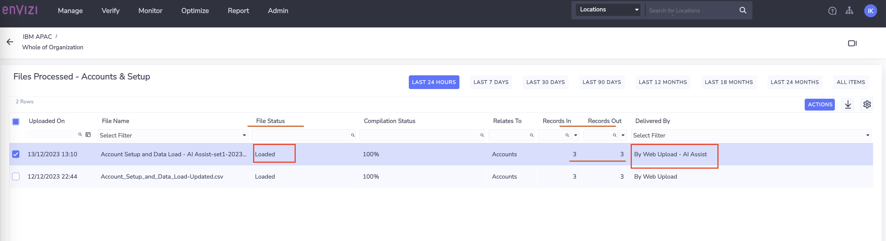

# Using AI Assist to classify Scope 3 data

In this exercise, using AI assist features we will load spend-based data for the `Category 1 Purchased goods` for our Bank.

For reference, here is our Bank Scope 3 groups and categories identified.

We have already created the  Groups and locations for the same in the previous lab exercises. This exercise provide the instructions to capture the data by leveraging AI Assist with two different scenarios. 
   - Scenario 1 : Automatically submit the file processed by AI Assist directly 
   - Scenario 2 : Modify the file processed by AI Assist and submit manually

## 1. Download the AI Assist template

CLICK ME

1. Click on `Manage` -> `Data Upload Templates`

2. Select the file `Account Setup and Data Load - AI Assist` , 

3. Click on `Actions` and `Download`

4. Open the downloaded file `Account Setup and Data Load - AI Assist.xlsx` contents.

5. Go through all the 4 sheets of the file carefully to get more insights on AI Assist feature
   - **Records to load              :** This is the main data sheet which will be processed once uploaded into the system 
   - **Guidance                     :** Provides overview of AI Assist, important notes on how to use various fields, do and don't 
   - **Supported account styles     :** Provides list Account styles supported for Scope 3 - Category 1 Purchased Goods and Services in Envizi through Eora 66 Emission factor library
   - **Template fields definitions  :** - Details on field types , mandatory or optional, etc

## 2. Scenario 1: Automatically submit the file processed by AI Assist directly 

CLICK ME

### 2.1. Populate Template with Data (Optional)

1. Make a copy of the downloaded template file `Account Setup and Data Load - AI Assist.xlsx` 

2. Rename the file in the format `Account Setup and Data Load - AI Assist_xxxxx.xlsx`. Here xxxxx could be `-set1-` followed by your `Prefix-Id`. Ex: `Account Setup and Data Load - AI Assist-set1-IBM50.xlsx`

3. In above template file, fill in values for the below columns as per your requirements.
   - Organization 
   - Location
   - Account Supplier
   - Record Start YYYY-MM-DD
   - Record End YYYY-MM-DD
   - Spend in USD
   - NLP Reference 1

### 2.2 Preparing the Prepopulated Template

1. Take the sample file `07-Account Setup and Data Load - AI Assist-set1-IBM50.xlsx` from the shared Box folder.

2. The file name format should be `Account Setup and Data Load - AI Assist-xxxxx.xlsx`. Remove `07-` from the file name and replace `IBM50` with your `Prefix-Id`. 

3. Replace the `ORGANIZATION` column values with Organization name you obtained as a prerequisite.

4. To prevent naming conflicts, replace `IBM50` with your `Prefix-Id` for the `LOCATION` column.

The template content could be like this now. Obviously your `Prefix-Id` should be there before `IN Bank` in the  `LOCATION` column.

### 2.3 Upload file for AI Assist Processing

1. Click on  `Manage` ->  `AI AssistFile Processing` to open the file upload screen for AI Assist. (Keep refreshing the page after few seconds)

2. Click on `Upload For AI Processing`

3. Select the template file that we created in the above step.

4. Click on `Save`.

### 2.4 Download AI Assist processed file

1. Wait for the `Al Processing Status` column to change to `Completed`

2. Click on `Actions` -> `Download Processed File` to download the AI processed file.

### 2.5 Observe and Update the account style

1. Open the downloaded file.

2. Verify the value of the column `Account Style Caption` updated by AI Assit

    

Observe that the `Account style caption` is mapped correctly for the `Category 1 purchased goods` activity data type based on the text provided in the `NLP Reference 1` column.

### 2.6 Upload the file Data loading

As we are satisfied with the account style mapped by AI Assist, we can proceed to load the data by submitting this file directly from AI Assist page.

1. In the `AI Assist File Processing` page ensure that the uploaded record is checked/selected.

2. Click on `ACTIONS` -> `Submit for Data Loading`

      

The AI assist would take up the AI processed file from the server create the required `Accounts` and `Data`.

### 2.7 Verify file processing status

1. Check the status of the field `Data Loading Status` and wait till it shows `Submitted` 

2. Then click on `GO TO FILES PROCESSED`

      

3. Verify `File Status` column as `Loaded` and no errors. 

4. Check `Records In` and `Records Out` column values. It should have the total number of records available in the uploaded excel file.

### 2.8 Verify Account

Lets verify the Accounts created and data loaded. 

1. Navigate to `Organization Hierarchy` and goto the `Location` mentioned in the uploaded excel file.

  

- You can see the accounts get created. 
- The account name could be of the format `Location_AccountStyle_AccountSupplier` and it would take 100 characters maximum.

2.  Click on the `Account` to view Account Summary page 

3. Look at `Account style` and `Records` loaded

      

This concludes the Scenario 1 lab using the AI assist feature for deriving the relevant Account style for the spend based data of Scope 3 Category 1. 

## 3. Scenario 2 : Modify the file processed by AI Assist and submit manually

CLICK ME

The following exercise calls out a a scenario where the account style assigned by AI assist is not mapped to correct Scope 3 Category or data type. In such cases, users can take modify the account style according to their requirement and then upload the files manually. Lets follow the steps to replicate this scenario.

### 3.1 AI Assist File Processing

### 3.1 Upload file for AI Assist Processing

1. Take copy of the sample file `08-Account Setup and Data Load - AI Assist-set2-IBM50.xlsx` from the shared Box folder.

2. The file name format should be `Account Setup and Data Load - AI Assist_xxxxx.xlsx`. So, remove `08-` from the file name and replace `IBM50` with your `Prefix-Id`. 

3. Replace the `ORGANIZATION` column values with Organization name you obtained as a prerequisite.

4. To prevent naming conflicts, replace `IBM50` with your `Prefix-Id` for the `LOCATION` column.

The content may look like this.
 

5. Navigate to Envizi UI and click on  `Manage` ->  `AI Assist File Processing`

6. Click on `Upload For AI Processing` 

7. Select the file updated in step-2 and `Save`

### 3.2 Download AI Assisted processed File

8. Wait for the `Al Processing Status` column to change to `Completed`

9. Click on `Actions` -> `Download Processed File` to download the AI processed file.

10. Open the `downloaded` file which is processed by AI Assit

<!-- 8. Verify the value of the column `Account Style Caption` updated by AI Assit

     -->

### 3.3 Observe and Update the account style

11. Observe that the `Account style caption` column against each spend data.  Apart from Records/ Row 1, for the rest it is mapped correctly

For Row 1, the spend data is related to computers and laptops purchased, however AI Assist mapped to it as `S3.1 - Other real estate, general - USD or local` , which is incorrect. 

12. Update the `Account style caption` for the Row 1 to `S3.1 - Computer and electronic products - USD or local`
You can click on `Account style caption`  drop-down to chose  the correct one or can refer to sheet `Supported account styles`

### 3.4 Upload the file for data loading

13. As we have modified the file after AI Assist processing, we can't directly submit the file for data loading as we did in the previous exercise. Here, we need to manual provide the file to upload. 

`Manage` -> `AI Assist File Processing` -> Select the file -> click on `UPLOAD DIRECTLY TO DATA LOADING`

### 3.5 Verify file upload status

14. Check the status of the file from AI Assist page. Observe the filed status  - `AI Processing Status` - `Not Applicable` . This is because, the file we have uploaded is already having the `Account style caption` filled. AI Assist only process the rows if the `Account style caption` is blank and the `NLP reference 1` column is filled. 

15.  Click on `GO TO FILES PROCESSED` , which shows the file status and the number of accounts created. 

Observe the values of the fields `File Status` , `Records In`, `Records Out` and `Delivered By`

### 3.6 Verify Account Summary

16. For the locations specificed in the data loading file, verify that  the accounts are created and the records are loaded by navigating through the `Organization Hierarchy` or going to the `Manage`-> `Location` -> `Accounts` -> view each account details .

This concludes the exercise. Happy Learning !

## Conclusion

In this lab exercise, we have learnt how Envizi uses Natural Language Processing (NLP) using the AI Assist feature, for categorizing the Spend based data into the appropriate Scope 3 Category 1 Purchased Goods & Services. 

 We have also looked into steps to follow when AI assist maps the correct account style as well as how to handle when the category mapped is not satisfactory to the user requirement. 

