# Load data using Data Flow automation Service Cloud Storage (S3) via Postman

In this exercise you would learn how to use Postman tool to invoke CloudStorage (S3) apis to load data into the Envizi. The data is provided in .csv/xlsx file in the format of Universal Account Connector templates.

## 1. Use Postman tool to load the Data into Envizi S3 Folder

CLICK ME

### 1.1 Get S3 Details.

1. Get the details of the Envizi Cloud Storage (S3) credentials

- Bucket 
- Folder
- Access Key
- Secret Access Key
  
You can find this info in the file `s3-config.txt` from [here](./files/s3-config.txt)  or from the shared Box folder.

### 1.2 Download the prepopulated template file

1. Keep your input file in UDC format ready

You can take the sample file `POCAccountSetupandDataLoad_INbank_India_ATMs.xlsx` from [here](./files/POCAccountSetupandDataLoad_INbank_India_ATMs.xlsx) or from the shared Box folder

2. Update the content based on the data which you want to ingest.

3. Prefix the columns `Location` and `Account Number` with the `Prefix-Id` to avoid duplicates.

### 1.3 Form the URL for S3

1. Form the url  based on the details  

   http://<bucket_name>.s3.amazonaws.com/<folder_name>/<file_name_with_extension>
   
   Example:
   http://envizi-client-dataservice-us-prod.s3.amazonaws.com/client_dedd4566f2f247/POCAccountSetupandDataLoad_INbank_Co_All.XLSX

### 1.4 Push the file using PostMan

1. Open Postman tool
   
2. Click to "+" to add a new request 

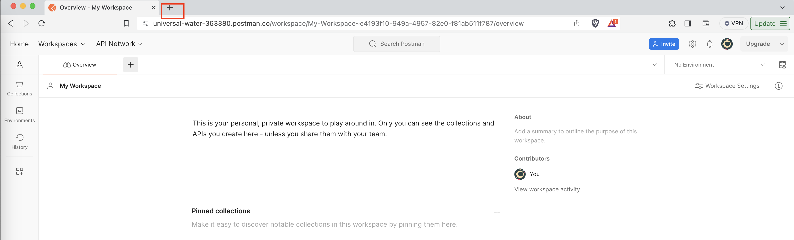

3. In the request window of Postman, configure the below 
- `Method`: `PUT`
- `URL`:  The one formed in step 1

4. Click on `Authorization` tab and Set below parameters 
- Select `Type`: `AWS Signature`
- `AccessKey`: Obtained in pre-reqs for S3 connection
- `SecretKey`: Obtained in pre-reqs for S3 connection

    ##### Expand `Avanced Configuration` and set below:
- `AWS Region` - `us-east-1`
- `Service Name` - `s3`

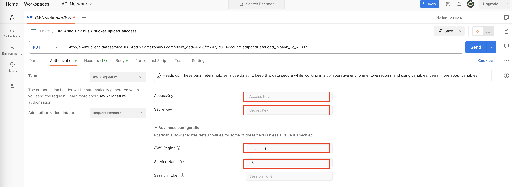

5. Click on `Body` tab and 

- Select `binary`
- Click on `Select File` box and click on `New File from local machine`

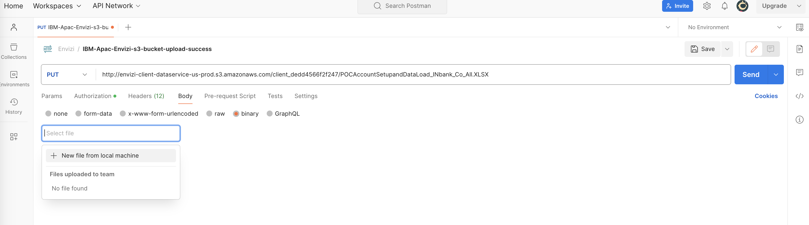

- Chose the file and click `Open`

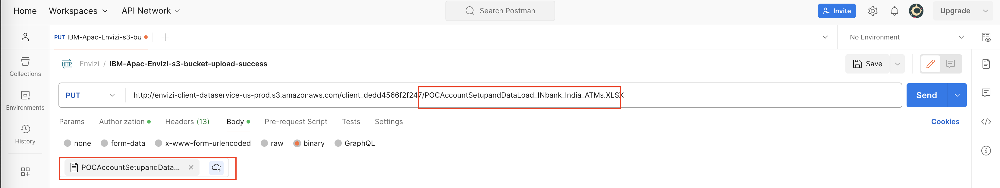

- Make sure the file name matches the file selected
  
6. Click on `Send`

7. Check the `Respnse` status should be `OK`
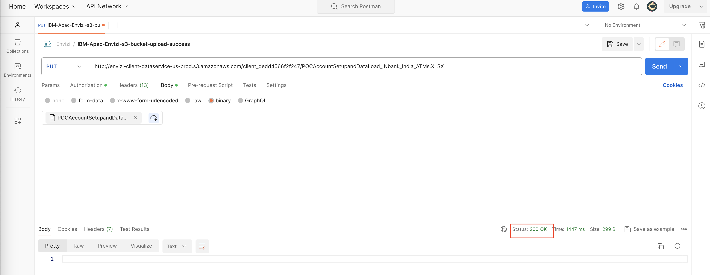

## 2. Validate the Data loaded through Envizi UI

CLICK ME

1. Navigate to `Admin` > `Data Flow Automation` 
2. Click on `File Delivery Status` to check the file loaded

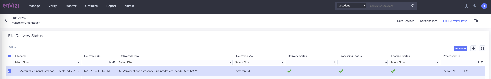

3. Navigate `Manage` > `Files Processed - Accounts & Setup`

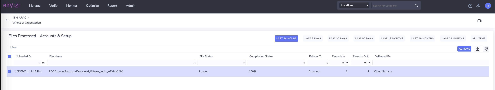

4. Verify the file is loaded successfully
   
5. Navigate to `Manage` > `Accounts` > `IN Bank -  Bangalore ATM Diesel`
   
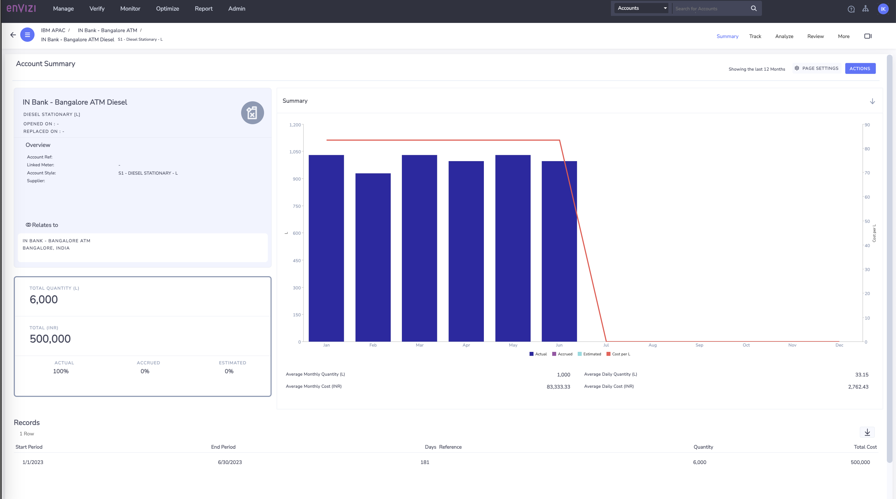

You can see the Account is created and also the records are loaded successfully.

## 3. Troubleshooting 

### 3.1. Data Load Issue - Verify logs

CLICK ME

If the file is not processed and showing the Error in the Load Status of the file delivered to S3 as below, then verify the Parse errors and Load erros

1. In Envizi UI `Admin` > `Data Flow Automation`  > `File Delivery Status`
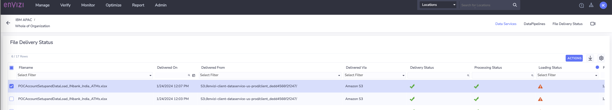

2. Select File with error 

3. Click `Actions` > `Loading logs`
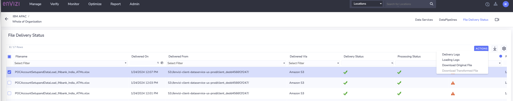

4. View the `File Status`
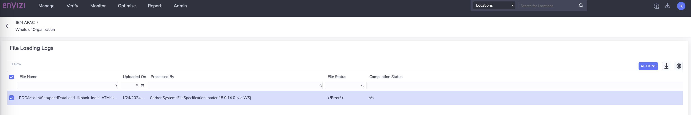

5. Click on `Actions` 
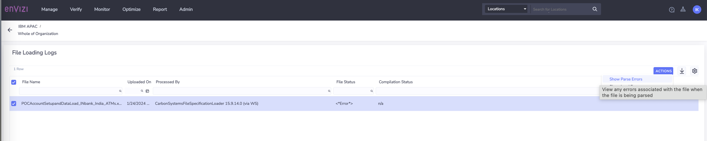

6. Click on `Parse Errors` to check if any parsing errors
   
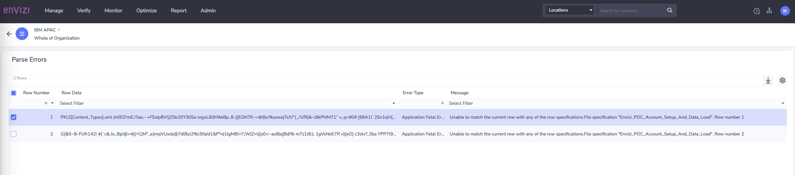

7. You can see if there are any errors. In the above screen-shot it shows the file content seems to be coming as garbage data instead of actual data.
The error message : 
Unable to match the current row with any of the row specifications.File specification "Envizi_POC_Account_Setup_And_Data_Load". Row number 1

8. For this particular garbage data issue, it seems like the file is somehow got corrupted on the source machine where Postman is running. This got resolved when we restarted the Postman. However, you need to check based on the error message.

9. Similarly, you can check `Load Errors` 
    

### 3.2. Postman related issue - Mismatch of header x-amz-content-sha25

CLICK ME

If the request in Postman fails with the error : The provided 'x-amz-content-sha256' header does not match what was computed. 

Please follow the below instructions to resolve.

1. Generate the shasum code for your file by executing the below file
    `shasum -a 256 <UDC_File_TO_Upload.XLSX>`

2. Copy the output of the command  

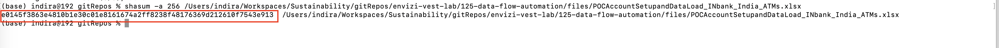

3.  Click on `Headers` tab and add additional header as below
-  `Key`: `x-amz-content-sha256`
-  `value`: Output of the command  from Step 1&2 above

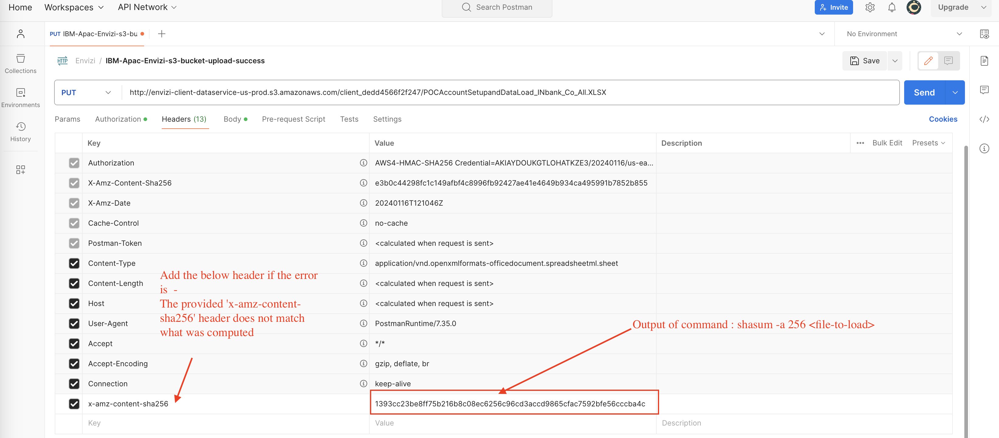

### Reference 
Data Services - https://knowledgebase.envizi.com/home/provisioning-data-services 

Data Pipelines - https://knowledgebase.envizi.com/home/configuring-data-pipelines 
