# Monitor Health of Data and identify issues.

In this lab exercise we will monitor the health of the data by looking into Envizi Reports available out of the box. The Reports will provide the details on data gaps / arrears , etc at various levels such as  account, data type, Supplier level.  Based on the insights from the reports, we will take necessary actions to address the gaps / arrears.

# 1. Check Data Quality of the Accounts

Envizi provides the below reports to understand the quality of data and also helps us to identify the gaps / missing data so that users can take necessary action. 

1. Account Data health check 
2. Account Incomplete Report

## 1.1. Power Report: Account Data health check

CLICK ME

Account Data health check is a power report which helps us to analyze health of data loaded into the accounts in Envizi. By looking into the report, the data capture team can understand what % of accounts have the data captured in last 4 months and what is the % of accounts for which data need to be catpured. 

In this section we will go through these reports and get the insights on the data which we have so far loaded into accounts for our organization. 

### 1.1.1 Report Home

#### Open Account Data health Check report

1. In the Global Search ->  Choose `Reports` from the drop-down and enter `health` in the text box to search for the report. 

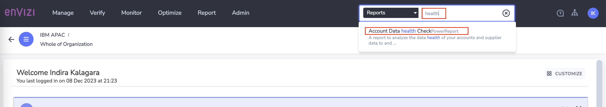

2. Click on the `Account Data health Check` PowerReport from the results.

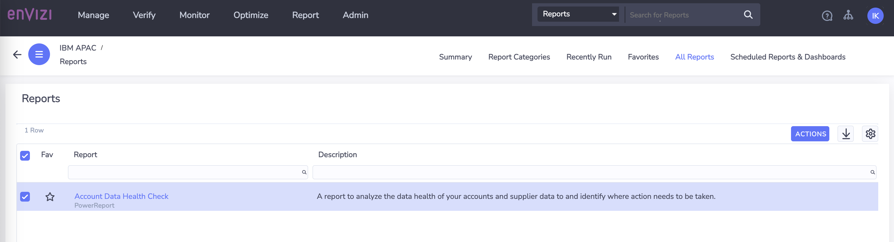

3. View the  report opened in new browser tab, which provides Account health details across overall organization

   

#### Apply Filter for Group Level 1

4. Click `Group Filter` on right-hand corner and select your group in `Group Level 1` ( Ex: `IN Bank`) and close

Now, the page shows `Data Activity` and `Data Gaps` related to the group which you have selected. 

As per the screenshot , 87% of the accounts have the data captured in last 4 months. 

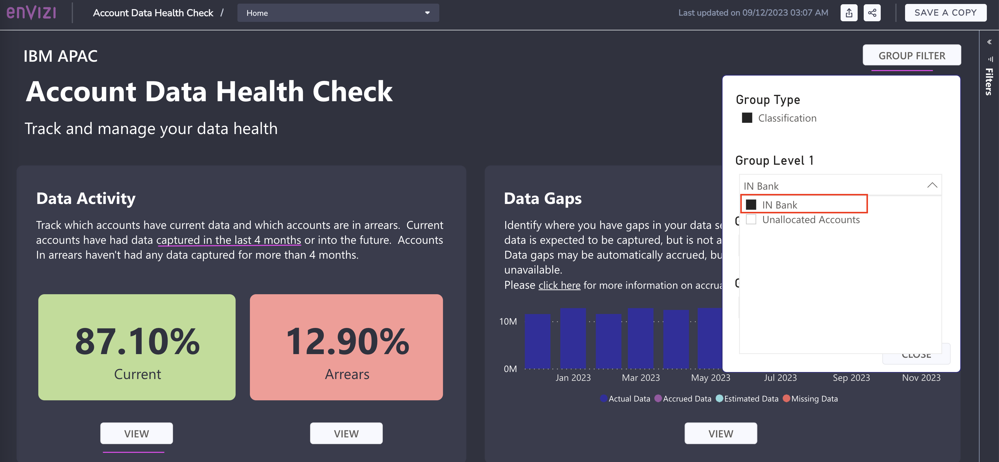 

### 1.1.2 Data Activity - Current

#### Current Home

5. Click on `View` under `Data Activity - Current` in the above screen to view more details

This page  displays the information by category wise (electricity, fugitive gases, ) and also by Supplier-wise. 

As per the screenshot, there are 27 Accounts for which the data is loaded in last 4 months. 

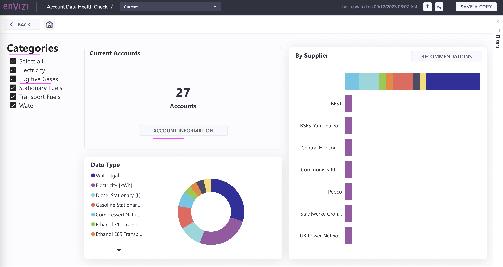 

#### Account Information

6. Click on `Account Information` in the above screen to view those accounts

Notice the `Last Date of Data` column, which indicates when the data is last captured in this account (in last 4 months)

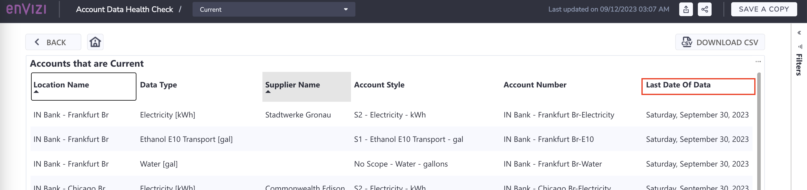 

### 1.1.3 Data Activity - Arrears

7. Go back to home page of `Account Data Health Check` report 

8. Click on `View` under `Arrears` to look at the Accounts for which data is `NOT` captured in `last 4 months`.

 

#### Arrears Home

9. There are few accounts for which the data is not captured in last 4 months. Click on the `Account Information` to view those accounts

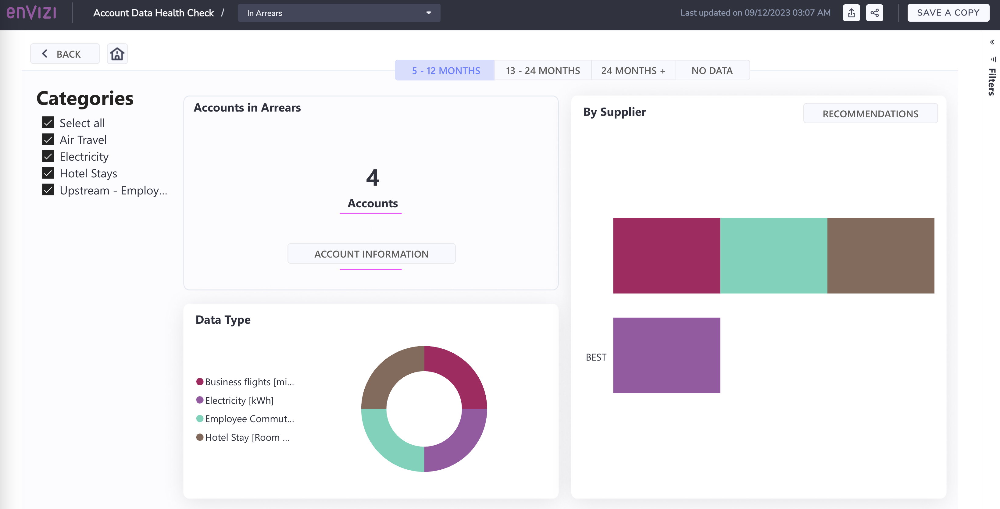 

#### Account Information

Looking at the `Last Date of Data` column (eg: June 30, 2023) , the data capture team can identify that they need to capture the latest data into these accounts and work on it further.  For example, at the time of this report (refer screenhot - Last updated on 09/12/2023 03:07 AM),  its been more than 4 months  that the data is not captured into these accounts, hence identified as arrears.  

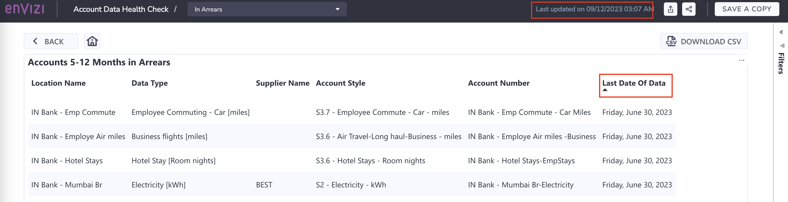 

### 1.1.4 Data Gaps

10. Lets go back to `Home` page and look at the `Data Gaps`. The bar graphs under `Data Gaps` section shows that from July 2023 there is lot of accured data, which  means the 
system has estimate the data based on previously available data because the accounts are not loaded. 

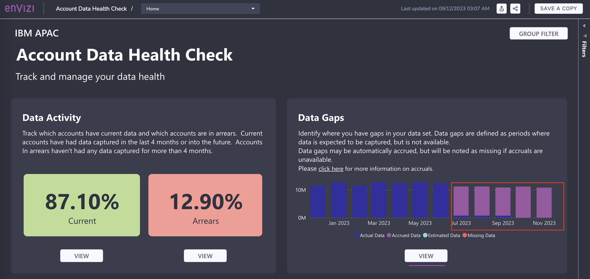 

#### Data Gaps Home

11. Click on `View` in the above screen to see more details

By default, the page opens with `last 12 months` data based on the `consumption` for `all the categories` by `Supplier`.

12. Unselect `Select All` and select only `Electricity` , 

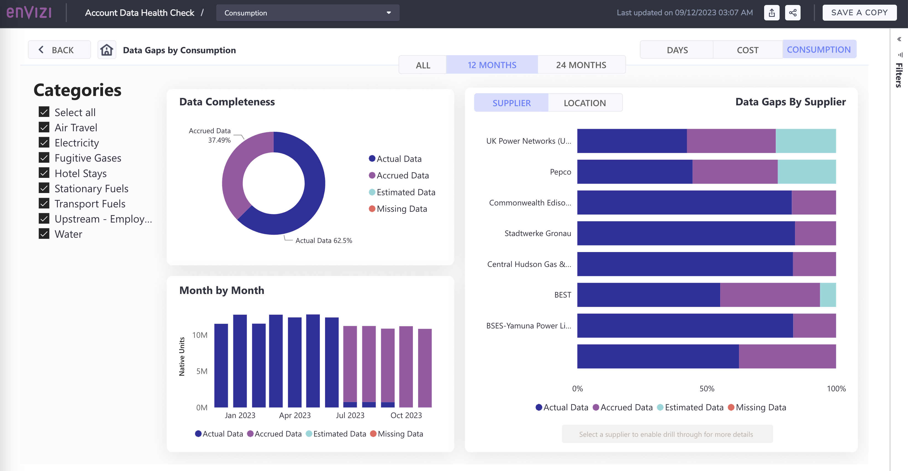 

This gives you more details insights on how much data is loaded, how much is estimate and accrued for this data type. 

From the screenshot you can observe the following
- more than `25%` of electricity data is missed to capture
- however `5 to 6%` of data is estimated data

You can also see the `Date Gaps by Supplier` chart, where you can see that from `which suppliers` the data is missing regularly.  

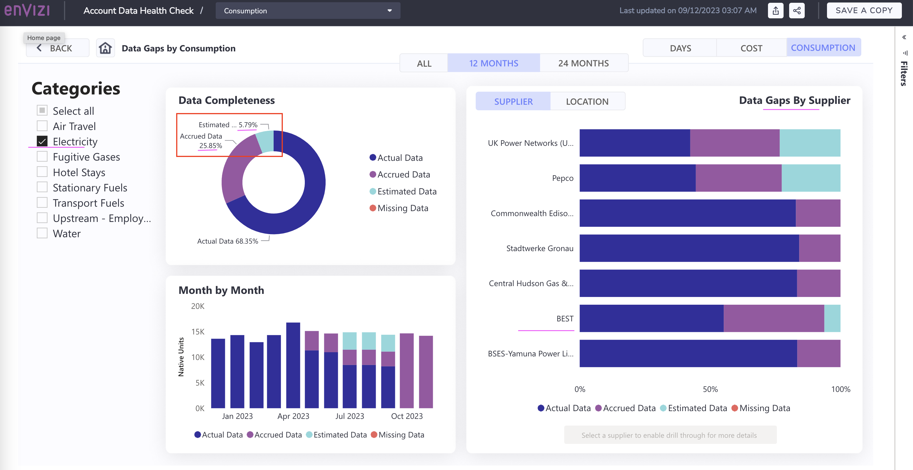 

#### Data Gaps by Supplier

13. Click on `BEST` from  `Data Gaps By Supplier` in the above screen to Drill-down on Supplier to get more insights. 

Observe the following.
- Only `55% of data captured is actual data` from Supplier `BEST` and the rest is `MISSING`. 
- Around `38% of data is accrued` 
- Around `6% of data is estimated`

So this is not good sign for data accuracy and quality. Hence there is a need to check with supplier why this data is missing to submit. 

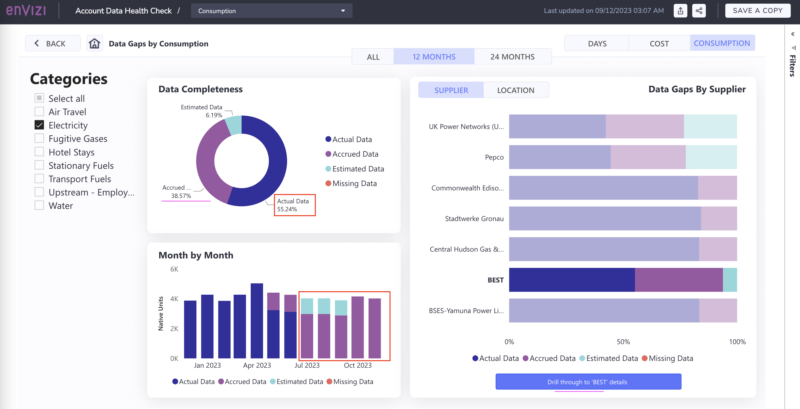 

#### Data Gaps by Supplier in detail

14. Click on `Drill through to BEST details` in the above screen to see the more detailed view

This screen shows location wise data capture from the Supplier. You can see the below 2 locations.
- IN Bank - Mumbai Br
- IN Bank - Mumbai Co

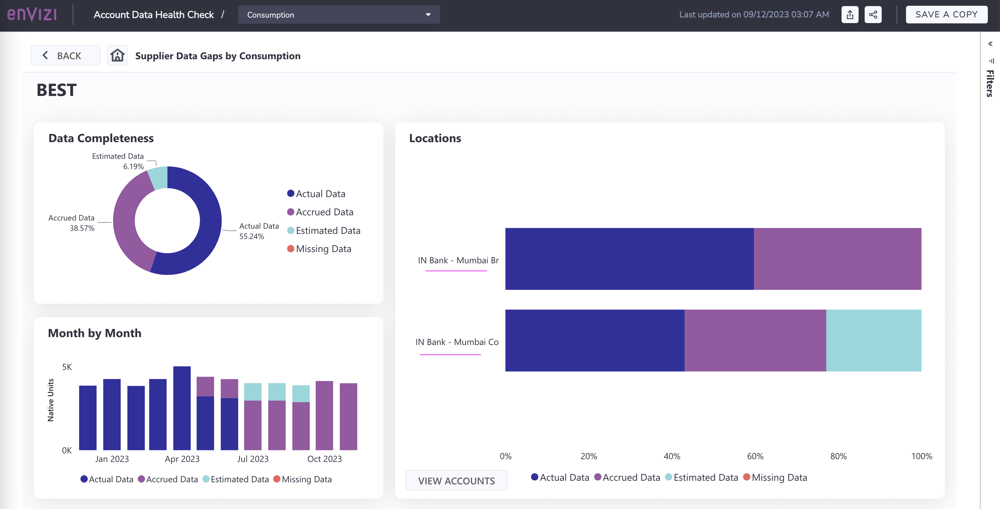 

#### Data Gaps by Supplier in detail - Mumbai Br

15. Select `IN Bank - Mumbai Br` in the above screen.

- As you see in screenshot, `40% of data is missing` for this location. 
- Look at `Month by Month` chart, there is `NO` data supplied for this location from `July 2023` by this Supplier. 
- This is important insight which `needs attention` and required to be notified to concern location / business unit teams to address the issue. 

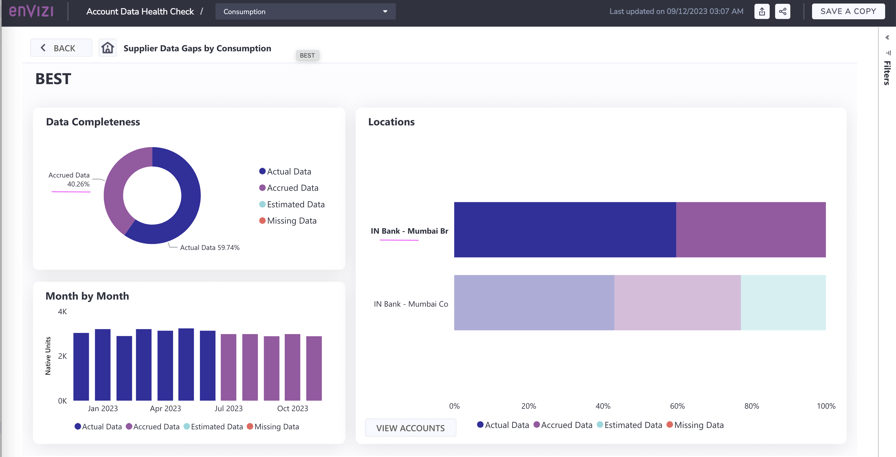

#### Data Gaps by Supplier in detail - Mumbai Co

17. Similarly, Click on   `IN Bank - Mumbai Co` in the above screen and get insights for this location. 

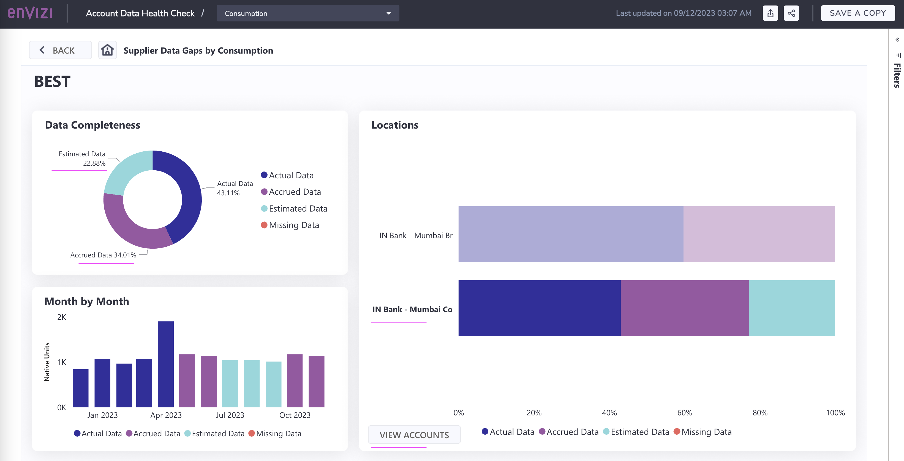 

#### Data Gaps by Supplier in detail - View Accounts

18. Click on `View Accounts` on the above screen to view account-wise details. 

From screenshot , we can see that account `IN Bank - Mumbai Co-Electricity` has lot of  `Estimated` . For data accurancy, it is important to ingest the actual data, hence we will need to address this issue to load data into the system. 

19. Take a note of this account  `IN Bank - Mumbai Co-Electricity` as we will learn how to address this using issue management by raising an issue against the same.

In the next section we will also look at `Accounts Incomplete Data report` and how it helps to get more insights at account level. 

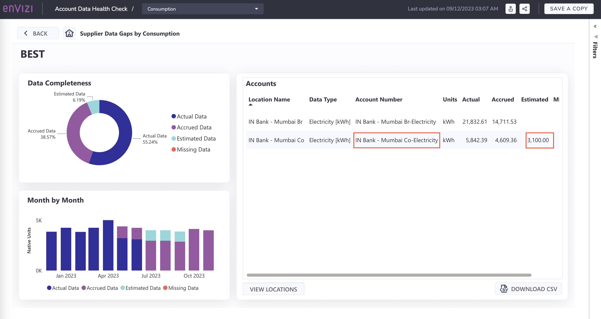

## 1.2. Report: Accounts Incomplete Data report

CLICK ME

The Accounts Incomplete Data report provides details of accounts that contain `missing or overlapping data` across the reporting period selected. The report also provides information on what data has been entered in the account if missing or overlapping data is reported in order for you to have some context to the data that has been captured in other months for that account.

Lets look at what this report provides you in details.

### 1.2.1 Open the report and Download as CSV

1. In the Global Search ->  Choose `Reports` from the drop-down and enter `incomplete` in the text box to search for the report. 

2. Click on the `Accounts Incomplete Data` from Reports page. In `Accounts Incomplete Data` window, 
-  Select `Group` for which you want to check the Accounts data status, 
-  leave deafult to Select `Location` to `All locations` and Submit

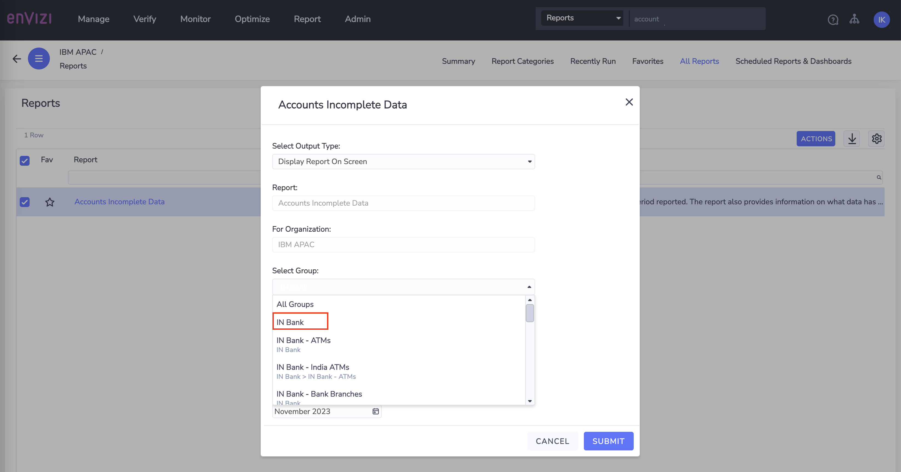

3. Click on the `Download As CSV` and save it to your local machine.

### 1.2.2 Observe the report content

#### View missing data records
4. Open the file as csv or using Microsoft xls   

Look at the below columns 
- Days_In_Month
- Expected_Days_In_Month
- Days_Mismatch

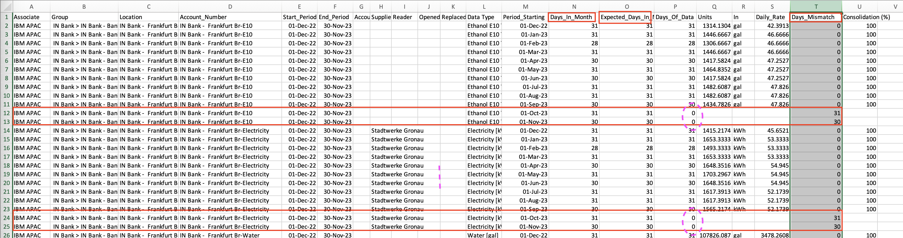   

5. Filter the rows where `Days_Mismatch` is > 0, which gives all the accounts which has missing data for 1 or more days in a given month

#### Filter by Location `IN Bank - Mumbai Br`

From the report `Account Data Health check` above, we have observed that `40% of data is missing`  from location `IN Bank - Mumbai Br` of  `electricity` accounts.

Let's dig into details of this  location `IN Bank - Mumbai Br` and corresponding accounts.

6. Apply Filter on `Location` column for `IN Bank - Mumbai Br`

7. Observe the following
- data is missing for all the days starting from the month of July 2023 till Oct 2023 (at the time of report) for this account
- the account is `IN Bank - Mumbai Br-Electricity`

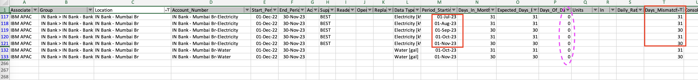   

We will learn how to address this using issue management by raising an issue against the same

## 1.3 What we observed from the 2 reports

CLICK ME

What we observed from the reports `Account Data health check` & `Accounts Incomplete Data` reports?

#### Account Data health check report

From the `Account Data health check` report, we have identified 
-  % of accounts which are missing data from last 4 months
-  type of data which is missing mostly
-  which locations are missing data, and what %
-  what is % of estimated data and which accounts / locations has estimate data
-  Suppliers who is not providing data from last few months

#### Accounts Incomplete Data report

From the `Accounts Incomplete Data report` report, we have identified 
- identitfied missing data across all locations 
- identified how many days of data is missig for each account 

#### Identified Accounts 

In the above exercise, we have encountered couple of accounts which having data quality issues like - missing data  or having esitmated data instead of actual data. 

- Account:  `IN Bank - Mumbai Br-Electricity` - address Missing data 
- Account:  `IN Bank - Mumbai Co-Electricity` - address Estimate data, capture actual data. 

In the next section, we will learn how to use the issue management to raise and track the issue against these data gaps and address them.

# 2. Deal with the Missing data and arrears 

In this section, we will raise issues against the accounts and assign to an user who is resposbile to capture the actual data.  

## 2.1 Create an Issue for the account `IN Bank - Mumbai Br-Electricity`

CLICK ME

### 2.1.1 Open the Account Summary Page

1. In Global Search, search for the Account `IN Bank - Mumbai Br-Electricity` and Open the Account Summary page.

2. On Account Summary page, right-hand corner, click on `Show / hide Preview Panel`

3. Click on Scroll down button in `Issues` section.

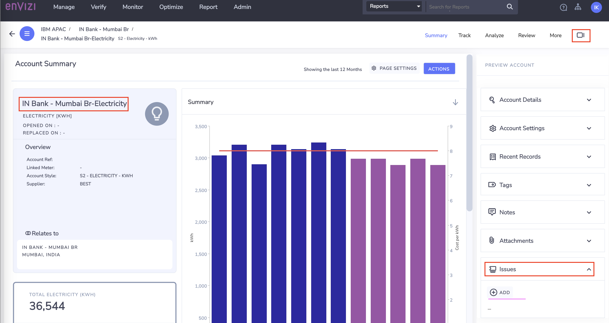

### 2.1.2 Create an Issue

4. Click on `ADD` button

5. Provide below deatails on the new window and Save.
- Type: `Data Capture`
- Summary: Provide brief description about the issue
- Description: Provide more details related to the issue to understand the issue better and acted upon
- Source: Leave defaults `Accounts`
- Related to: Leave deafault, shows account name for which the issue is being raised for
- Priority: Select as per issue's context
- Assignee: Select the email address of the user whom this issue has to be assigned to and worked upon. It good practise to select a user who would be responsible for capturing the data from the location.  If not, assign it to self.
- Reporter: Leave defaults
- Category: Leave defaults to `Data Capture` 
- Sub Category: Select `Account in Arrears` or `Missing Records`
- Capture Data From: Select the data from which the data has to be captured
- Capture Data To: Select the data till when the data has to be captured
- Due Date: Select by when the issue has to be acted upon

1. Click on `Save` button

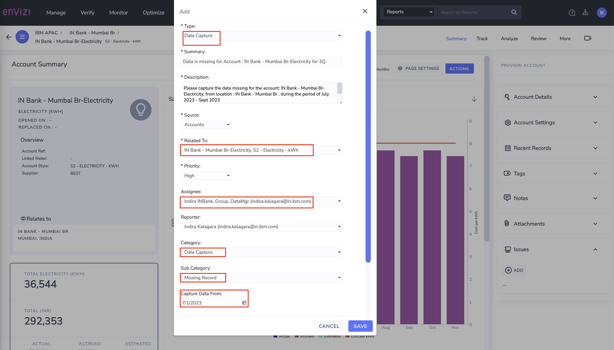 

### 2.1.3 View Issue

6. View the issue created under `Issues`

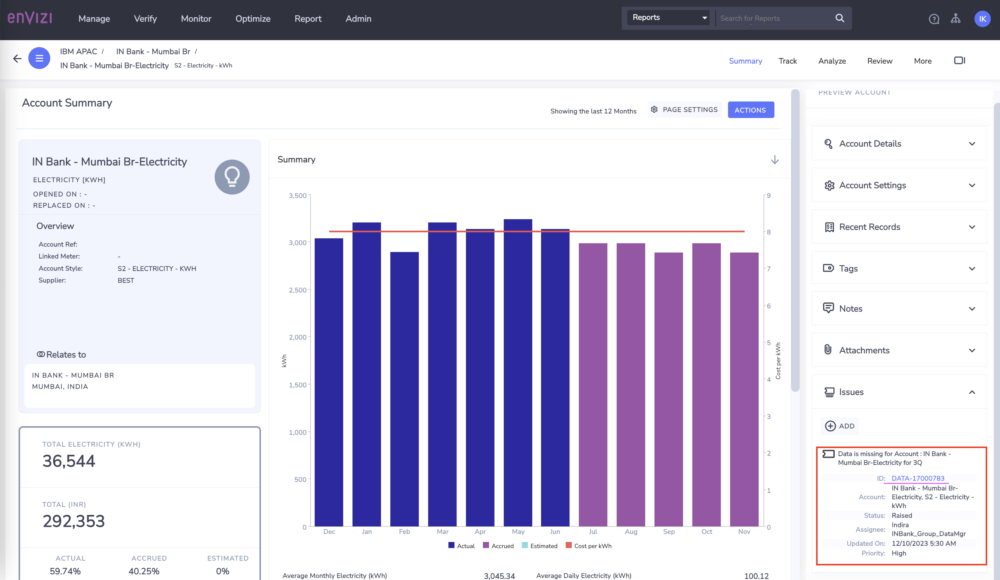

7. Click on the issue ID and view the details

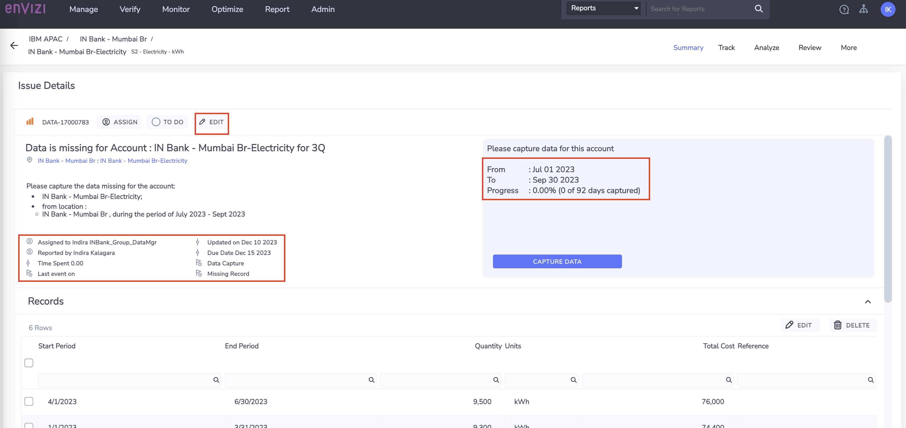

#### Email notification

8. You can also check your email for the email notification received.  Both sender and receiver should be notified of the issue. You might have recevied a similar email as shown below. 

You can click on `View` button in the email which takes you to Envizi's Issue page directly

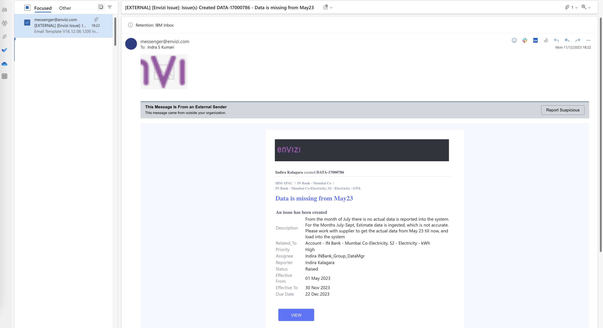

Please ignore the status change update on the email 

## 2.2 Create an Issue for the account `IN Bank - Mumbai Co-Electricity`

CLICK ME

### 2.2.1 Open the Account Summary Page

1. In Global Search, search for the Account `IN Bank - Mumbai Co-Electricity` and Open the Account Summary page.

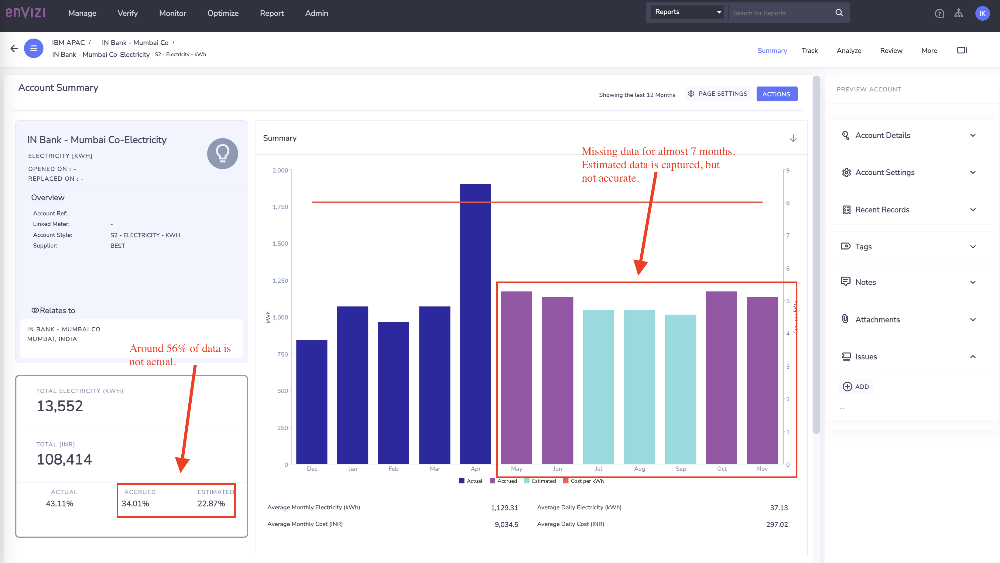

### 2.2.2 Create an Issue

2. Create an issue as mentioned in section 2.1.2

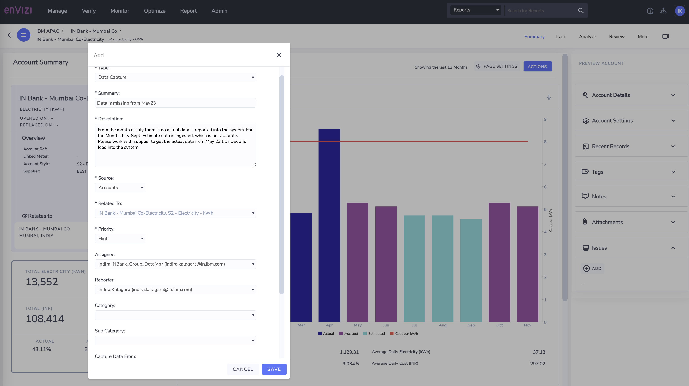

Please note that we will address this issue in the upcoming labs. 

In this exercise continue to resolve the issue raised for account `IN Bank - Mumbai Br-Electricity`

# 3. Conclusion
That concludes the Data Monitoring exercise for the Account data quality.

In this lab, you have leart how to use the Envizi out of the box reports such as `Account Data health check ` and `Account Incomplete Report`,  to identify the data quality issues across locations, accounts and suppliers. 
