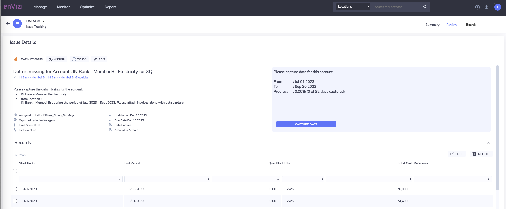

# Data capture through Issue management

In this lab exercise we will look at how the missing data is captured via Issue Management. 

In the previous lab, you have leart how to use the Envizi out of the box reports such as `Account Data health check ` and `Account Incomplete Report`,  to identify the data quality issues across locations, accounts and suppliers. 

Now in this lab, we wills see how the data is captured via Issue Management

# 1. Data capture through Issue management

Let's look at how the data is captured via Issue Management

CLICK ME

So far in this lab exercise, 
- have identified the account with missing data or accounts in arrears
-  raised an issue and assigned to an user to capture the data

Now, lets look at how the issue is resolved by the assigned user. 

1. The user would receive an Email notification once the issue is assigned to him/her and  Login to Envizi UI to check the details of issue. 

### Open Issue-Summary

2. Click on `Monitor > Issues > Summary` to Open the Issues Summary page.

### Open Issue Details

3. Click on issue under `Issues by Location`.  

Please note that you can also go to this same screen directly from Envizi UI -> `Monitor` -> Issues -> `All issues`

4. Click on `View Issue`

5. View details of the issue 

### Update issue status as InProgress

6. Update the issue status from `ToDo` to `Investigating` / `InProgress`

### Capture Data

7. Now start working on the issue. Click on the `Capture Data` button on right side of the page. 

    Provide details for the fields , verify all other fields which are auto-populated and `Save`
   - Total Electricity (kWh)
   - Total Cost (optional)
  

You can attach invovices if you have for this billing period.

### View the Progress

8.View the Progress and the records in the Issue page.

There are different ways to capture data, which we will learn in other exercises.
Scroll-down on the page to view the activity log of the issue. 

### Update Issue Status as SUBMITTED

10. Update the status of the issue to `SUBMITTED`. Lets do this using Kanban boards.  Click on  `Boards` from right-hand corner on the issue page

11. Drag and drop the issue tile from `IN PROGRESS` column from Board to `SUBMITTED` column

### Update Issue Status as Resolved

12. As soon as the status update, system will send the email notifications with the status updates.  

1.  The System Admin or the user with IssueManager role, will verify the issue and the records loaded. Once satisifed with the issue status, the user will be change the status of the issue from `Submitted` to `Resolved`

### Issue Activity log

14.   Assigned user is notififed of the status change. Can also check activity log. 

# 2. Conclusion
That concludes the Data Monitoring exercise for the Account data quality.

In this lab, you have leart about, how the missing data is captured via Issue Management.
