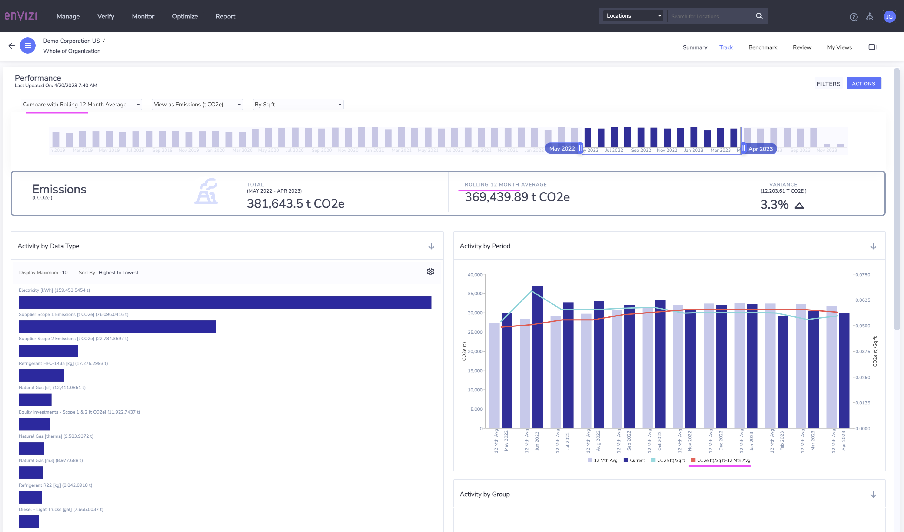

# Exploring Dashboards

In this lab exercise you will explore about the dashboards in Envizi .

# 1 Dashboards 

Dashboards are dynamic pages enabling the visualization and reporting of data in a graphical format.

They're accessible across different levels (Organizational, Group, Location, Account, Meter), typically found on a Summary page.

# 2 Available Dashboards

Here is a list of important dashboards available in Envizi.

CLICK ME

<table>
    <tr>
        <th>Category</th>
        <th>Report Name</th>
    </tr>
    <tr>
        <td rowspan=9>Performance</td>
        <td>Organization Summary</td>
    </tr>
    <tr>
        <td><a href="#user-content-4-dashboard---organization-performance">Organization Performance</a></td>
    </tr>
    <tr>
        <td>Performance by Data Type</td>
    </tr>
    <tr>
        <td>Performance by Group</td>
    </tr>
    <tr>
        <td>Performance by Scope</td>
    </tr>
    <tr>
        <td>Performance by Tag</td>
    </tr>
    <tr>
        <td>Performance Trend</td>
    </tr>
    <tr>
        <td><a href="#user-content-5-dashboard---emission-performance">Emissions Performance</a></td>
    </tr>
    <tr>
        <td>Energy Production</td>
    </tr>
    <tr>
        <td rowspan=5>BENCHMARKS</td>
        <td>Ranking Locations by Intensity</td>
    </tr>                
    <tr>
        <td>Ranking Locations by Ratio</td>
    </tr>     
    <tr>
        <td>Ranking Groups by Intensity</td>
    </tr>
    <tr>
        <td>Rate Analysis</td>
    </tr> 
    <tr>
        <td>Energy Star Portfolio</td>
    </tr> 
    <tr>
        <td>SOLAR</td>
        <td>Solar Portfolio</td>
    </tr> 
    <tr>
        <td rowspan=2>METER ALERTS</td>
        <td>Summary</td>
    </tr> 
    <tr>
        <td>Notifications</td>
    </tr> 
    <tr>
        <td rowspan=3>ISSUES</td>
        <td>Summary</td>
    </tr>     
    <tr>
        <td>Scheduled Issues</td>
    </tr>   
    <tr>
        <td>All Boards</td>
    </tr>           
</table>

# 3 How to access Dashboards

CLICK ME

 
The dashboards can be accessed via `Monitor` menu.

The `Monitor` menu in top navigation contains various submenus categorized under `PERFORMANCE`, `BENCHMARKS` and `METER ALERTS`. These comprise all the dashboards accessible in Envizi.

## Dashboards at different levels

Dashboards are available at different levels in Envizi.

### Organization Level
Here are the links to various dashboards available at the organization level. The menu items available in the first section (highlighted in dotted light blue line) of the each menu are the dashboards link.

### Group Level
Here are the links to various dashboards available at the group level. 

### Location Level
Here are the links to various  dashboards available at the location level. 

### Account Level
Here are the links to various  dashboards available at the account level. 

## Excercise

#### Excercise 1

1. Open any submenu under the `Monitor > PERFORMANCE` and view the Dashboard.
2. Open any submenu under the `Monitor > BENCHMARKS` and view the Dashboard.
3. Open any submenu under the `Monitor > METER ALERTS` and view the Dashboard.

#### Excercise 2

1. Open the Organization Summary and observe all the submenus under the menus `Summary`, `Track` and etc  
2. Select any Group Summary and observe all the submenus under the menus `Summary`, `Track` and etc  
3. Select any Location Summary and observe all the submenus under the menus `Summary`, `Track` and etc  
4. Select any Account Summary and observe all the submenus under the menus `Summary`, `Track` and etc  

# 4 Dashboard Options

Envizi dashboard contains several options to choose with.

CLICK ME

## 4.1 Period

Using the time-scale, user can choose the the time period for analysis.

You can drag on the either edge of the highlighted box to select the period. You can only select a maximum of 12 months.

## 4.2 Compare With

There is an option to compare the current values with the other values.

Here are the compare options available.

Baseline `Ending MMM YY` shows up when baseline year is set for an organization.

## 4.3 Filter

You can filter on various criteria in dashboards by clicking on the Filter button in the top right.

Dashboards may have different filter criteria available depending on the purpose of the dashboard.

1. Click on `Filter` button to open the filter screen

It shows various criteria available.

2. Select any of the criteria.

3. The dashboard is refreshed and shows the filtered data.

## 4.4 Actions

The following actions can be performed on the Dashboads.

1. You can email the dashboard.
2. Schedule an email on a regular basis.
3. Save the dashboard view so you can quickly access it any time with your preset customizations.

# 5 Dashboard - Performance

CLICK ME

The Performance dashboard helps to track performance of your organization, group, location or account by aggregating, ranking and proportioning your data over a selected period of time. 

## 5.1. Open the Dashbarod

1. Choose the Performance Dashboard from `Track > Performance`

## 5.2. Performance Dashboard Home

CLICK ME

Here is the Performance Dashboard.

The dashboard shows the Activity by Data Type, Activity by Period, Activity by Location, Activity By Group and Activity by Category as graphs.

### 5.3. Activity by Data Type

CLICK ME

This chart shows data `aggregated by Data Types` using the unit of measure selected. Only `data types` relevant to the `unit of measure` selected in the `View As` dashboard option are included.  e.g. if Energy(GJ) is selected then `water` data types would not be included.

By default the chart shows only the few records or change the options using Gear icon.

2. Click on `View All` to see the entire list.

The entire list is displayed as a table like this.

It shows the energy cosumption of the current and previous period.

3. Download the list as a file by clicking on the download icon.

4. Here is the html format of the file.

### 5.4. Activity by Period

CLICK ME

This chart `aggregates your data by month`. The `blue bars` represent the `period range` you have selected and the `grey bars` represent the `comparison` you have chosen. The left hand y-axis is the unit of measure you have selected as your View As dashboard option.

### 5.5. Activity by Location

CLICK ME

This chart ranks `your data` aggregated by Locations using the unit of measure selected. 

5. Click on `View All` to see the entire list.

The result is displayed like this. You have the download option to download the file.

Here is the html format of the file downloaded file.

### 5.6. View as

CLICK ME

#### 1. View as Emissions

Currenly the view is Engery Consumption. You can view the Emission details also.

6. Choose `View as Emissions..` option

The emission values are displayed.

#### 2. View as Cost

7. Choose `View as Cost..` option

The cost values are displayed.

#### 3. View by Production Volume

8. Choose `By Production Volume` option

The values are displayed accordingly.

### 5.7. Compare with

CLICK ME

We can change the compare option.

9. Choose the `Compare with Same Period Previous Year` option

It is comparing with the perious year for the same time.

The current period starts from May-2022, the comparison is also from May-2021.

Here the comparision shows the `Compare with Rolling 12 Month Average`.

Here the comparision shows the `Compare with Baseline Ending Dec 2017`.

Here the comparision shows the `Compare with Target`.

# 6 Dashboard - Emission Performance

CLICK ME

1. Click on the  `Monitor > Emission Performance`  menu to open the Emission Performance dashboards.

The dashbaord is displayed here.

Emission Performance shows the Emissions details such as Total Net emissions , Previous Period Net emissions and Variance.

The `Emissions by Period` graph shows monthly data for scope 1, 2 and 3 emissions, comparing them to the preivous year.

The `Emissions Inventory` shows the emission details for scope 1, 2, 3 data upto the Category, DataType and Location level.

### 6.1. Scope 1

CLICK ME

Shows data Scope 1 data with Category level.

Shows data Scope 1 data with Category and Data Type level.

Shows data Scope 1 data with Category, Data Type and Location level.

### 6.2. Scope 2

CLICK ME

Shows data Scope 2 data with Category level.

Shows data Scope 2 data with Category and Data Type level.

Shows data Scope 2 data with Category, Data Type and Location level.

### 6.3. Scope 3

CLICK ME

Shows data Scope 3 data with Category level.

Shows data Scope 2 data with Category, Data Type and Location level.

### 6.4. Offsets 

CLICK ME

Shows the offsets data.

### 6.5. Comparing

CLICK ME

Shows the `Compare with Previous Period`

Shows the `Compare with Same Period Previous Year`

Shows the `Compare with Rolling 12 Month Average`

