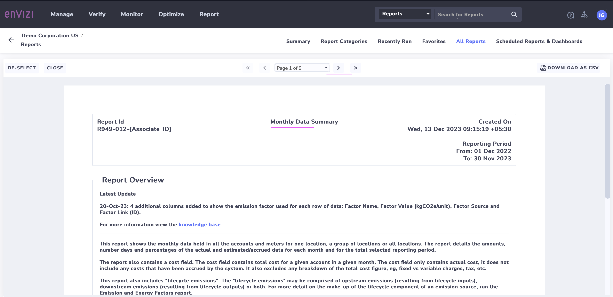
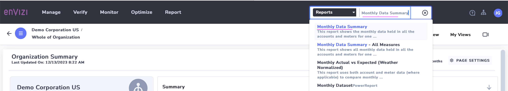
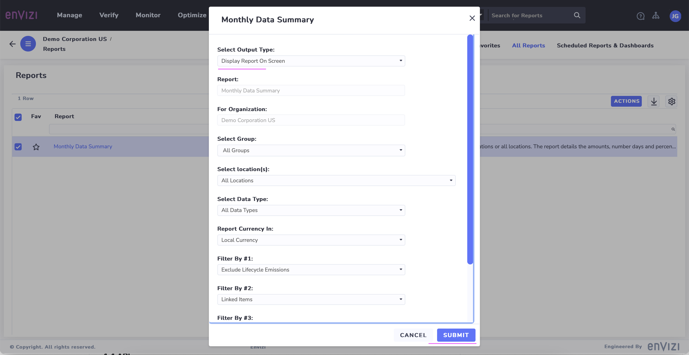
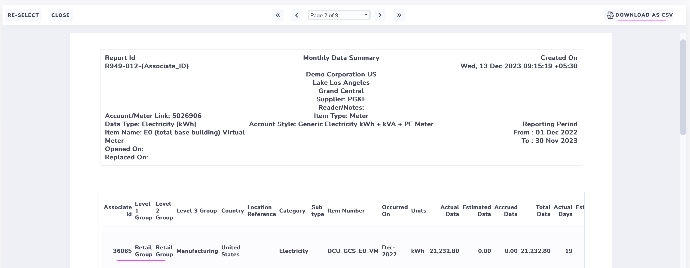
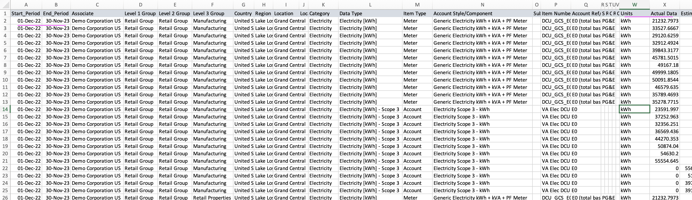

# Exploring Extract Reports

In this lab exercise you will explore about the extract reports in Envizi .

## 1 Extract Reports

CLICK ME

IBM Envizi offers some extract reports capable of extracting data, displaying it on-screen, and facilitating downloads.

It allow users to specify a range of selection criteria to view the data in screen and download and to send the report in mail.

Extracting reports provides the following options.
- Choose from various delivery methods (screen, email)
- Choose Groups, locations, Regions, Utilities, report time period/end date
- Choosing `Create Report and E-mail it now` in CSV, PDF, XLSX format
- Choosing `Schedule Report and E-mail it later` also adds the Daily, Weekly, ...etc. schedule.

Click Submit to run the report based on the selected parameters.

## 2 Available Extract Reports

Here are some of the important Extract Reports available.

CLICK ME

<table>
    <tr>
        <th>Category</th>
        <th>Report Name</th>
        <th>Description</th>
    </tr>
    <tr>
        <td>Data Management</td>   
        <td>Account Style Data Extract</td>
        <td>This report extracts account items for a single account style</td>	
    </tr>
    <tr>
        <td>Data Management</td>
        <td>Annual Data Summary</td>
        <td>Shows annualized data held in all the accounts and meters for selected  locations</td>
    </tr>
    <tr>
        <td>Data Management</td>
        <td>Monthly Data Summary Report</td>
        <td>Shows all monthly data held in all the accounts and meters for selected  locations</td>	
    </tr>
    <tr>
        <td>Data Management</td>
        <td>Survey Responses</td>
        <td>This report creates a csv file that contains all the survey responses captured</td>
    </tr>
    <tr>
        <td>Emissions, Energy and Sustainability</td>
        <td>Consumption  Summary Report</td>
        <td>It provides a comprehensive review of the CO2e attributable to a location</td>	
    </tr>
    <tr>
        <td>Emissions, Energy and Sustainability</td>
        <td>Emission and Energy Factors</td>
        <td>This report lists the factors used to calculate the GHG emissions and energy consumed or produced within your organization.</td>	
    </tr>
    <tr>
        <td>Emissions, Energy and Sustainability</td>
        <td>Emission Sources Summary Report</td>
        <td>This report shows how much was consumed (kWh, L of fuel, etc.) at all locations and how much CO2e was emitted as a result.</td>	
    </tr>
    <tr>
        <td>Emissions, Energy and Sustainability</td>
        <td>Emissions by GHG Type</td>
        <td>This report summarizes emissions by Greenhouse Gas.</td>
    </tr>
    <tr>
        <td>Emissions, Energy and Sustainability</td>
        <td>Energy Consumption Detailed</td>
        <td>his report shows activity data in native units and energy in GJ for all locations across your organization.</td>	
    </tr>
    <tr>
        <td>Extract Reports</td>
        <td>Attachment Summary</td>
        <td>provides a list of attachments across the Organization from Organization, Group, Location, Account and Meter levels</td>	
    </tr>
    <tr>
        <td>Extract Reports</td>
        <td>Audit History Report</td>
        <td>This report lists all changes made by a specified user within a company for the selected period.</td>
    <tr>
        <td>Extract Reports</td>
        <td>Extract for Accounts</td>
        <td>The report details account info such as account style, data type, location name and etc</td>	
    </tr>
    <tr>
        <td>Target Reports</td>
        <td>Monthly Performance - Actual vs Target and Budget</td>
        <td>Report compares the actual consumption in native units and cost  for a selected period</td>
    </tr>
    <tr>
        <td>System Setup Reports</td>
        <td>Account Style Extract</td>
        <td>This report lists all account styles in Envizi and their associated data type, sub type, field names (C1-C40) and account style rules.</td>	
    </tr>
    <tr>
        <td>EPA Energy Star Reports</td>
        <td>Energy Star Ratings</td>
        <td>extracts Energy Star ratings details that have been captured in Location Ratings</td>	
    </tr>
</table>

## 3 How to extract the report

CLICK ME

1. Enter a report name in the Global  Search. Ex: Monthly Data Summary

It will display the report in the search results.

2.  You can click on the report

It shows the Filter page. 

3. Click on the `Submit` button. (Keep the default values for the filter as it is)

It shows the report home page.

4. Click on the second page arrow in the top to go to next page.

The second page is displayed.

4. Click on `DOWNLOAD AS CSV` button to download the report in csv format.

The csv file looks like this.

