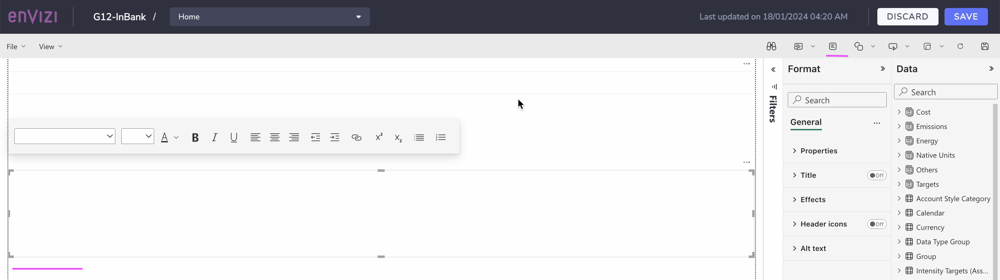
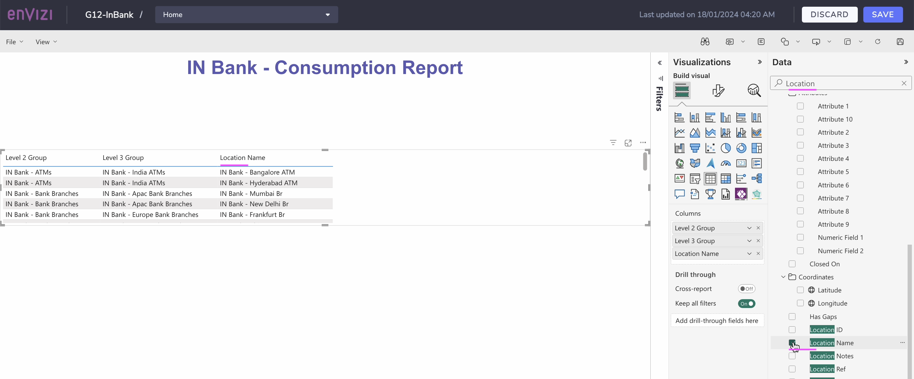
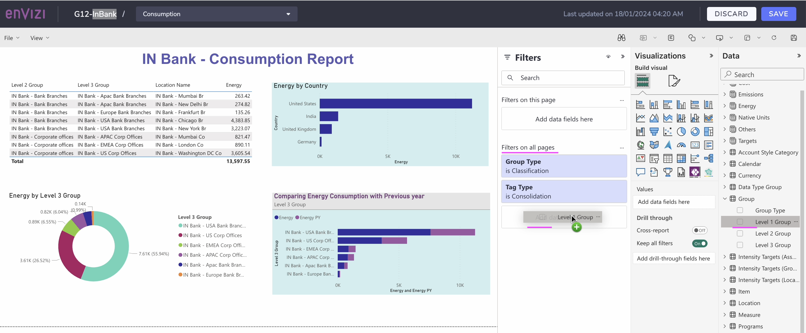

# Creating Custom Power Reports in Envizi

PowerReports can be viewed, edited and saved, and kept private or shared with other Envizi users within your organization.  This gives users the freedom to navigate and respond to the changing reporting requirements of your organization.

In this lab exercise you will explore about the How to create a new custom Power Reports in Envizi .

#### Pre-Requisite

1. Get your `Prefix-Id` from your Instructor. This id to be prefixed in all your data to avoid duplicate records. Your `Prefix-Id` could be in the format `MU11`, `MU12`.

## 1 PowerReport Edit Permission

To create a new custom power report or to edit the existing power report the user needs to have the `PowerReport Edit` work role.

## 2 PowerReport Datasets

For customers who want to build their own reports, PowerReports can be built using Standard Datasets, available with their relevant modules:

There are 3 datasets available in Envizi.

CLICK ME

### 2.1 Monthly Dataset

The Monthly Dataset is a comprehensive dataset containing monthly aggregated data from your Envizi platform. It powers the majority of Standard PowerReports across many modules and can be leveraged to build powerful custom reports directly in the Envizi platform.

A comprehensive dataset containing consolidated monthly data, which includes support for data type groups, ratios, and a range of standard data objects.

https://knowledgebase.envizi.com/home/monthly-dataset-glossary

### 2.2 Survey Dataset

The Survey Dataset supports reporting on surveys and scorecards (Surveys which include scoring) in Envizi's PowerReport framework.

The dataset includes all survey responses for all surveys that have at least one question answered. If a respondent has not filled in any answers, that Location’s (which could represent a third party like a supplier or investee) survey response will not be included.

A dataset containing survey responses and scoring for scorecard-type surveys.

### 2.3 Daily Dataset

A dataset that includes a range of daily metrics derived from interval meter data. This dataset will be supported via the Interval Meter Analytics module.

## 3 PowerReport Edit

The existing power report can be saved as a new copy and then it can be edited.

### 3.1 Open the existing Power Report

CLICK ME

1. Open a Power report that you are interested. Here lets open the `Monthly DataSet` power report.

The report is displayed like this.

### 3.2 Save a Copy

CLICK ME

1. In the above screen, click on `Save a Copy` button to save a separate copy of the report.

2. Enter the name for the report. Name of the report should start with your Prefix-Id.

3. click on `Save` button

4. Click on `View Report` button to open the saved report.

The report is displayed as below.

### 3.3 Edit Home

CLICK ME

1. In the above screen, click on `Edit` button to open the report in the edit mode.

The report is opened in Edit mode.

2. Update the heading section

3. Clear the first 2 tiles content

4. Update the 3rd tile  content

The home page of the report looks like this now.

### 3.4 Create Page

CLICK ME

1. In the above screen, click on `+` button to open a new page.

2. Enter the page name as `Consumption`

3. Click on the Textbox icon from the top

4. Enter the text as `G12 - In Bank Consumption Report`. Use your Prefix-Id instead of G12.

The content may look like this

### 3.5 Create Table data for Consumption

CLICK ME

1. From the Visualizations panel, choose the `Table` icon.

2. From the Data panel, Search for `Group`.

3. Choose the `Level 2 Group` and `Level 3 Group`

The table get displayed on the page with the L2 and L3 groups.

4. From the Data panel, Search for `Location`.

5. Choose the `Location Name`

The `Location Name` is added to the existing table.

6. From the Data panel, Search for `Energy`.

7. Choose the `Energy`

The `Energy` is added to the existing table.

8. Position the Table to the top left of the page.

### 3.6 Create Countrywise Consumption

CLICK ME

1. From the Visualizations panel, choose the `Bar Chart` icon.

2. From the Data panel, Search for `Country`.

3. Choose the `Country`

A panel get displayed on the page with the country.

4. From the Data panel, Search for `Energy`.

5. Choose the `Energy`

The `Energy` is added to the existing graph.

6. Position the Graph accordingly.

### 3.7 Create Level 3 Group wise Consumption

CLICK ME

1. From the Visualizations panel, choose the `Donut Chart` icon.

2. From the Data panel, Search for `Level`.

3. Choose the `Level 3 Group`

A panel get displayed on the page with the Level 3 group.

4. From the Data panel, Search for `Energy`.

5. Choose the `Energy`

The `Energy` is added to the existing graph.

### 3.8 Create Level 3 Group wise Consumption along with previous year

CLICK ME

1. From the Visualizations panel, choose the `Bar Chart` icon.

2. From the Data panel, Search for `Level`.

3. Choose the `Level 3 Group`

A panel get displayed on the page with the Level 3 group.

4. From the Data panel, Search for `Energy` .

5. Choose the `Energy` and `Energy PY`

The `Energy` and `Energy PY` are added to the existing graph.

### 3.9 Formatting

CLICK ME

1. Choose the `Bar Chart` Graph panel

2. From the Visualizations panel, choose the `Format` icon.

3. Choose the `General` tab

4. In the `Title > Title > Text` box enter the title as `Comparing Energy Consumption with Previous Year`.

5. Choose the `Text Color` as well.

6. In the `Title > SubTitle > Text` box enter the title as `Level 3 Group`.

7. Choose the `Title > Title > Background color` accordingly for the panel heading.

8. Choose the `Effects > Background > color` accordingly for the panel body.

9. Choose the `Energy by Country` `Bar Chart` panel

10. From the Visualizations panel, choose the `Format` icon.

11. Choose the `General` tab

12. Choose the `Effects > Background > color` accordingly for the panel body.

### 3.10 Save

CLICK ME

1. Click on `Save` button to save the report.

The report is saved.

2. Label the button to `Consumption Report`

### 3.10 Create Account Level Consumption Page

CLICK ME

1. In the above page, click on `+` icon to create new page.

2. Enter the page name as `Account Consumption`

3. Create a label with the text `Account level Consumption`.

4. From the Visualizations panel, choose the `Pie chart` icon.

5. From the Data panel, choose the `Energy` and `Item Name`.

They get added to the page like this.

### 3.11 Update Home Page

CLICK ME

1. From the Home page, copy and paste the existing tile 3 content in to tile 2.

2. Change the labels of title and button accordingly in tile 3.

3. Choose the button `Account Consumption Report`

3. Choose the  `Button > Action > Destination` value as `Account Consumption`. (To enable the button click to open the `Account Consumption` page.)

3. Click on `Save` button.

### 3.12 Navigate from Home Page

CLICK ME

Now the page is in the view mode.

1. Click on the `Consumption Report` button.

It opens the `Consumption Report` page

2. Click on the `Account Consumption Report` button.

It opens the `Account level Consumption Report` page

### 3.13 Create Filter

CLICK ME

You can apply filters at 3 levels
- Entire Report Level
- Page Level 
- Panel Level

1. Click on `Edit` button to open the report in Edit mode.

The report is opened.

2. Open the `Consumption` page

3. Choose the `Filters` Panel

See the `Filters on all pages`

3. From the `Data` panel, drag and drop the `Level 1 Group` in to the `filters on all pages` section.

4. Select the `In Bank` check box to show only the data from `In Bank`. In your case you need to choose the `In Bank` with your Prefix-Id.

5. Click on `Save` button

The page is in view mode now.

The filters panel shows that the `In Bank` is selected by default.

6. Choose some other value from `Level 1 Group` and the entire page refreshes accordingly.

### 3.14 Sharing

CLICK ME

The custom report created is available exclusively for the current user.

1. Right click on the report.

2. Choose `Sharing`

3. Confirm it by clicking on `Yes`

The report is available for all the users now.

## Reference

1. Monthly Dataset - Glossary - Basic Fields
https://knowledgebase.envizi.com/home/monthly-dataset-glossary

2. Monthly Dataset - Glossary - Advanced Fields
https://knowledgebase.envizi.com/home/monthly-dataset-glossary-advanced-fields

3. Monthly Dataset - Tutorials
https://knowledgebase.envizi.com/home/monthly-dataset-tutorials

