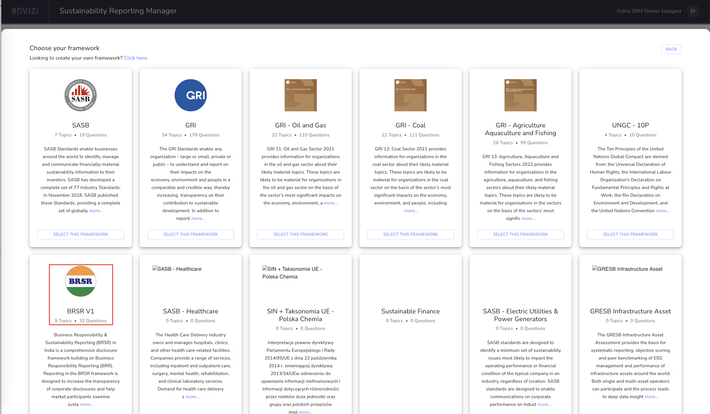
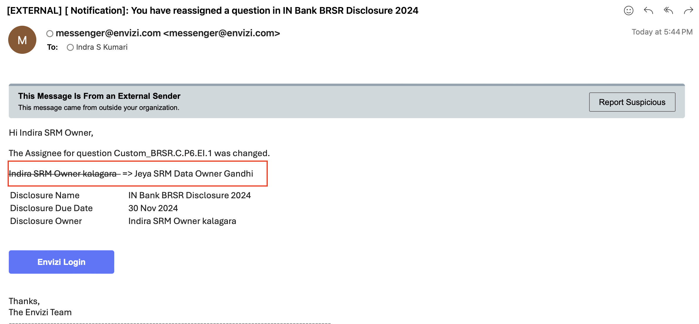
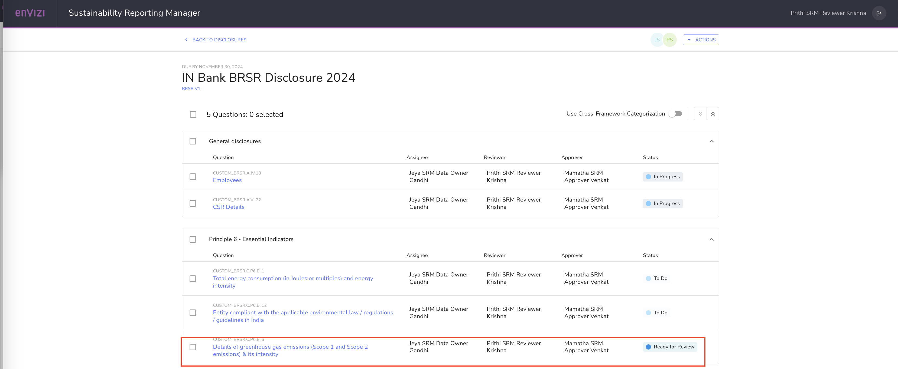

# Working on ESG disclosures as a Sustainability Reporting Manager (SRM)

In this lab exercise you will learn how to leverae Sustainability Reporting Manager Module of Envizi to help create the ESG disclosures and work on the same. 
In this lab, we will use various role plays who would create disclosure, work on disclosure questions, review the responses and approve to the completion.

We will basically follow the workflow as shown here from end-to-end, create disclosure, assign ownership, complete the disclosure.

To do this lab with various personas, we should have the following users created with the roles provided in the table under column named `Access + Special Role`. To create the users and logins please refer [User creation lab exercise](/161-Creating-Contacts-and-Users-using-ui/readme.md) and create the following users by logging into Envizi with `System Adminstrator` role.  The SRM Persona will be defined in the SRM module while working on the disclosures.

<table>
    <thead>
        <th>First Name </th>        
        <th>Username </th>
        <th>Access + Special Role </th>        
        <th>SRM Persona </th>
    </thead>
    <tr>
        <td>Your Envizi Admin User</td>
        <td>Envizi System Admin user</td>        
        <td>System Administrator</td>
        <td>System Administrator + SRM Role</td>        
    </tr> 
    <tr>
        <td>xxx_SRM Owner</td>    
        <td>xxx_srmowner</td>
        <td>General User + SRM Role</td>                
        <td>Disclosure Owner</td>
    </tr> 
    <tr>
        <td>xxx_Data Owner</td>
        <td>xxx_dataowner</td>
        <td>General User + SRM Role</td>                
        <td>Data Owner</td>        
    </tr> 
    <tr>
        <td>xxx_SRM Reviewer</td>    
        <td>xxx_srmreviewer</td>
        <td>General User + SRM Role</td>                
        <td>SRM Reviewer</td>
    </tr> 
    <tr>
        <td>xxx_SRM Approver</td>    
        <td>xxx_srmapprover</td>
        <td>General User + SRM Role</td>                
        <td>SRM  Approver</td>        
    </tr> 
    </table>

## 1. Navigate to `Sustainability Reporting Manager` with various roles

### 1.1 Login with System Administrator Access Role + SRM 
1. Login into as System Administrator role with SRM Role access
   
2. Click on Envizi  `Sustainability Reporting Manager` in the home page

The  Sustainability Reporting Manager page is opened in new browser session.

3. View the disclosures if any  and also two options `Framework Library` and `Add Disclosure`

Observer that, user with `System Administrator` role can create the disclosures. 

### 1.2 Login with General User Access Role + SRM : xxx_SRM Owner

1. Login into Envizi UI in separate browser
2. Click on Envizi  `Sustainability Reporting Manager` in the home page
3. On the Sustainability Reporting Manager page , you can see  `Framework Library`. 

However you do NOT find the `Add Disclosure`  button, because currently you are not owner of any disclsoure or assigned to any disclosure to work on.

## 2. Create to Disclosure and assgin to owner

1. Login with  `System Administrator` role with SRM Role access
2. Go to  `Sustainability Reporting Manager`  

3. Click on  `Add Disclosure`

4. Add details as below for the disclosure and assign to a owner `(xxx_SRM Owner)`
- `Name` : Provide name of the disclosure
- `Disclosure Owner` - Select SRM Owner user `xxx_SRM Owner` from the list. Type first 3 letters of user firstname, list would appear.
- `Default Asignee` - Same as SRM Owner as above
- `Default Reviewer` - Same as SRM Owner as above
-  Set Due Dates for `Ready for Review`, `Complete by` and `Disclosure Due by`

Please note that we are setting all the users to the same as Disclosure owner here, because in the next step the disclosure owner can take more control on whom to assign which roles. 

Similarly, Disclosure Owner can assign an `approver`, hence not selected here.

## 2. Working on Disclosure as Disclosure Owner(xxx_SRM Owner)

### 2.1 Add Framework and questions to Disclosure
1. Login to Envizi as xxx_SRM Owner 
2. Navigate to  `Sustainability Reporting Manager`

3. Click on `Framework Library`  to view various libraries available and Click on `Back To Disclosures` 
   
4. On SRM home page, Click on `View` under the disclosure created above `IN Bank BRSR Disclosure 2024`

5. You can view the Disclosure details. As there no frameworks / questions added you would probably see a blank page.

6. Click on `Actions` > `Add Questions`

7. The page will display the set of frameworks available in Envizi. Chose a framework by clicking a `Select this framework`. For example `BRSR`

8. On the next Framework page, select the questions as you wish. For this exercise we select all the questions  

9. Click on `Save`

10. Now, the disclosure owner can see all the questions on this page, along with the defautl assignee and reviewer  to the questions. 

However there is no approver role assigned. Hene Disclosure owner wants to include an approver and then assign the questions to various users

### 2.2 Update  Disclosure Properties to assign Approver

1. On Disclosure page, click on `Actions` > `Set Properties`

2. On the `Update Disclosure` window, set the following properties
- Select `Include Approver` checkbox
- Set `Default Approver` to an approver user `xxx_SRM Approver`
- Set `Ready for Approved by` date 
- Select `Include Notifications` checkbox at the end of the page.

3. Leave other fileds as-is and click `Save`

4. Now you can see the `Approver` role assigned against each question. 

### 2.2 Assign questions and set reviewer

Now that the disclosure is created and also added the questions, the disclosure owner would like to distribute the questions to different users who can work on the question and provide the appropriate response.  And A reviewer is assigned to each question so that he/she can review once the response is ready

1. On Disclosure page, Select the set of questions which you want to assign

2. Click on `Assignee` but at the botton of the page 
   
3. Remove current assignee and select the user `xxx_SRM Data Owner` 
   
4. Click `Yes`
   

5. Similarly, Change Reviewer user. Click `Reviewer` button 
6. Remove current reviwer  and select the user `xxx_SRM Reviewer` 

7. Now you can view on the page, the Assignee and Reviewers got updated.

8. For each question and update, there is an Email notifications sent by the system. User can check their inbox for the messages from `messenger@envizi.com <messenger@envizi.com>' 
   An example will look like this 

## 3. Working on Questions assigned by Assignee (xxx_SRM Data Owner)

1. Log into Envizi with user `xxx_SRM Data Owner`
2. Navigate to `Sustainability Reporting Manager` page

3. The page displays the details about the disclosure like 
- Number of questions assigned and in different status (Todo,In progress, Ready for Review, Ready for Approval, Complete ) 
- Due date with respect to reivew / approval / completion and disclosure
- reviwers assigned

4. Click on `View`

5. Select a question to work on 

6. Update the status of the question from `Todo`  to `In Progress`

8. View the question and go through the details, guidance

7. Scroll down and look at the Envizi Guidance to help answer the questions 

For each of the question, Envizi provides additional guidance along with the supported which can supply the inputs to respond to the question.
For examplle, for this selected question related to Scope 1, 2 emissions, Envizi Guidance  provides link to `Sustainaility Executive Report`

Click on the `Sustainaility Executive Report` to get the details related to various scopes, to fill back as response to the question. 

8. You can fill the response based on the guidance and inputs from the report.

You can leverage  `Search Responses` option on the  on top right corner , to get  matching response for this questions from previous / other disclosures if any available, where the similar question is answered / have responses filled. 

9. Add attahchments. For example, you can download the `Sustainaility Executive Report`  and attach as a supporting document for the quantitative information provided. Similarly can add links and any other external documents as supplements for the response.

10. Once done with response, Send to review by changing the  status from `In Progress` to `Ready for Review`

11.  Similarly, work on other questions. Update Status to `In progress`  and then change to `Reday to Review` once complete. 
12.  Go back to disclosure page, view the overall progress with respect to number of questions assigned to the user

13. Click on various `statuses` on right side, and you can view the `% completion` against each `status` for the questions assigned to you.

Now that the some questions are assigned to review, lets look at Reviewer's view of `Sustainability Reporting Manager` page
`
    

## 3. Reviw the questions by Reviewer (xxx_SRM Reviewer)

1. Log into Envizi with user `xxx_SRM Reviwer`
2. Navigate to `Sustainability Reporting Manager` page

   
3. Click on `View` and look at the status of the questions.
4. Click on the question with status `Ready for Review`

5. Reivew the response and add comments as neccessary.

6. Change the status from `Ready for Review` to `Ready for Approval`

Note: If the response is not satisifactory, Reviewer can send back the question to assignee by changing the status from `Ready for Review` to `Todo` / `In Progress`
   

## 4. Approve the questions Review on Questions by Reviewer (xxx_SRM Reviwer)

1. Log into Envizi with user `xxx_SRM Approver`

2. Navigate to `Sustainability Reporting Manager` page

3. View the total number of questions assigned to the approver on chart on right side and `% of status` against each status

4. Click on the question with status `Ready for Approval`

5. Click on `View`

6. Review the responses provided and comment 

7. Change status from `Ready for Approval` to `Complete`
   
Note:
In case, the responses are not satisifactory or additional information is needed , then the approver send back the question to either reviewer or directly to assignee by changing status from `Ready to Approval` to `Ready for Review` / `Inprogess` to `Todo`. 

8. Go back to `Disclosures` page and view the `% of completion` on the chart.

## 4. Export Disclosure document 

The user can download the disclosure either as  `pdf` or `Microsoft Word` with whatever necessary details relevant based on the requirements.

1. Navigate to `Sustainability Reporting Manager` page
2. Click `Export` button in the `disclosure` tab

3. Check / Uncheck the content which needs to be included in the document and also the `Download attachments`

4. Click on `Export`
5. The file is downloaded in .zip format to your local system
6. Open the file and view the content

## Conclusion:  
In this lab, we have learnt how an organization can use Envizi to create an ESG Disclosure for their annual ESG reporting disclosure requirements including various frameworks. We have also learnt how different personas with different roles such as disclosure owner, assignee, reviewer and approver, can participate in the disclosure preparation and bring to completion. 
You can also view the additional details on the SRM [here](readme-additional.md)
