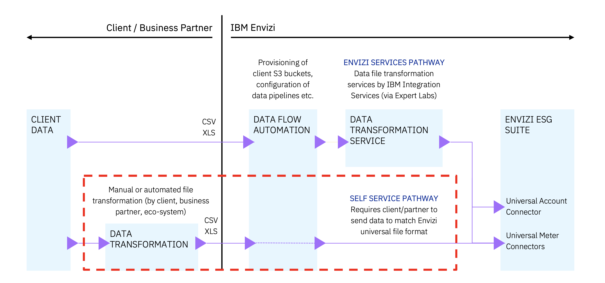
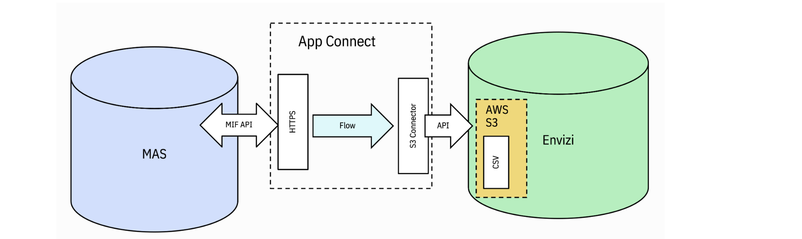
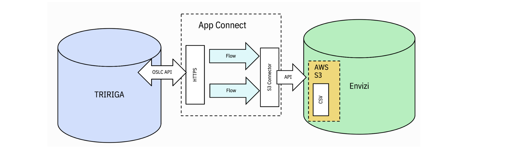
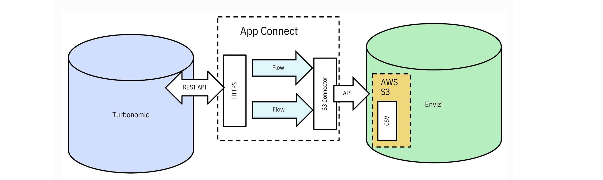
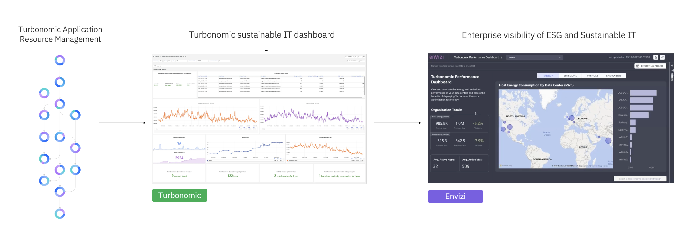

# Integrating Envizi with external Systems

## Envizi Services Pathway

## IBM Sustainability Software Portfolio Connectors

IBM TRIRIGA Application Suite (TAS) and IBM Maximo Application Suite (MAS) customers have access to a collection of predefined integrations between TAS, MAS, and IBM Envizi ESG Suite. Those integrations can be used in a variety of combinations to enable many usecases and they can each be configured for additional flexibility.

https://ibm.github.io/IBM-Sustainability-Software-Portfolio-Connectors/

### IBM Maximo Connector for Envizi

https://ibm.github.io/IBM-Sustainability-Software-Portfolio-Connectors/max-envizi-index/

### IBM Tririga Connector for Envizi

https://ibm.github.io/IBM-Sustainability-Software-Portfolio-Connectors/tas-envizi-index/

### IBM Turbonomic Connector for Envizi

#### Connector

https://ibm.github.io/IBM-Sustainability-Software-Portfolio-Connectors/turbonomic-envizi/

#### IBM Turbonomic Dashboard

#### Integrating Turbo with Envizi via AppConnect for Green IT data 
https://community.ibm.com/community/user/envirintel/blogs/jeya-gandhi-rajan-m1/2023/03/23/integrating-turbo-with-envizi-via-appconnect

#### Turbonomic Performance Dashboard in Envizi 
https://community.ibm.com/community/user/envirintel/blogs/jeya-gandhi-rajan-m1/2023/04/01/turbonomic-performance-dashboard-in-envizi

