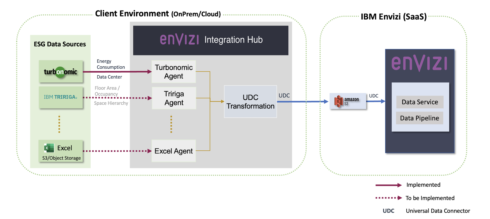
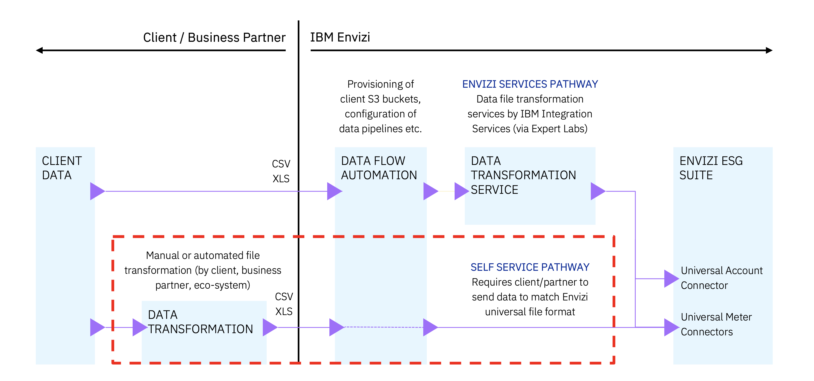

# Envizi & Turbonomic Integration via Integration Hub

Envizi Integration Hub facilitates the integration of data from various external systems into the IBM Envizi ESG Suite.

It connects to external systems, such as Turbonomic, retrieves emissions data, converts this data into the Universal Account Setup and Data Loading format (UDC), and then dispatches it to an S3 bucket configured within the IBM Envizi ESG Suite.

#### Integrate IBM Turbonomic data with IBM Envizi using Envizi Integration Hub

https://developer.ibm.com/tutorials/awb-integrate-turbonomic-with-envizi/

## Source

https://github.com/ibm-ecosystem-engineering/envizi-integration-hub-app

## Envizi Services Pathway

