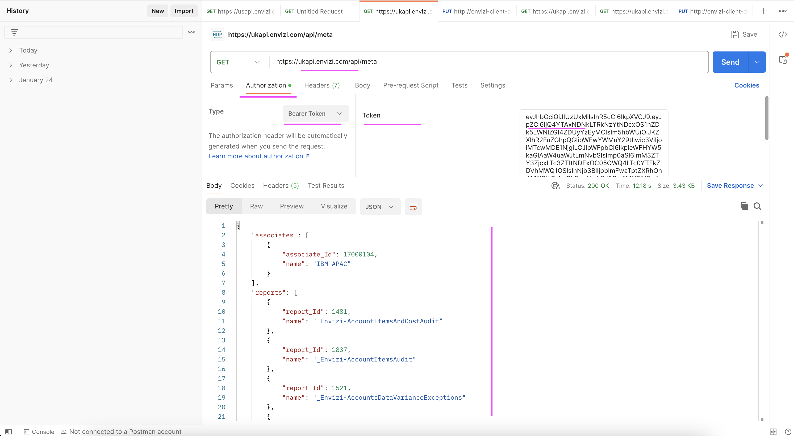

# Exposing Envizi data to external systems by using API 

The objective of this lab is to understand about Envizi APIs. This helps to learn about the different APIs available in Envizi and how to use them to get the data from Envizi to feed into the external systems..

Envizi provides the following 3 types of APIs to the user.
1. Retrieve Report Names
2. Retrieve Report Parameters
3. Retrieve Report Data

# 1 API URL

The root URL of the API would be the following.

- For Australia, New Zealand and ASEAN users - https://auapi.envizi.com/api
- For US and Canada users - https://usapi.envizi.com/api
- For UK, Europe and South African users - https://ukapi.envizi.com/api
- For most Middle East users - https://meapi.envizi.com/api

# 2 API Authentication

The Envizi API employs `API Access Token` for authorizing access to Envizi API. 

Any eligible active Envizi user is able to generate and use an API token when the user has a `API Token Personal Role` assigned. 

Here are the instructions for [generating the API Access Token](../202-api-access-token)

# 3 Using API

## 3.1 Retrieve Report Names

The `meta` API option allows the user to get the `list of reports` available for data download via API for this user. 

The report names retrieved here to be used with all other `report meta` and `data` API calls.

<details><summary>CLICK ME</summary>

### Sample URL

The sample url looks like this
    
    https://ukapi.envizi.com/api/meta


### Sample PostMan Request


### Sample Curl Code 

<details><summary>CLICK ME</summary>

Here is the sample code using `meta` API to pull the report names.

```
export API_REGION=<<REGION>>
export API_ACCESS_TOKEN==<<TOKEN>>

export API_SUFFIX=api.envizi.com/api
export API_URL="https://$API_REGION$API_SUFFIX/meta"

curl "$API_URL" --header "Authorization: Bearer $API_ACCESS_TOKEN"
```

- `<<TOKEN>>`    : API Access token of the Envizi user generated following the instructions from section 3 API Authentication
- `<<REGION>>`  : The value would be `uk` , `au`, `us` or `me` based on the user region.

</details>

### Sample Output

The sample Output of the above API call is given in [meta.json](./files/data/meta.json) file. 

The important reports are highlighted here.


</details>

## 3.2 Retrieve Report Parameters

Envizi provides an `reports meta` API to retrieve the list of available `Parameter Names and its Ids` for the specified report. This helps the user to understand what parameters they can use to filter the report data while using API.

<details><summary>CLICK ME</summary>

The parameters could be 
```
- Group_Id
- Location_Id
- Utility_Type_Id
- Currency_Id
- Period : { 1, 3, 6, 9, 12, 24, 36, 48, 60} - How many months of data from the given end Period.
- End_Period : End period of the data. e.g. 2023/04/30
- etc
```

Let us see about how to retrieve report parameters.

### Sample URL

The sample url looks like this  

```
Format: 
https://ukapi.envizi.com/api/meta/reports/<<REPORT_NAME>

Example:
https://ukapi.envizi.com/api/meta/reports/_Envizi-SetupLocations
```


### Sample PostMan Request


### Sample Curl Code

<details><summary>CLICK ME</summary>

Here is the sample code using `report meta` API to pull the report parameters.


```
export API_REGION=<<REGION>>
export API_ACCESS_TOKEN==<<TOKEN>>

export REPORT_NAME=_Envizi-SetupLocations

export API_SUFFIX=api.envizi.com/api
export API_URL="https://$API_REGION$API_SUFFIX/meta/reports/$REPORT_NAME"


curl "$API_URL" --header "Authorization: Bearer $API_ACCESS_TOKEN"
```

- REPORT_NAME
    - Any report name taken from the previously retrieved [meta.json](./files/data/meta.json) file. 
    - Here we are using `_Envizi-SetupLocations` to get location parameters.

</details>


### Sample Output

The sample Output of the above API call is given in this [report-parameters.json](./files/data/report-parameters.json) file. 

The screenshot of the above output with the important values can be found here.

There are 3 parameters (`Group_Id`, `Location_Id` `Filter_By`) and its available values found for the given report.


</details>

## 3.3 Retrieve Report Data

Envizi provides an `reports data` API to retrieve data from the given report. You can pass report filter parameters along with API to get filtered data. 

<details><summary>CLICK ME</summary>

### Sample URL

The sample url looks like this.

#### 1. Without Parameters

```
Format: 
    https://ukapi.envizi.com/api/data/<<REPORT_NAME>

Example:
    https://ukapi.envizi.com/api/data/_Envizi-SetupLocations
```

#### 2. With `Group_Id` Parameter

```
    https://ukapi.envizi.com/api/data/<<REPORT_NAME>>?<<PARAM_NAME1>>=<<PARAM_VALUE1>>

    https://ukapi.envizi.com/api/data/_Envizi-SetupLocations?Group_Id=12345
```

#### 3. With `Period, End_Period, and Location_Id` Parameters

```
    https://ukapi.envizi.com/api/data/_Envizi-MonthlyDataSummary?Period=1&End_Period=2023/03/31&Location_Id=5003114
```


### Sample PostMan Request


### Sample Curl Code

<details><summary>CLICK ME</summary>


Here is the sample code using `report data` API to pull the report data.


```
export API_REGION=<<REGION>>
export API_ACCESS_TOKEN==<<TOKEN>>

export REPORT_NAME=_Envizi-SetupLocations
export GROUP_ID=5037106

export API_SUFFIX=api.envizi.com/api
export API_URL="https://$API_REGION$API_SUFFIX/data/$REPORT_NAME?Group_Id=$GROUP_ID"

curl "$API_URL" --header "Authorization: Bearer $API_ACCESS_TOKEN"
```

- REPORT_NAME
    - Name of the report for which we need to retrieve data. 
    - See [meta.json](./files/data/meta.json) file to view the list of report names. 
    - Here `_Envizi-SetupLocations` report is used.
- GROUP_ID
    - To filter the report data based on the Group_Id. 
    - See [report-parameters.json](./files/data/report-parameters.json) file to view the list of available group id. 
    - Here `TurbonomicD1` > `ONPREM-DataCenter` subGroup is used.

</details>

### Sample Output

The sample Output of the above API call is given in this [report-data.json](./files/data/report-data.json) file. 

The screenshot of the above output with the important columns can be found here.

There are 3 locations (`HawthorneSales`, `UCS-DC-10.10.150.38` `vc03dc01`) found under the given group id.


- Location Name : Column shows the retrieved location.
- Group Link : Column shows the `GROUP_ID=5037106` parameter that we passed in.
- Group Name : Columns shows the `Group Name` equivalent of the GROUP_ID that we passed in.

</details>

# 4 Scripts (Optional)

Here Shell scripts are given to Retrieve report names, all the report params and all the report data using APIs .

Here are the steps to execute the script if needed.

<details><summary>CLICK ME</summary>

## 4.1 Update Config file

1. Download this github repo.

2. Go to the [files/src](./files/src) folder in the command prompt.

```
cd files/src
```

## 4.2 Update Config file

1. Update the below properties in `config.sh`

```
### Envizi API Access Token
export API_ACCESS_TOKEN==


### Region (uk, au or us) based on the user region
export API_REGION=
```

- API_ACCESS_TOKEN :  API Access token of Envizi User
- API_REGION : The value would be `uk` , `au`, `us` or `me` based on the user region.

## 4.3 Retrieve Report Names

1. Run the below script to retrieve the report names.
```
sh 01-meta.sh
```

- It would create a new folder with timestamp under [output](./files/src/output) folder.
- In the new folder the `meta.json` file might have created.


## 4.4 Retrieve Report Parameters

Here we are retrieving all the reports parameters one by one. 

1. Run the below script. 

```
sh 02-report-param.sh
```

- It would create a new folder with timestamp under [output](./files/src/output) folder.
- In the new folder bunch of json files get created.

Note: This script takes time to execute based on the data available in the org. So few lines are commented in the script. You can uncomment and try.

## 4.5 Retrieve Report Data

Here we are retrieving all the reports data one by one. 

1. Run the below script 

```
sh 03-report-data.sh
```
- It would create a new folder with timestamp under [output](./files/src/output) folder.
- In the new folder bunch of json files get created.

Note: This script takes time to execute based on the data available in the org. So few lines are commented in the script. You can uncomment and try.

</details>


# 5. How to use PostMan

<details><summary>CLICK ME</summary>

Lets retrieve the Report Names using the PostMan.

1. In the postman, click on + to create new tab.


2. Enter the following in the postman window.

    - The URL.  Ex: `https://ukapi.envizi.com/api/meta`
    - GET option to be selected
    - Authorization > Bearer token > Token




3. Click on the `Send` button

4. View the results in the bottom section of the window.

</details>

</details>

# 6. Reference

Envizi API Technical Documentation
https://knowledgebase.envizi.com/home/envizi-api-technical-documentation