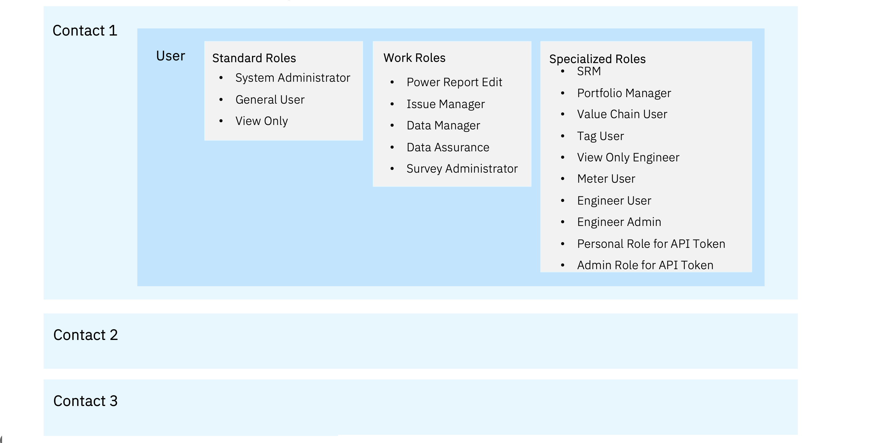

# Understanding Contacts, Users and User roles in Envizi

In this article let us understand about the Contacts, Users and User roles in Envizi

- Need to create `Contact and Login` with appropriate access levels to login into Envizi.
- Can use `Create New User` functionality to set up the user with both a contact and a login in one step.
- Only `System Administrators` can create, edit and delete contacts and logins.
-  `Contact only` (not having login) they can just receive emailed reports, dashboards or notifications or links to PowerReports and not able to login to Envizi.

## 1. Envizi Access Level and Access Role Explained

#### 1.1 Access Level
Access Level determines what data a user is able to see. In general there are 4 access levels in Envizi. 
- Organization
- Group
- Location
- Tag.

#### 1.2 Access Role
Access Role determines the ability of a user to make data changes in Envizi. In general, there are 3 Access Roles in Envizi
- System Administrator
- General User 
- View Only

## 2. Types of Users

#### Contacts, Logins and Roles

### 2.1 Standard Roles

- **System Administrators** can manage `groups`, `locations`, `accounts`, `contacts` and logins and organization preferences.

- **General User** can run reports, view data and `enter data` into Envizi.

- **View Only** users can run reports, `view data` but cannot edit any data in your organization.

### 2.2 Specialised Roles

**Engineer Admin** has a user experience that is optimized for users of EFD and APM. The user has a limited set of menus which align with the EFD and APM modules. They also have addition menus related to system administration functions.

**Engineer User** has a user experience that is optimized for users of Equipment Fault Detection (EFD) and APM. The user has a limited set of menus which align with the EFD and APM modules.

**Meter User** has a user experience that is optimized for users of Interval Meter Monitoring (IMM). The user has a limited set of menus which align with the IMM module.

**Portfolio Manager** has a user experience that is optimized for Group level users who manage a single group and who login to Envizi to perform specific tasks such as capturing data, resolving data issues, fulling in surveys, resolving Interval Meter Alerts and managing Program Actions. Your organization needs to actively use Issue Tracking and or the Programs module for this experience to be useful to users as it is driven by the Issues and Program Actions assigned to the Portfolio Manager user. You can read more about the Portfolio Manager user here.

**Sustainability Reporting Manager (SRM)** User is a login level role that can be added to individual users to provide them with access to the Sustainability Reporting Manager. This can be added on the Login page.

**Value Chain User** is a user usually external to your organization who is asked to respond to value chain surveys. They have a user experience optimized to responding to surveys as part of the Value Chain Surveys and Assessments module.

**View Only Engineer** has a user experience that is optimized for users of EFD and APM. The user has a limited set of menus which align with the EFD and APM modules. View only users can’t edit or change information, rather only view charts and run reports.

**Tag User** has a user experience that is optimized for users who have general user access to one Tag only.

**Tag View Only** has a user experience that is optimized for users who have view only access to one Tag only.

**Personal Role for API Tokens** allows the user to have access to APIs.

**Admin  Role for API Tokens** allows the user to have access to APIs.

In this lab exercise we will create Contacts and Logins in Envizi for a given organization using Envizi Setup Contacts excel template.

## 3. Work Roles

Work roles enable users to perform specialized functions, the main one being receiving the Data Receipt report when automated data loaded into the platform. 

- There may also be work roles that are specific to a particular module. 
- Each module will specify what work roles may be required to perform specific functions within that module.
- A contact can have multiple work roles

Here are the roles available.

1. Data Assurance - used in Data Receipt reporting.
2. Data Manager - used in Data Receipt reporting.
3. Issue Manager - used in Issue Management.
4. PowerReport Edit - used in PowerReports.
5. Survey Administrator - used in Value Chain Survey.

## Next Steps

You can learn about how to create Contacts and logings.

1. Create Contacts and Logins in Envizi using UI : [Link](../161-Creating-Contacts-and-Users-using-ui)

2. Create Contacts and Logins via Excel Template : [Link](../162-Creating-Contacts-and-Users-using-template)