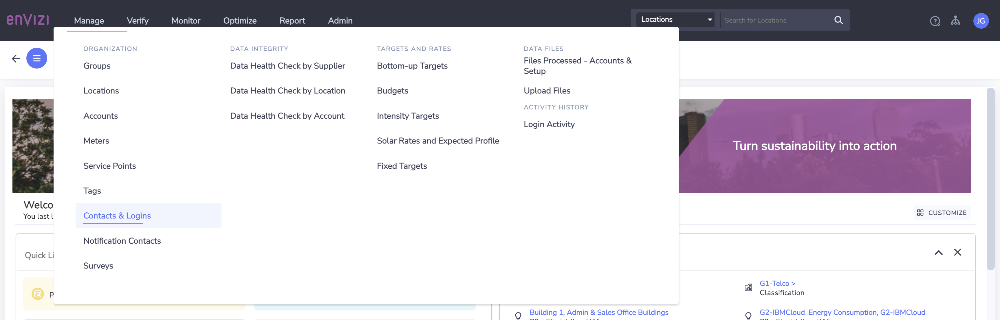
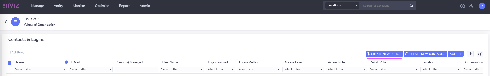
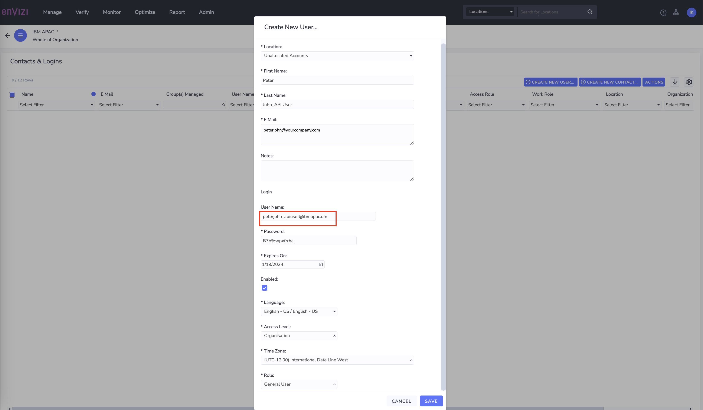
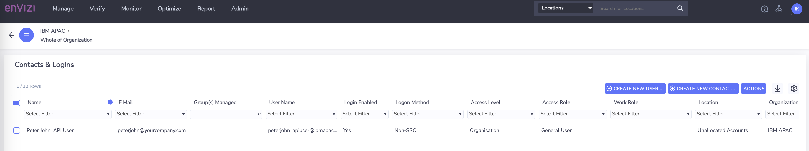
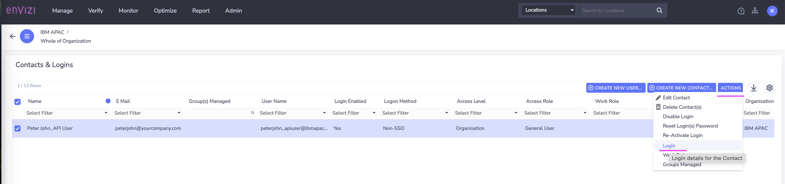
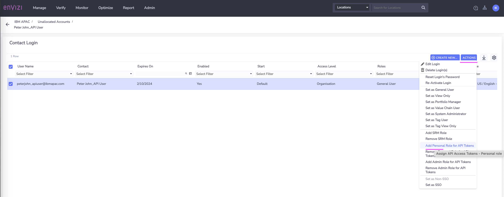
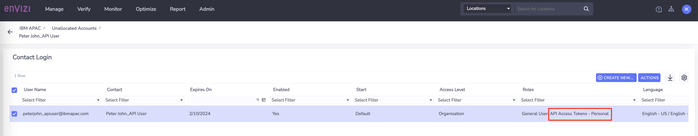
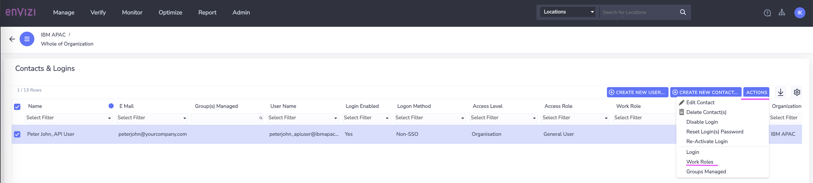
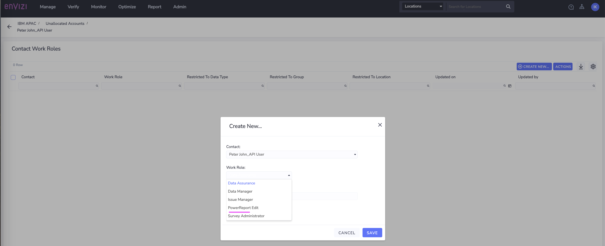
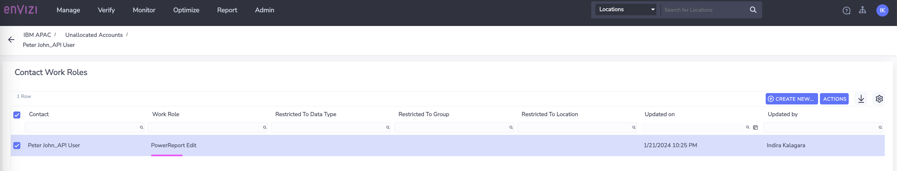

# Create Contacts and Logins in Envizi using UI

In this lab exercise we will learn how to create users in Envizi and also assign different access level and roles to exercise different responsibilites in your organization. 

## 1. How to create user and assign roles

In this section, we are just going to  understand how to create new user and how to assign roles.  Section 2, only contains the lab that team needs to do.

### 1.1. How to Create New User

CLICK ME

Here are the steps to create new users.  

1. Navigate to `Manage > Contacts & Logins` 

2. Click on `Create New User` 

3. Enter the details of the user in `Create New User ...` popup window

- **Location    :** `Unallocated Accounts`
- **First Name  :** Provide First Name and Suffix (ex: `Peter APIUser`)
- **Last Name   :** Provide LastName (ex: `John`)
- **Email       :** Give your email, so that you can receive the otifications
- **User Name   :** Provide username in the format given in the table (ex: `peter_john_apiuser@ibmapac.com`)
- **Password    :** Provide password (12 characters. Atleast 1 caps, 1 small, 1 digit and 1 special char)
- **Expires On  :** Select later date
- **Enable      :** Leave default to selected
- **Language    :** Leave default or select based on your preference
- **Access Level:** `Organization`
- **Time Zone    :** As per your timezone
- **Role         :** `General User`

4. Click on `Save` 

The user is created successfully along with the contact details and also enabled to login to Envizi platform. Once the user is created, next step is to assgin the roles.

### 1.2. How to Assign Specialized Role

CLICK ME

1. Select the Contact from the `Contacts & Login` 

2. Click on `Actions > Login`

3. On `Contact Login` page, Click on `Actions`

4. Select the specialized role for the user.  Ex: For API User, select  `Add Personal Role For API Tokens` 

5. The role is assigned and can be view on the `Contact Login` screen

### 1.3. How to Assign Work Role

CLICK ME

1. Select the Contact from the `Contacts & Login` 
2. Click on `Actions > Work Roles`

3. On `Contact Work Roles` page, Click on `Create New`
4. Click on `Work Role` drop-down
5. Select the work role as mentioned for the user. Ex: `Power Report Edit`

6. Leave rest of the fileds to default 
7. Click on `Save`
8. The role is assigned and can be view on the `Contact Login` screen

## 2. Excercise

CLICK ME

### Create PowerEdit User

Create an user with the below details and assign the worker role.

- First Name : YourFirstName PowerEditUser (ex: `Peter PowerEdit`)
- Last Name : YourLastName
- User Name : YourFirstName_YourLastName_poweredit@ibmapac.com  (ex: `peter_john_poweredit@ibmapac.com`)
- Access Role : General User
- Work Role : PowerReport Edit

### Create API User

Create an user with the below details and assign the specialized role.

- First Name : YourFirstName APIUser (ex: `Peter APIUser`)
- Last Name : YourLastName
- User Name : YourFirstName_YourLastName_apiuser@ibmapac.com  (ex: `peter_john_apiuser@ibmapac.com`)
- Access Role : General User
- Specialized Role : Personal role for API Tokens

### Create Issue Manager

Create an user with the below details and assign the work role.

- First Name : YourFirstName IssueManager (ex: `Peter IssueManager`)
- Last Name : YourLastName
- User Name : YourFirstName_YourLastName_issuemanager@ibmapac.com  (ex: `peter_john_issuemanager@ibmapac.com`)
- Access Role : General User
- Work Role : Issue Manager

### Create SRM User

Create an user with the below details and assign the specialized role.

#### SRM Owner

- First Name : YourFirstName SRM Owner (ex: `Peter SRM Owner`)
- Last Name : YourLastName
- User Name : YourFirstName_YourLastName_srm@ibmapac.com  (ex: `peter_john_srmowner@ibmapac.com`)
- Access Role : General User
- Specialized Role : SRM Role

#### Data Owner

- First Name : YourFirstName Data Owner (ex: `Peter Data Owner`)
- Last Name : YourLastName
- User Name : YourFirstName_YourLastName_srm@ibmapac.com  (ex: `peter_john_dataowner@ibmapac.com`)
- Access Role : General User
- Specialized Role : SRM Role

#### SRM Reviewer

- First Name : YourFirstName SRM Reviewer (ex: `Peter SRM Reviewer`)
- Last Name : YourLastName
- User Name : YourFirstName_YourLastName_srm@ibmapac.com  (ex: `peter_john_srmreviewer@ibmapac.com`)
- Access Role : General User
- Specialized Role : SRM Role

#### SRM Approver

- First Name : YourFirstName SRM Approver (ex: `Peter SRM Approver`)
- Last Name : YourLastName
- User Name : YourFirstName_YourLastName_srm@ibmapac.com  (ex: `peter_john_srmapprover@ibmapac.com`)
- Access Role : General User
- Specialized Role : SRM Role

## 3. Conclusion 

This concludes the lab and you will be using the users created in this lab in the subsequent labs.