# Create Contacts and Logins via Excel Template

In this lab exercise we will create Contacts and Logins in Envizi for a given organization using Envizi Setup Contacts excel template.

#### Pre-Requisite

1. Get your `Prefix-Id` from your Instructor. This id to be prefixed in all your data to avoid duplicate records. Your `Prefix-Id` could be in the format `MU11`, `MU12`.
2. Get the `Organization` name from Instructor.

#### Key steps

Here are the key steps in this process:
1. Download the Envizi excel template called `Setup Contacts`.
2. Update the template according to the contacts and logins needed.
3. Upload the template file into Envizi to create Contacts and Logins.

## 1. Download the Template

1. Download the excel template `ContactCreate-and-Update_v1.xlsx` from [here](./files/ContactCreate-and-Update_v1.xlsx) or from the shared Box folder.

## 2. Understand the template

The content of the template looks like the following.
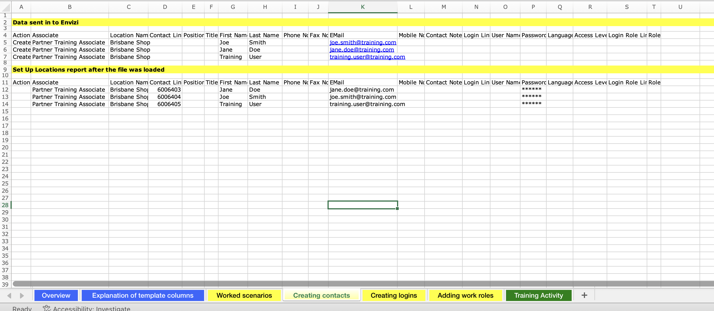

1. Go through the template and understand the various information given in each sheet. 

#### Important
To stay aligned with the labs, we recommend using the Prepopulated template file discussed in the following section for the upcoming steps.

## 3. Prepopulated Template

We are going to use the Prepopulated Template to feed in the contacts and login. Let's download, understand and do the required changes in the Prepopulated Template.

### 3.1 Download the Prepopulated Template

1. Download the Prepopulated Template data file `Envizi_SetupContacts_G11.xlsx` from [here](./files/Envizi_SetupContacts_G11.xlsx) or from the shared Box folder.

### 3.2 Understand the Prepopulated Template

The template file would be like this. Let's understand this.
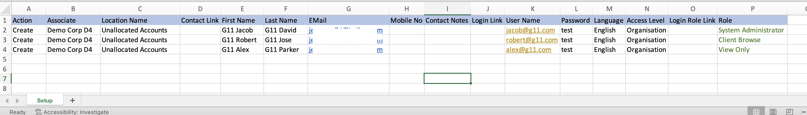

1. The template contains 3 records, which would result in the creation of three contacts and three logins.
2. `Role` : can be `System Administrator`, `Client Browse` or `ViewOnly`. Here the `Client Browse` role means `General User`
3. `Password` : dummy password `test` is given. User needs to change the password during the first login.
4. `Location Name` : Let it be as `Unallocated Accounts`
5. `Access Level` :  It can be `Organisation`, `Group` or `Location`. Here it is at Organisation level.

### 3.3 Prepare the Prepopulated Template

1. The template file name format should be `Envizi_SetupContacts_xxxxx.xlsx`. Replace xxxx with your preferred text. But it is better to use your `Prefix-Id`.
2. Replace the `Associate` column values with Organization name you obtained as a prerequisite.
3. To prevent naming conflicts, replace the prefix `G11` with your `Prefix-Id` in the `First Name`, `Last Name` and `User Name` columns. For example, transform `G11 Jacob` to `A12 Jacob`.
4. Replace the `EMail` column values with your email id. Same email can be given for several users.

The Prepopulated Template file is ready for upload now.

## 4 Upload the template file into Envizi

Lets us upload the above updated template file into Envizi for to create Contacts and Logins.

### 4.1 Upload the file

1. Navigate to Envizi UI. 

2. Click on `Manage > Upload files` to upload the file.
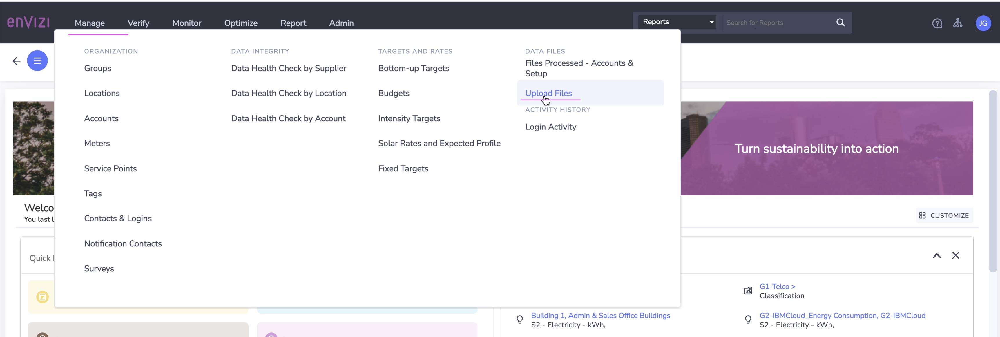
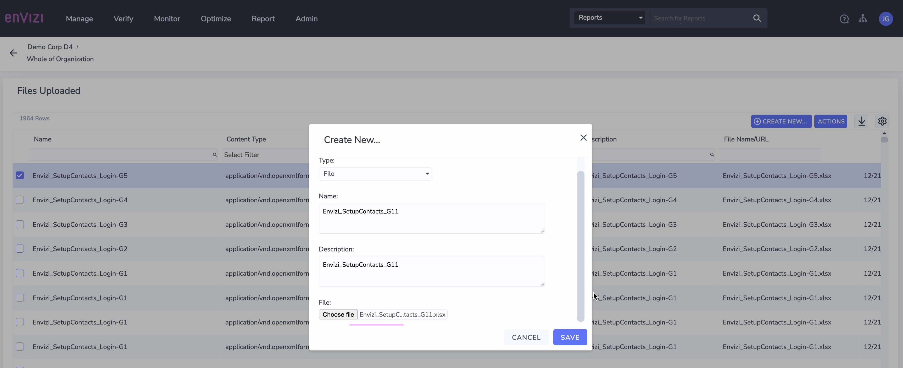

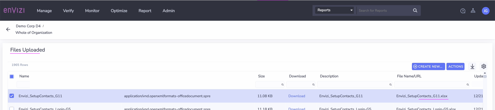

### 4.2 Verify Upload Status

1. Navigate to `Manage > Files Processed - Accounts & Setup` 
2. You should see the file status changed to `Loaded` 
3. Observe  `Records In ` and `Records Out` fields on the same page. 
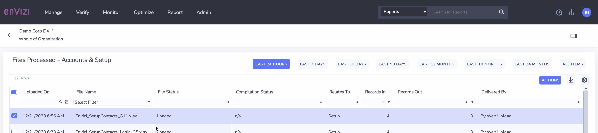

## 5 View the Users Created

1. Click on `Manage > Contacts and login` to the see the users created.
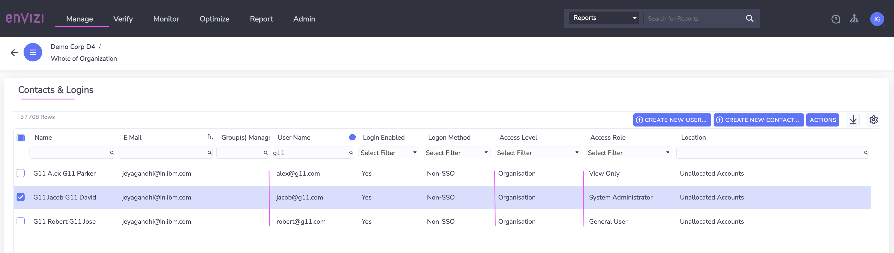

## 6 Notifications

The user should have got the 2 notifications in the mail id.

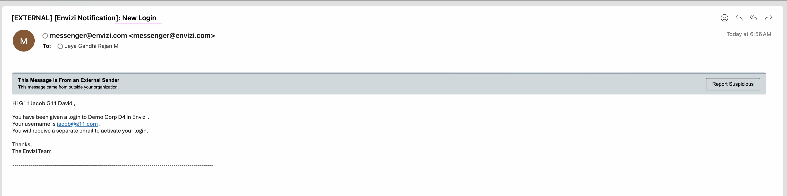

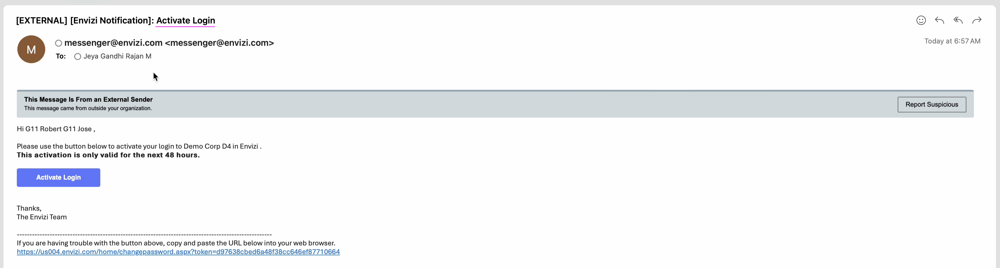

This `Activate Login` helps to reset the password and to login. But we don't use this here.

## 7. Login into Envizi

Login into envizi via the newly create login ids.

1. Enter the username 

2. Enter the password that we have given in the excel

3. Reset the password.

The password must be at least 12 characters long and include at least one uppercase letter, one lowercase letter, one number, and one special character.

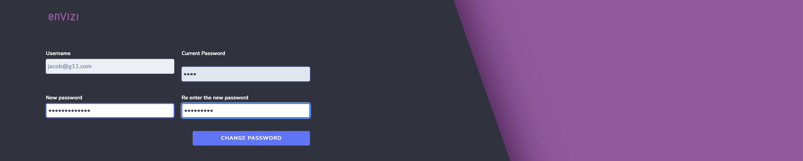

The home page is displayed. 

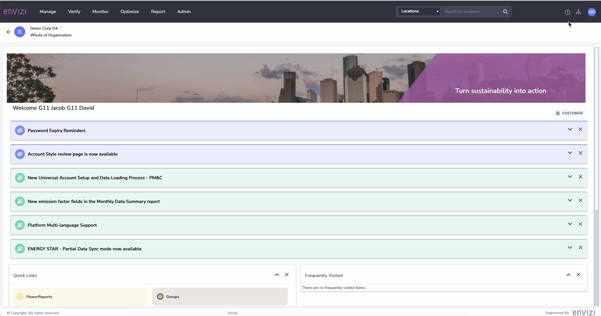

You can try login with the other users and reset the passwords.