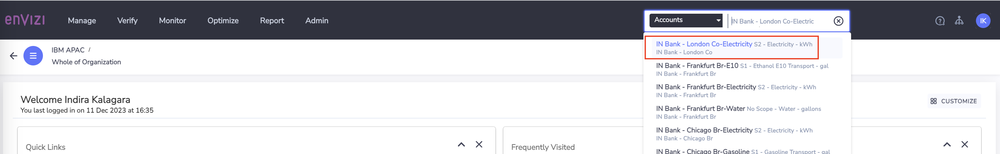
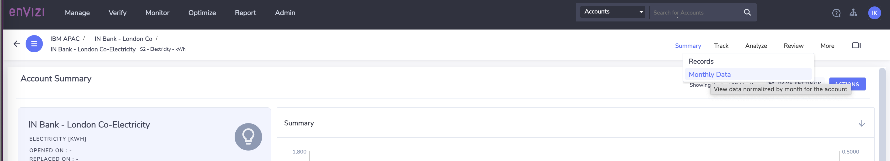
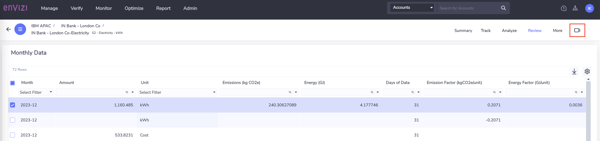
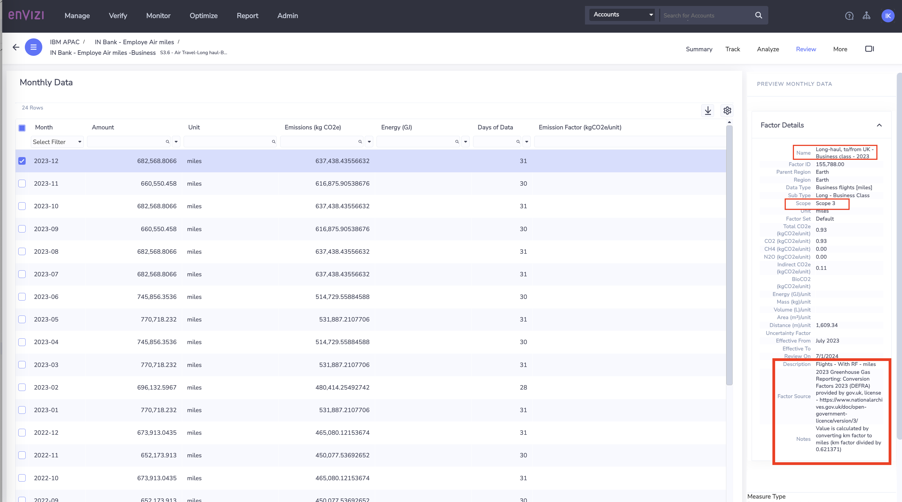

# Emission Factors are assignment for Activity Data in Envizi 

In this lab exercise we will explore about application of emission factors to calculate the emissions for different activity data across different regions or countries

# 1. Emission Factors in Envizi

Envizi supports `emissions calculation` for all Scope 1, Scope 2 and Scope 3 activity data. 

Envizi maintains a `emission factor library` which contains all the publicly available emission factor sets as well as licensed factor sets, covering Scope 1, Scope 2 (both Location based and Market based) and Scope 3 (all categories supporting Spend-based / average data / supplier specific )
Please refer [Envizi knowledge base](https://knowledgebase.envizi.com/home/managed-emission-factors) for latest updates.

Envizi applies the emission factors `based on` various crieterias such as `data type, sub type, factor set, region, effective and published dates`. 

Lets navigate through following scenarios to understand which emission factor is applied
- Different accounts related to same type of activity data across different regions / countries
- Similarly, navigate through accounts related to different types of activity data

# 2. Explore Emission factors assigned to activity data

Lets look into different accounts related to `Electricity`

## 2.1 Activity data - Scope 2 - Electricity

CLICK ME

### Account: IN Bank - London Co-Electricity

1. Envizi UI -> Global Search -> Choose `Accounts` -> Type `London Co-Electricity`

2. On `Account Summary` page, Click on `Review` -> `Monthly Data`

3. On `Monthly Data` page, click on `Show / hide preview panel`

4. Select one of the data row against the quatity measure and expand `Factor Details` in right-side under `Preview Monthly Data`

5. Look at the  high-lighted fileds more closely from the screenshot. 

- **Name        :** Electricity Generated kWh 2023
- **Region        :** Based on the location parameters provided City, Sate, Country the region will be assigned by Envizi
- **Data Type     :** Type of activity data
- **Sub Type      :** If any subtype exist for a given data type. 
- **Scope         :** Scope 1/2 or 3
- **Factor set    :** The factor set applied from Envizi fator library to this activity data based on the Envizi's Factor Selection Alogorithm
- **CO2e, ...     :** Emissions with respect to CO2e and gases CO2, NH4,etc
- **Effective From:** The date from when the emission factor is effective. Refer [Knowledgebase](https://knowledgebase.envizi.com/home/factor-published-date-logic) more details
- **Effective To  :** The date from which the emission factor is effective. If not date, effective for current and future, until there is a date specified.
- **Review On     :** The date on when product team reviewed this emission factor set.
- **Description   :** Details about factor set 
- **Factor Source :** The source of the Emission factor library which Envizi uses. 

6. Observe that `Managed DEFRA` factor set is applied because the location is `UK`, Europe and `DEFRA` is specificly developed for `Europe`. 

### Account: IN Bank - Chicago Br-Electricity

1. Search for the account `IN Bank - Chicago Br-Electricity` in the global search above. You can search from same `Montly Data` page and it would automatically displays the account choosen. 

2. Observe Factor details applied 

3. `Managed - eGRID & US Climate Leaders` factor set is applied based on the location `United States`

### Account: IN Bank - New York Br-Electricity

1. Search for account  `IN Bank - New York Br-Electricity` 

2. Observe the factor set applied 

3. Same factor set which applied to `Chicago` account is applied to this account, because both the locations `Chicago` and `New York` are from same region/ country `United States` and have the same activity data type associated.

### Account: IN Bank - Mumbai Co-Electricity

1. Search for the account `IN Bank - Mumbai Co-Electricity` 

2. Observe that `Default` Factor set is applied. This is sourced from Global Emission factors library  `International Energy Agency (IEA)- Emission Factors 2022` . 
This is the `defautl factor set in Envizi`. If there is no region specific factor library matched in the factor selection process, the default factor library will be applied. 

## 2.2 Activity data - Scope 1 -  Diesel

CLICK ME

1. Look at the below 2 accounts 

2. Observe that emission factor from `Managed - DEFRA` is applied for the London account, where as `Managed - eGRID & US Climate Leaders` is applied for US based accounts

### Account: IN Bank - London Co-Diesel

### Account: IN Bank - Washington DC Co-Diesel

## 2.3 Activity data - Scope 3 

CLICK ME

### Account: IN Bank - Employe Air miles -Business

1. Observe that emission factor applied

### Account: IN Bank - Alfa Furtniture_S3.1 - Furniture and related products - USD or local_Alfa Furtniture India

## 2.4 Activity data - No Emissions calculated

CLICK ME

Lets also look at the scenario where Emissions are not calculated. 

### Account: IN Bank - Washington DC Co-Gas

1. Observe emission factors applied for the account with data type / account style `S1 - Gasoline Stationary - gal`

2. Lets look at different account with same data type  / account style `S1 - Gasoline Stationary - gal` belongs to different location / region

### Account: IN Bank - Mumbai Co-Gas

  
You can notice that, the emissions are not calculated for data captured for the same data type  `S1 - Gasoline Stationary - gal`  from different location `IN Bank - Mumbai Co`.

This happens when there are no matching factors found the Envizi emission library. In such cases, we can apply the Custom factors. 

In the Custom Factors lab, we can learn how to create and apply the custom emission factors.

# 3. Conclusion

In this exercise, we have explored to understand the different Emission factors applied for activity data belongs to different regions. 

To learn more on emission factos and how Envizi applies Factor selection algoithm please refer here https://github.com/indirakalagara/emission-factor-mgmt
