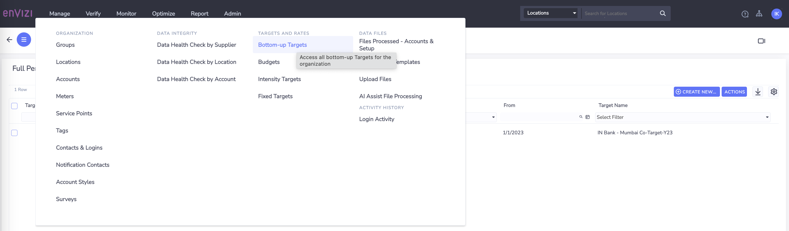
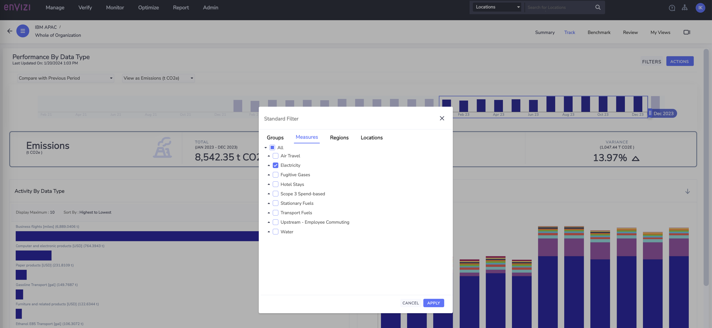
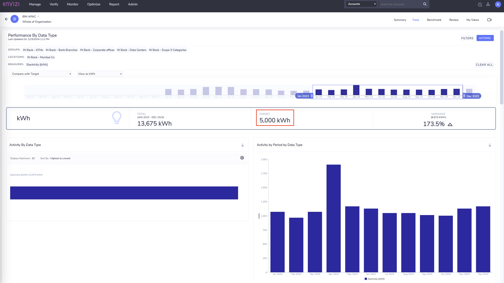
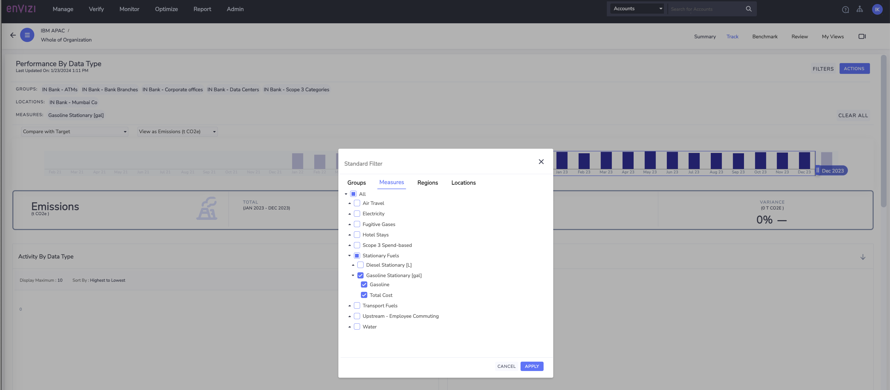
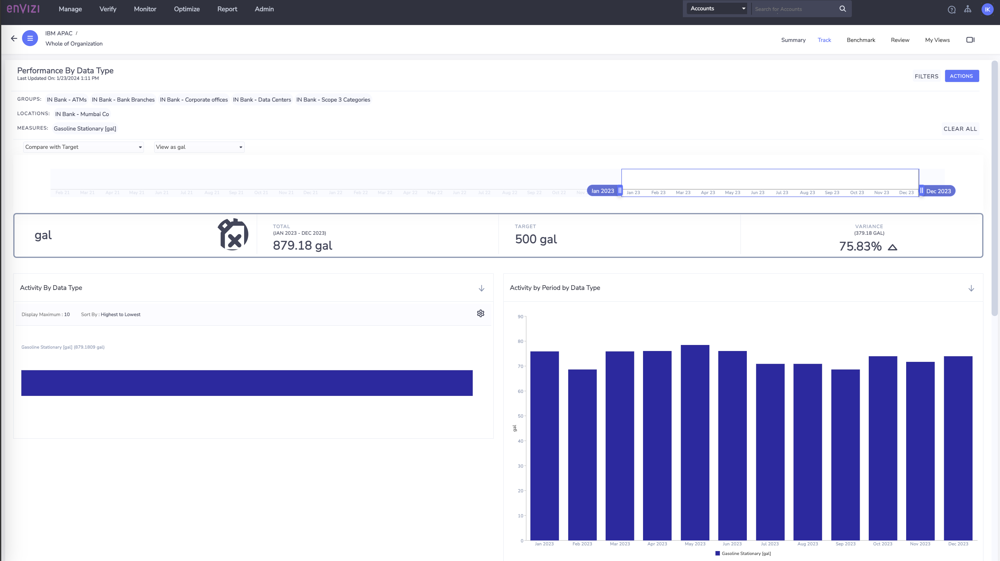

# Target Setting and Tracking

In this lab exercise we will learn how to set the bottom-up targets. Bottom-up targets for are to create the targets at the lowest level such as accounts / meters or locations  in the organization hierarchy.  These targets helps to track the consumptions / emissions which you can compare against the current performance and to achieve your organization's net-zero goals.  

## Key steps

In this lab you would be performing the following key steps
1. Create bottom-up target at account level
2. View the Target comparision on Performance dashboards.

## 1. Create Bottom-up targets for the Accounts. 

CLICK ME

Lets say the business unit leader tasked to reduce the consumptions for each individual datatype for the location `IN Bank - Mumbai Co`.

To start with, the business unit leader focused on to reduce `Electricity` and `Gasoline`. Hence the business leader came up with the reduction targets for these two accounts belongs to the locations.  The data for each of this data type is captured in respective accounts, hence the target is set directly on the Account level 

#### Data type: `Electricity`, Account: `IN Bank - Mumbai Co-Electricity `
- Target value : 5000 kwh
- Time-frame: Jan 2023 - Dec 2023
- Track in Native Units
 
#### Data type: `Gasoline`, Account: `IN Bank - Mumbai Co-Gas`
- Target value : 500 gal
- Time-frame: Jan 2023 - Dec 2023
- Track in Native Units
 
Lets now create these targets in the Envizi Platform.  To start with the first step is to create a Target container and then add the targets for various accounts / locations.

### 1.1 Create Bottom-up target

CLICK ME

1. Navigate to `Manage > TARGETS AND RATES > Bottom-up Targets` 

2. Click on `Create New `  on the `Bottom-up Targets` page
   
3. Provide the deatils as below: 

- `Name`: Name of the target 
- `Description`: Optional
- `Target type`: Select `Native Unit Target`
- `Measured in`: Leave to defaults. Auto populated for the `Native Unit Target`
- `Lowest level of targets:` Select `Account/Meter` 
- `Effective From`: Jan 2023
- `Effective To`: Dec 2023
- `Target Status`: `Active` (Default)

4. Click on `Save` 

Now that the Bottom-up Target container is created to hold the target data for the accounts.

### 1.2 Create Target Data for the identified accounts 

CLICK ME

##### 1.2.1 Data type: Electricity, Account: IN Bank - Mumbai Co-Electricity 

- Target value : 5000 kwh
- Time-frame: Jan 2023 - Dec 2023
- Track in Native Units

1. Select target created above `IN Bank - Mumbai Co-Target-Y23` .  `Right-click `or click on `Actions` 
   
2. Select `Target Data`

3. On `Full Period Target Data` page, click on `Create New`

4. In the pou-up window, provide the values as below
-  `Target`: Leave to defaults selected
-  `For`: chose `Accounts`
-  `Named`: Type account name / number` IN Bank - Mumbai Co-Electricity` and select the matched value
-  `From` and `To`: Leave to the defaults values populated as per the Target for this lab exercise
-  `Data Type(s):` leave to deautl, as it is populated based on the account selected
-  `Measuring`: Leave to default , `Native Units`
-  `Target Value`: Provide target value to set for this account - `5000` 
-  `Units`: Leave to default

5. Click `Save`

##### 1.2.2 Data type: Gasoline, Account: IN Bank - Mumbai Co-Gas

- Target value : 500
- Time-frame: Jan 2023 - Dec 2023
- Track in Native Units

1. Repeat the steps 1.2.1 for the account `IN Bank - Mumbai Co-Gas`
2. Make sure to provide the Account number and target values correctly
  

Now, we have created the Bottiom-up target for the two accounts as shown in the below screenshot

## 2. View the Target comparision on Performance dashboards.

CLICK ME

As we have created the bottom-up target and target values set for the accounts, lets have a look at how the consumption values vs target for these accounts.
Note: there can be a 24hr delay after changing the status before the target data is updated/removed in the datamart which provides data for the dashboards and reports. 

1. Navigate to `Monitor > Performance > Performance By Data Type` 

2. On `Performance By Data Type` page, Click on `Filters`

### 2.1 View  Target comaprision for data type : Electricity

CLICK ME

1. Select below filters and and `Apply`
   
- `Group`: `IN Bank` -  Select only the group which your accounts / locations belongs to. You can still narrow down selection to  `IN Bank - APAC Corp Offices`

- `Measures`: Select `Electricity` 
- `Locations`: Select `IN Bank - Mumbai Co`
  
  

2. On `Performance By Data Type` , Click on the drop-down and select `Compare with Target`
   
3. Select `View as kwh` in the next drop-down
   
4. Set the time frame  Jan 23 - Dec 23 
   
5. View the details and Target data value for the target period

Similarly, you can  view the Target comparisoion for the other datatype for which the target was set above. 

### 2.2 View  Target comaprision for data type : Gasoline

CLICK ME

1. Select the filter for 
- `Group`: `IN Bank`
- `Measures`: Select `Electricity` 
- `Locations`: Select `IN Bank - Mumbai Co`

2. On `Performance By Data Type` , Click on the drop-down and select `Compare with Target`

3. Select `View as gal` in the next drop-down

4. Observer that yearly target values are not met and actually the cosumption is 75%  increased than target value
   

## Conclusion:
In this lab we have learnt how to create the bottom-up targets at last level of organization heirarchy that is account level. YOu can create bottom-up target at account / meter or location level. We have also set the yearly target for the various activity data and compared the targets against the yearly consumption.

