# Setting Custom Emission Factors in Envizi

In this lab exercise we will learn how to create custom factors and how those get applied to the data loaded. 
Custom factors can be created through UI or using template. In this exercise we will create the custom factor using the UI. 

Generally Custom factors are created based on the organization requirements such  as 
- organization has their own emission factor to be applied instead of standard or publicly available factors
- have the supplier specific emission factors to be applied 
- when no matching factors available in Envizi managed library 

In our sample organization we have identified certain locations / accounts for which emission factor is not avaialble for a specific datatype in Envizi managed emission factor library and hence emissions are not calcuated.

Examples:
- Account: `IN Bank - Mumbai Co-Gas` Data type: Gasoline Stationary [gal] Location: `IN Bank - Mumbai Co` Region: `Mumbai, India`
- Account: `IN-Bank-London Co-Gas`  Data type: Gasoline Stationary [gal]  Location: `IN Bank - London Co` Region: `London, United Kingdom`

Lets work through these examples, and create the custom factos to apply on the same.

## 1. View the existing emission factors applied for the data

1. Navigate to `Manage` > `Accounts` > `IN Bank - Mumbai Co-Gas`.
2. Click on `Review` > `Monthly Data`
3. View montly data and observe there are no data under column `Emissions` .
4. Click on `Preview` and observe that there are no details under `Factor Details` because there us no matching emission factor found in Envizi managed library. 

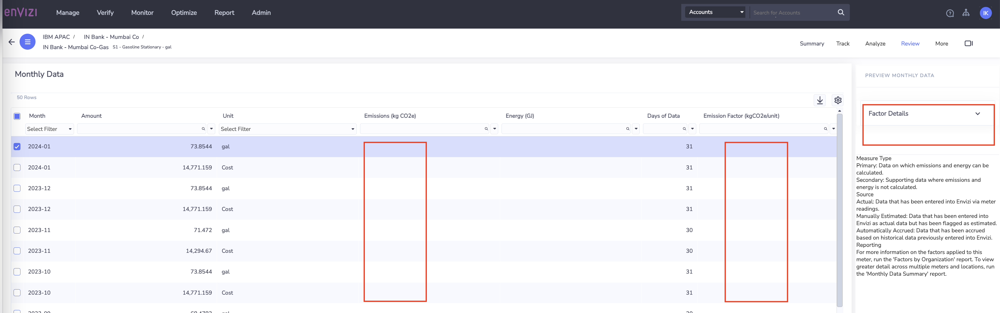

Now, lets go ahead create custom factor to be applied in the next section.

## 2. Create Custom Factor

## 2.1 Create new custom factor using UI 

### For Data type: Gasoline Stationary [gal]  Region : `Mumbai, India`

1. Navigate to `Admin` > `Configuration` > `Custom Factors`.
   
2. Click on Create New

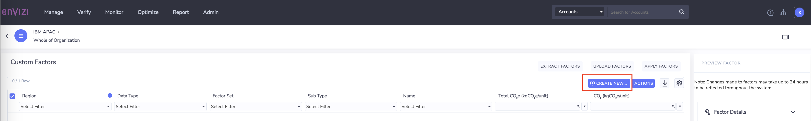

3. In `Create New` window, provide values for cloumns mentioned below and leave others to default.
  
- `Region` : Provide the specific region for which the custom factor should be applied. Enter first 3 letters of region `Mum` and select `Mumbai [State of Maharastra]` from list. 
    
- `Data type`:  Chose data type for which the emission factor should be applied. `Gasoline Stationary [gal]`  
    
- `Factor Set`:  Select the  Factor set / Custom Factor set from the list.  `POC - IBM APAC` 
  
- `Name`: Provide name to identify your factor set `IN-Bank Mumbai GAS CF`
 
- `Total CO2e(kgCO2e/unit)`: Provide the total CO2e value. The value of the CO2e emissions calculated by organization, which needs to be applied using this custom factor. ex: `50.06`
- `CO2 (kgCO2e/unit)`: Provide CO2e value. The value of the CO2e emissions calculated by organization, which needs to be applied using this custom factor.  ex: `50.06`
- `Effective From:` Select the Month of the Year from which this custom factor should be applied ex: `Jan 2023`
- `Effective To:` Select the Month of the Year until which the custom factor should be applied ex: `Dec 2023`

The fields `Effective from` and `Effective To` play an important role in factor selection to identify for what time frame the factor is applicable. 

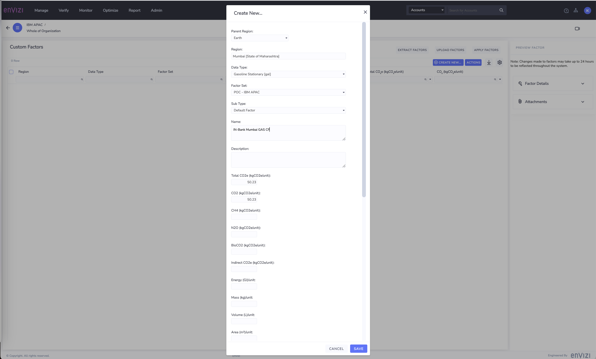

4. Click on `Save`

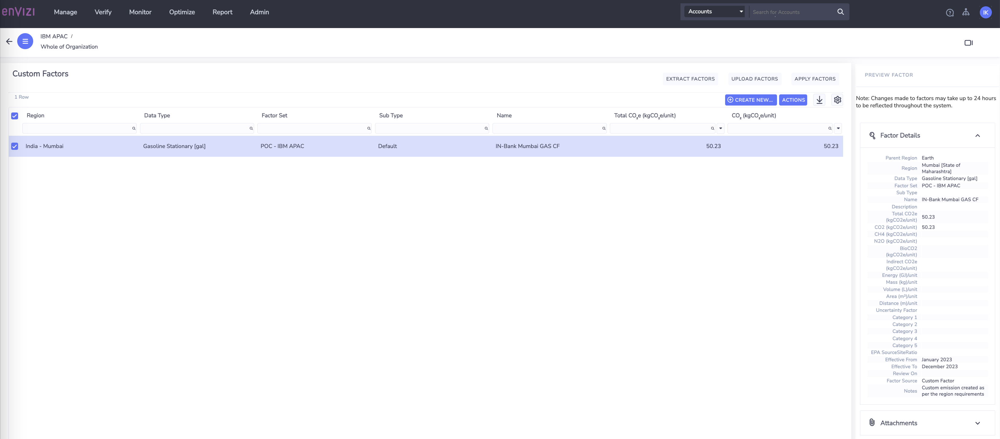

## 2.1 Create new custom factor using UI based on existing Factor

### For Data type: Gasoline Stationary [gal]  Region : `London, United Kingdom`

In this case we will create a new emission factor by using the existing factor. This would help to pre-pouplate the details in the new custom factor and then edit the same.

1. Navigate to `Admin` > `Configuration` > `Custom Factors`.
2. Select existing custom factor , right-click or click `Actions`

3. Select `Create a copy of this factor`

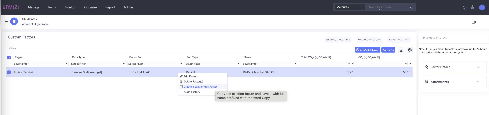

4. View the newly created custom factor

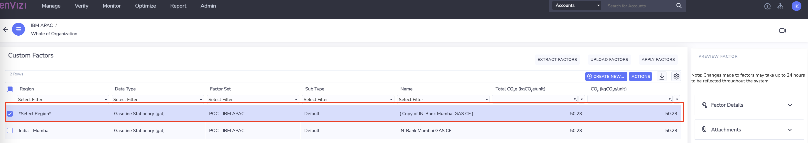

5. Select the newly created custom factor , click `Actions` > `Edit Factor`

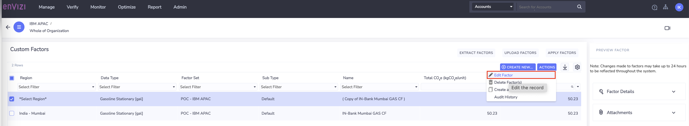

6. On `Edit Factor` window, edit the values for below

- `Region`: `United Kingdon, Europe`
- `Name`: `IN-Bank London GAS CF`
- `Total CO2e(kgCO2e/unit)`:  `60.23`
- `CO2 (kgCO2e/unit)`:  `60.23`
- `Effective From`: `Jan 2023`
- `Effective To`:  `Dec 2023`

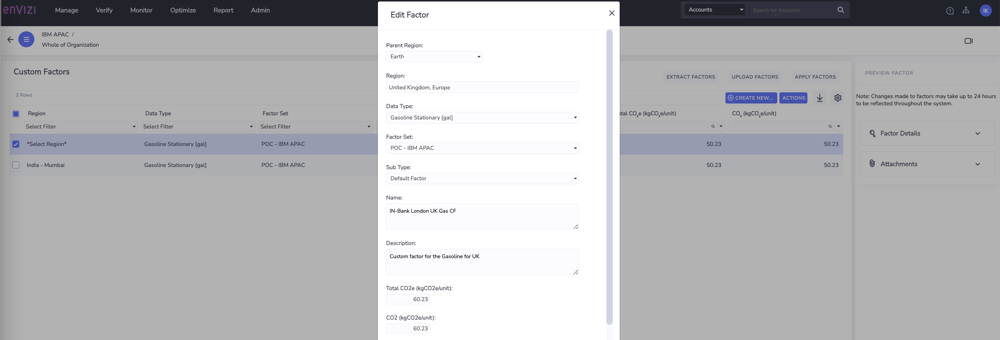

7. View the updated custom factor created. 

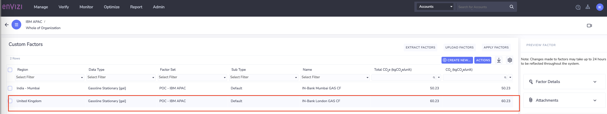

### Important note on the Custom factor application: 

Once new factors have been added or existing factors have been updated or deleted in Envizi, a recalculation is then scheduled to take place on the weekend.  This is done to reduce server load and ensure a fast and responsive user experience.  However if you wish to apply the new factors immediately, please get in touch with our help desk to request that factors be applied immediately.

Please refer [Envizi knowledgebase](https://knowledgebase.envizi.com/home/custom-factor-management#CustomFactorManagement-Recalculationusingnewfactors) for more details. 

## 3 View the Custom emission factors applied for the data.

1. Navigate to the account : `IN Bank - London Co-Gas` 
2. View `Review` > `Monthly Data` 
3. Click on `Preview` 
4. Select a record of consumption data between the time frame of `Effetive from`  and `Effective To` 

5. View the `Factor details` on `Preview` panel

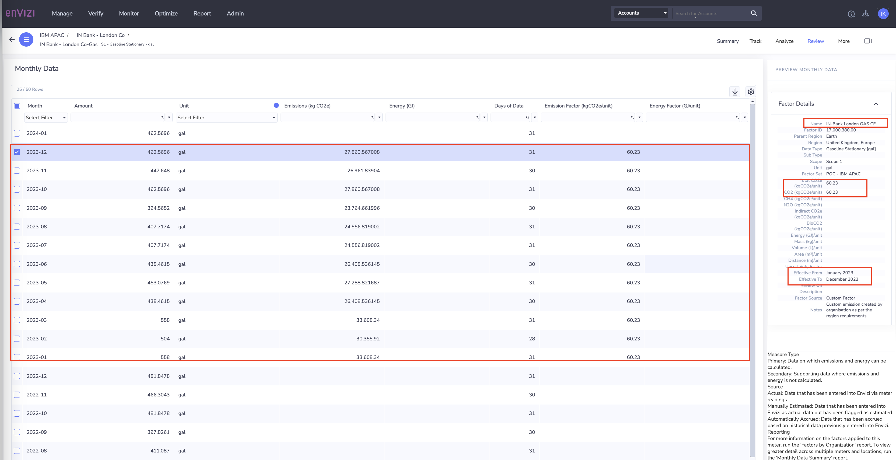

6. Observe the custom emission factor applied. 
PLease notice the time period the factor is applied. You can see that for only Year 2023 data records, the emissions are calculated based on the custom factor applied. 

7. Select the record before the `Effective From` date

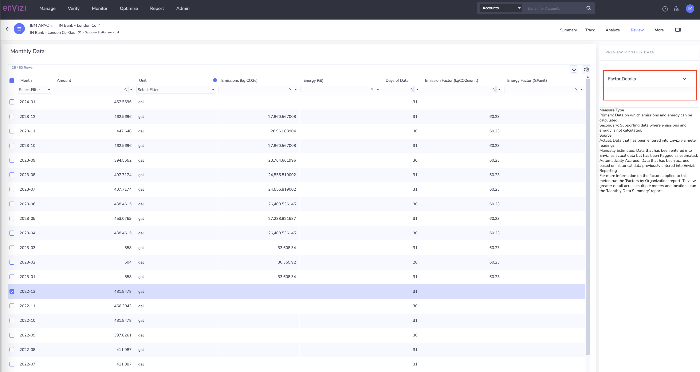

View the `Factor details` on preview panel. Observe that for Year 2022 data records, there is no emission factor applied, hence no emissions are cacluated

8. Select the record after the `Effective To` date

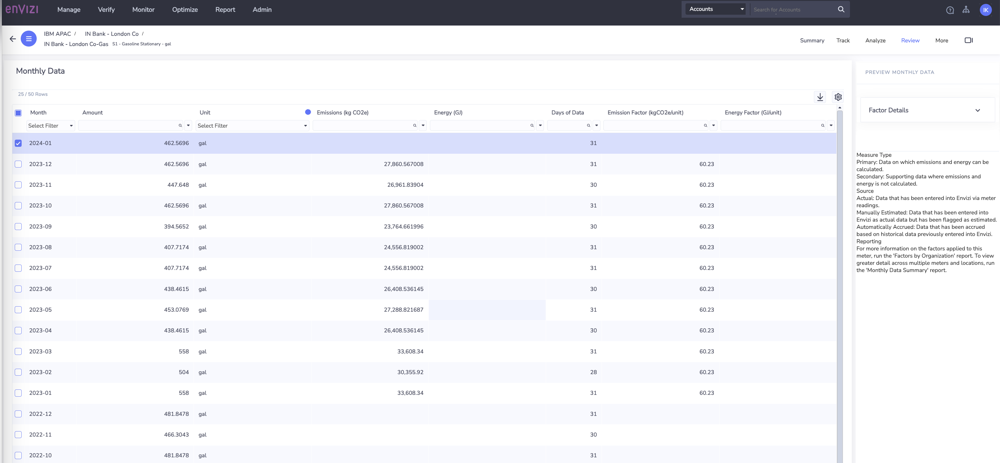

View the `Factor details` on preview panel. Observe that for Year 2024 data records, there is no emission factor applied, hence no emissions are calculated.

9. Similarly, observe the custom factor applied for the account: `IN-Bank-Mumbai Co-Gas` 

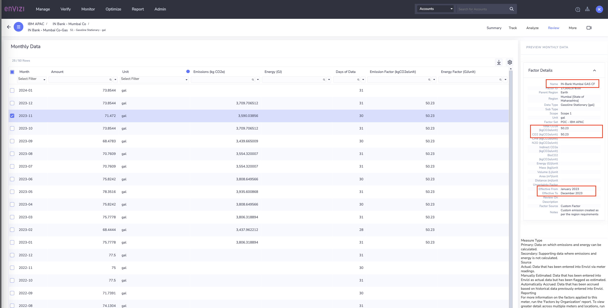    

Observe that the Custom factor `IN-Bank Mumbai GAS CF`, created specifically for the region `Mumbai [State of Maharastra]` is applied between the `Effective` dates. For the rest of the period the custom emission factor is not applied. 

## Conclusion:

In this exercise, we have learnt how to create different custom factors for a given data type for specific regions and how those custom factors are applied. We have also seen that how these factors effective and applied to calculate emissions only for the effective period.
   
   