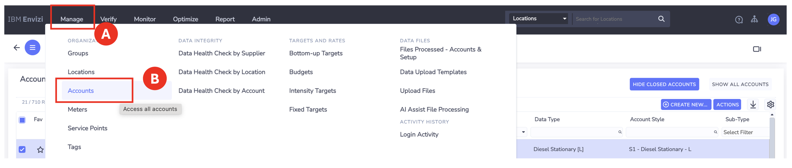
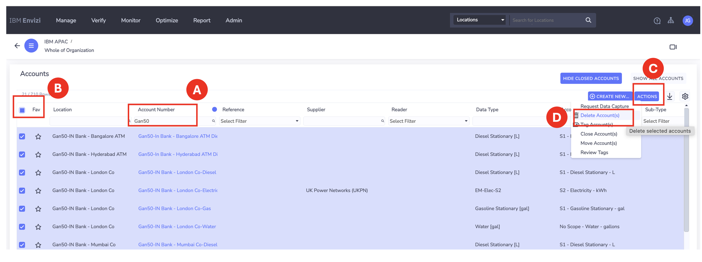
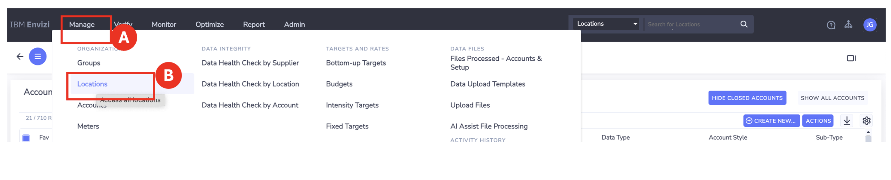
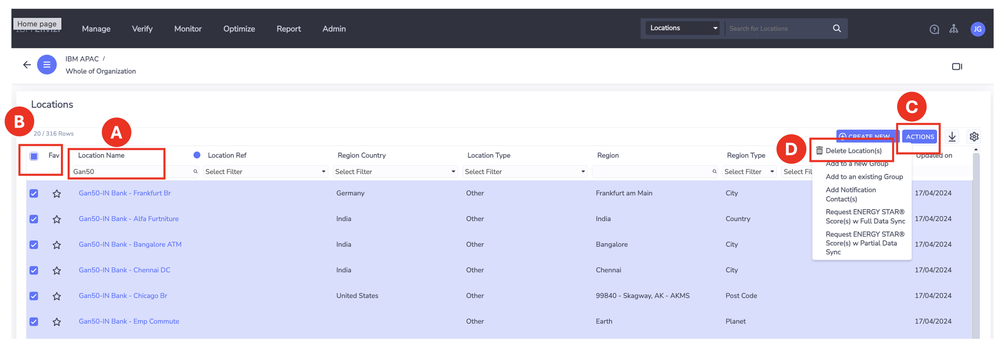
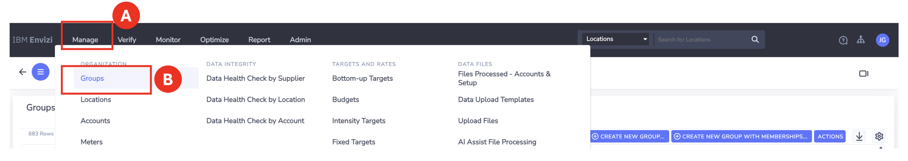
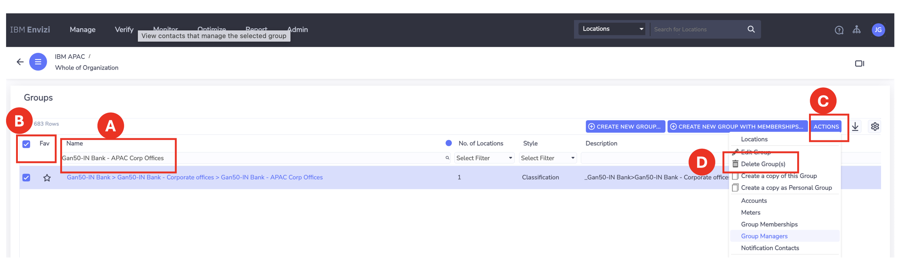
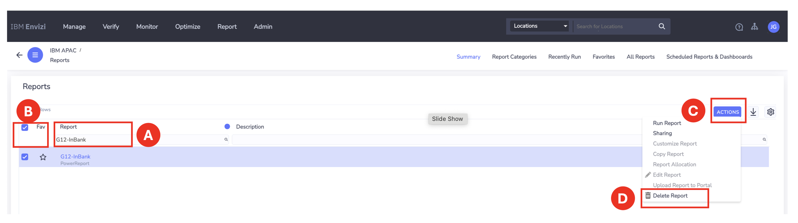
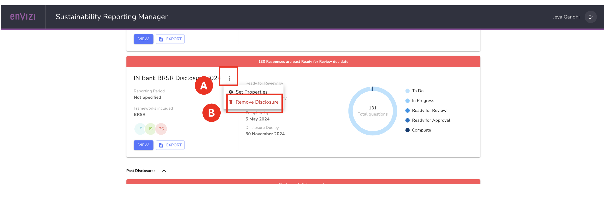
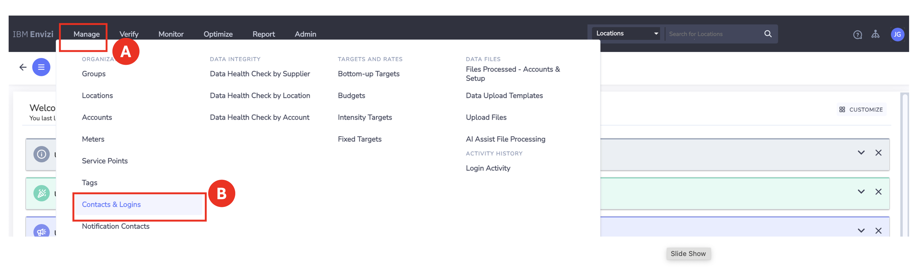
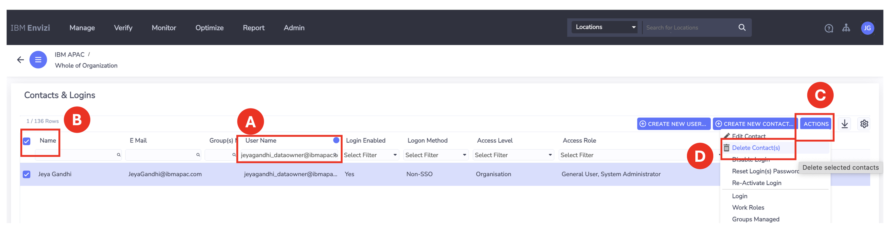

# Clearing Lab Data

You need to clear or delete the data that you have created as part of these lab exercises.

## 1. Login 

1.	Login as a `System Administrator` in Envizi console

## 2. Delete Accounts

1.	Click `Manage (A) > Accounts (B)` menus



2. Type your Prefix-ID in `Account Number (A)` text box to filter your records.
3. Select `Check box (B)` to choose all the filtered records.
4. Click `Actions (C)` 
5. Select `Delete Accounts (D)` menu.

It deletes all the selected Accounts



 
## 3. Delete Locations
1. Click `Manage (A) > Locations (B)` menus



 
2. Type your Prefix-ID in `Location Name (A)` text box to filter your records.
3. Select `Check box (B)` to choose all the filtered records.
4. Click `Actions (C)`
5. Select `Delete Locations (D)` menu.
It deletes all the selected locations




## 4. Delete Groups
1. Click `Manage (A) > Groups (B)` menus
 
 

You need to delete the groups in the below order. Since Level3 groups should be deleted before Level2 and Level2 should be created before Level1.

```
Gan50-IN Bank - APAC Corp Offices
Gan50-IN Bank - EMEA Corp Offices
Gan50-IN Bank - US Corp Offices
Gan50-IN Bank - Apac Bank Branches
Gan50-IN Bank - USA Bank Branches
Gan50-IN Bank - Europe Bank Branches
Gan50-IN Bank - India ATMs
Gan50-IN Bank - Operational DCs
Gan50-IN Bank - Cat 1 - Purchased Goods
Gan50-IN Bank - Cat 6 - Business Travel
Gan50-IN Bank - Cat 7 - Employee Commute

Gan50-IN Bank - Corporate offices
Gan50-IN Bank - Bank Branches
Gan50-IN Bank - ATMs
Gan50-IN Bank - Data Centers
Gan50-IN Bank - Scope 3 Categories
Gan50-Telco-CellTowers
Gan50-Telco-DataCentres
```

2. Choose the 1st group from the list. Replace `Gan50` with your Prefix-ID
3. Type your Group Name in `Name (A)` text box to filter your records.
4. Select `Check box (B)` to choose all the filtered records.
5. Click `Actions (C)`
6. Select `Delete Groups (D)` menu.
7. Repeat the steps for all the groups in the above list.
 


## 5. Delete Custom Power Report
1. Type your Prefix-ID in `Report (A)` text box to filter your records in the Reports screen.
2. Select `Check box (B)` to choose all the filtered records.
3. Click `Actions (C)`
4. Select `Delete Reports (D)` menu.
It deletes all the selected reports
 
 

## 6. Delete Disclosure
1. Goto `Sustainability Reporting Manager`.
2. Find your disclosure
3. Select `3Dot Icon (A)`.
4. Click `Remove Disclosure (B)`
It deletes all the selected disclosure
 
 


## 7. Delete Users
You have created the following users in the lab.

```
xxxx_poweredit@ibmapac.com
xxxx_apiuser@ibmapac.com
xxxx_issuemanager@ibmapac.com
xxxx_srmowner@ibmapac.com
xxxx_dataowner@ibmapac.com
xxxx_srmreviewer@ibmapac.com
xxxx_srmapprover@ibmapac.com
```

1. Click `Manage (A) > Contact & Logins (B)` menus
 
 

2. Choose the 1st user from the above list. 
3. Type your Username in `Name (A)` text box to filter your records.
4. Select `Check box (B)` to choose all the filtered records.
5. Click `Actions (C)`
6. Select `Delete Contacts (D)` menu.
7. Repeat the steps for all the users in the above list.
 
With this all the records created in all the labs should have been deleted.



