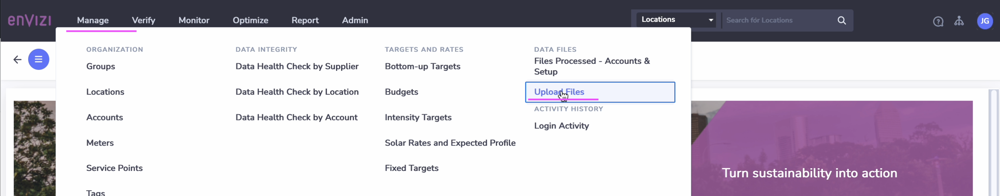
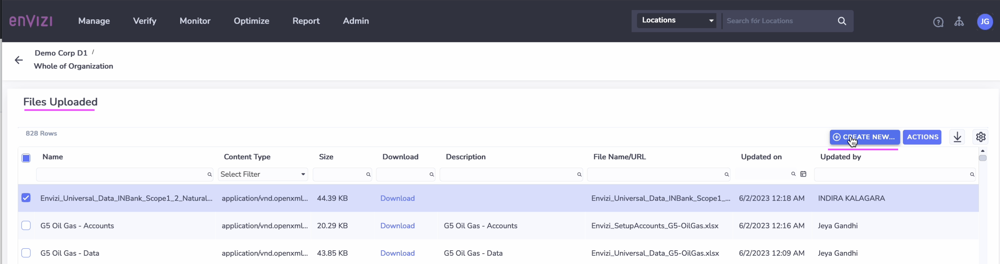
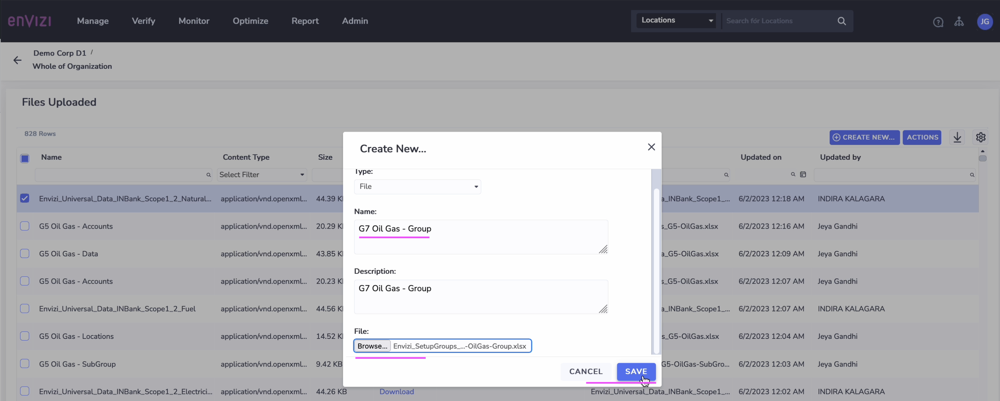
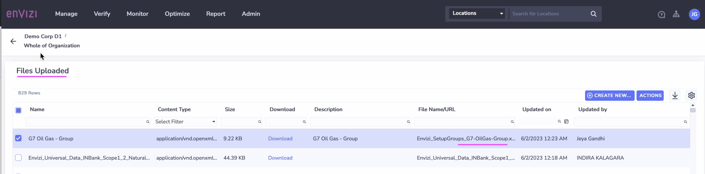
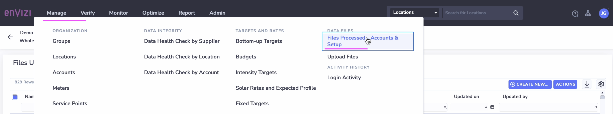
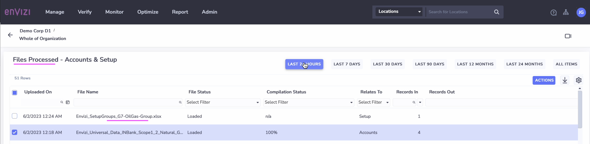
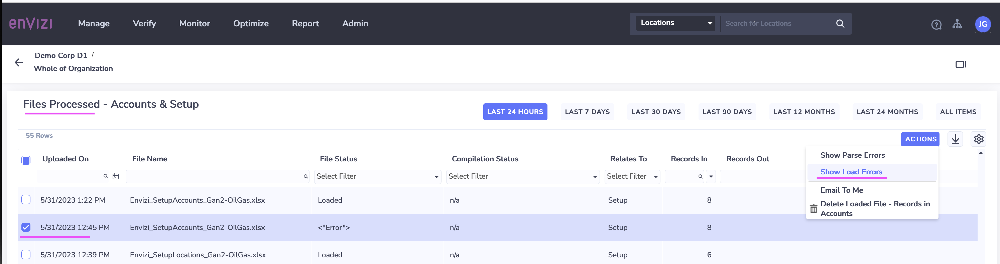
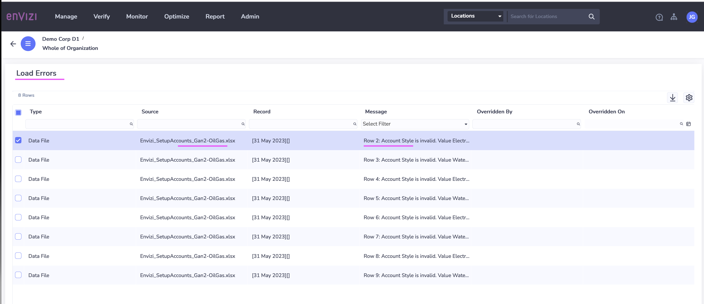

# Uploading a file into Envizi through UI

This article explains how to upload a file into Envizi using UI for Data integrations. 

## 1. Uploading File

1. Click on `Manage > Upload files`

2. Click on `Create new file upload`

3. Enter some values for `Name` and `Description`

4. Upload the required file. Example  :`Envizi_SetupConfig_xxxx.xlsx`.

5. Click on `Save`

Files get uploaded.

6. Click on `Manage > Files Processed - Accounts & Setup`

See the file got processed.

## 2. Troubleshooting

You can troubleshoot the error during the file upload.

### View the Parser Error or Load Error

1. Click on `Manage > Files Processed - Accounts & Setup`

2. Select a record

3. Click on `Actions > Show Load Errors`

4. Click on `Actions > Show Parse Errors`

