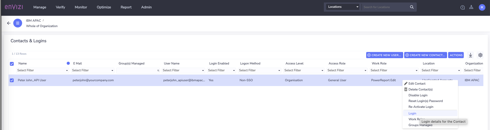
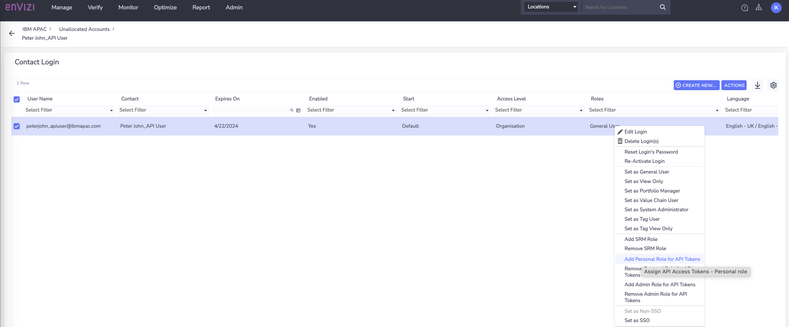
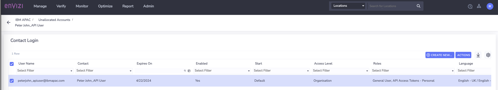
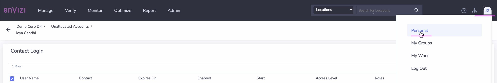
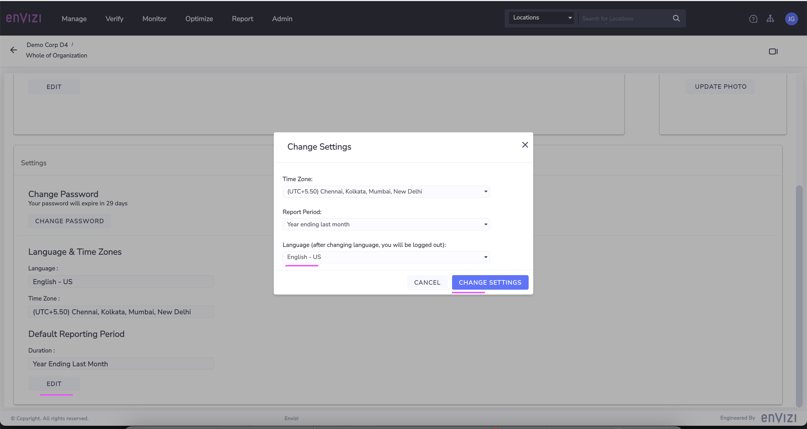
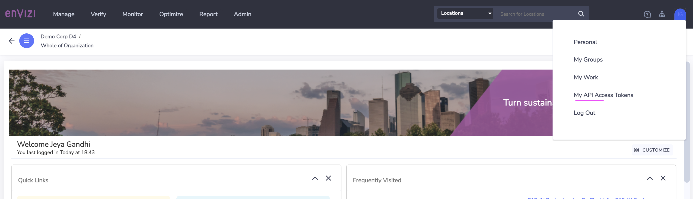
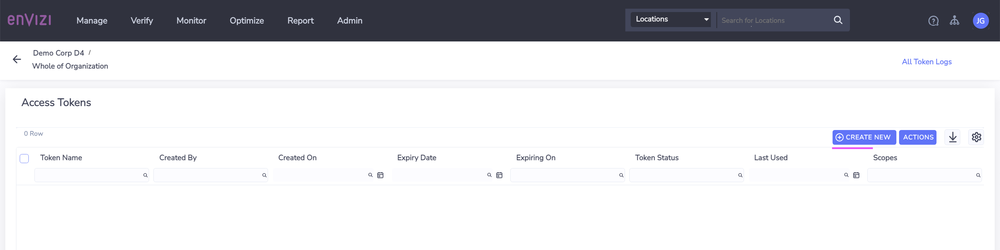
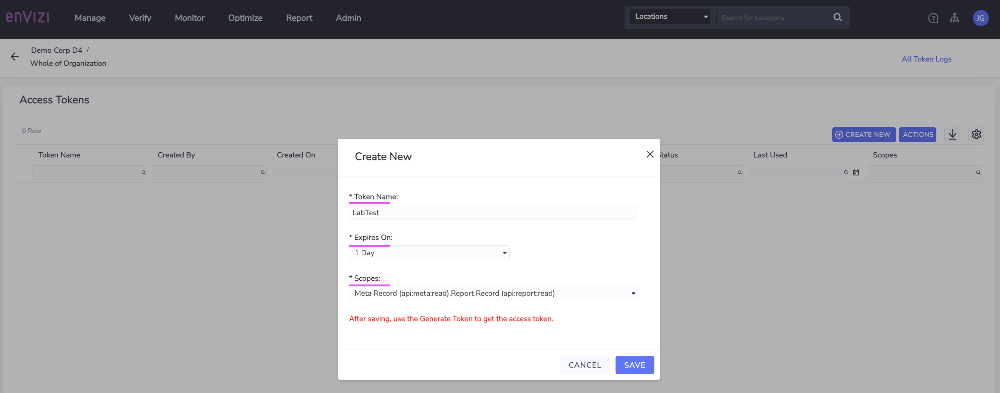
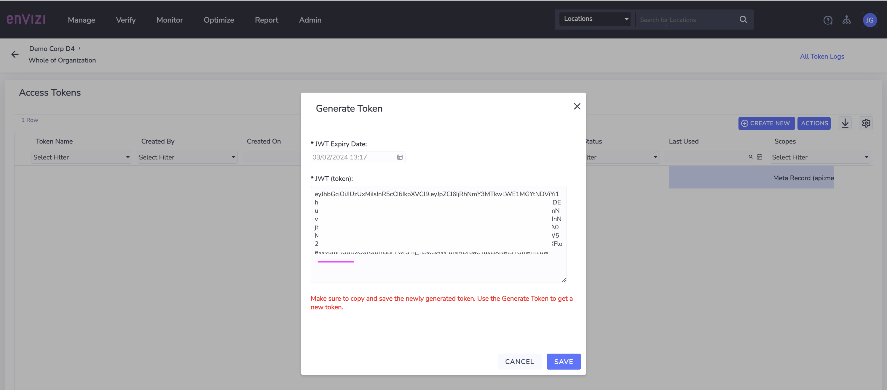

# Envizi API Access Token

This article explains how to generate and get API Access Token from Envizi to access the API.

An API access token is a JSON Web Token (JWT) that can be used to authorize a user when accessing remote application, like Envizi API, from a third-party application.  Adding or removing API Access Token roles can only be done by a system administrator user of the Envizi platform. 

The user can be given API Personal Access Token Role or Admin Access Role.

API Token Admin Role is given to users to view and maanage other users token at the orgaization level. To access APIs, the general practise is to create a generic user and grant `API Personal access token` role.

Below are the steps to follow to grant the role and generate the token.

## 1. Add `API Personal access token` Role for your login

1. Login as Envizi System Administrator
   
2. Click on `Manage > Contact & Logins`

It should shows the below page.

3. Filter and Choose your user which you want to grant the `API Personal access token` role

3. Click on `Actions > Login`

It shows the login page.

1. Click on `Actions > Add Personal Role for API Tokens`

The role has been added.

## 2. Modify Personal Settings for console refresh

This is a workaroud steps to refresh menu.

CLICK ME

1. Click on Top Right Icon and `Personal`

2. Click on `Edit` under Settings section

It Opens the popup.

3. Change some field. May be change the `language` (later it can be reverted)

4. Click on `Change Settings`

5. It will ask you to logout and login again. Do accordingly.

## 3. Create Access Token Record

1. Click on Top Right Icon and `My API Access Tokens`

It shows the Access Tokens page.

2. Click on `Create New`

3. Enter the values.

- Token Name - As you wish
- Expires On - As you wish
- Scopes - Leave it to default values

4. Click on `Save`

The access token record has been created.

## 4. Generate Access Token

1. Check the access token record (LabTest) that we created in the above step.

2. Click on `Actions > Generate Token`

3. Copy the token displayed

4. Click on `Save` to ensure the token is saved.

### 5. Reference

Envizi API Access Tokens

https://knowledgebase.envizi.com/home/envizi-api-access-tokens#EnviziAPIAccessTokens-HowtogenerateanewAPIaccesstoken?