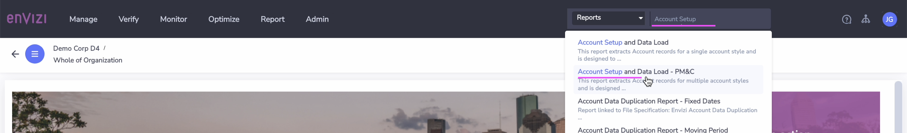
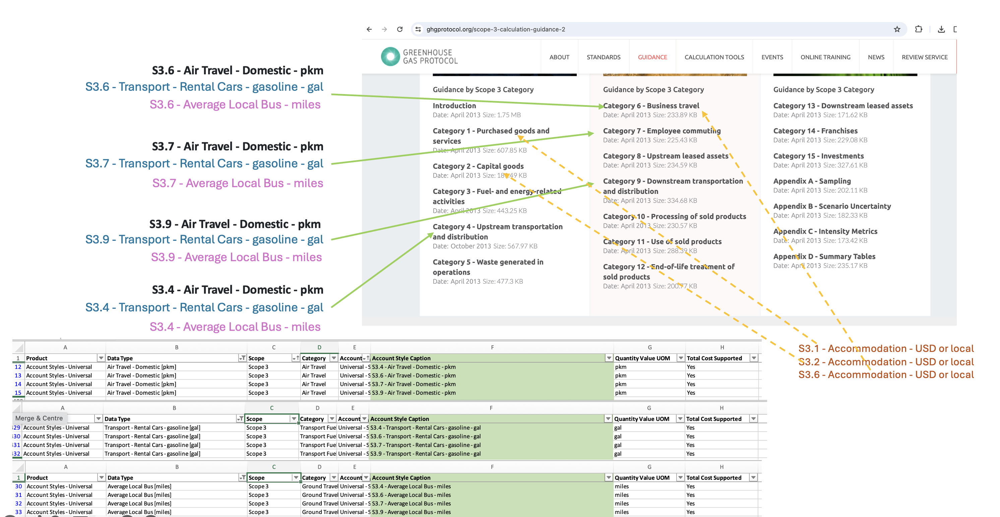

# Account Style Related info

This article explains several info regarding  `Account Style`.

This id is needed while using the builk data upload (`Account Setup and Data Load - PM&C`  and `Account Setup and Data Load`) excel template and also in the many other places.

This can be Retrived in several ways. Lets explore them.

## 1. Account Styles list

CLICK ME

The accounts styles are listed as a list in the UI. You can see the account style details here but not the link (id). 

1. Click on `Manage > Account Styles` from the top menu

2. You can see the list of Accounts styles.

3. Here you can see the account style `S1 - Diesel Stationary - gal` by filtering appropriately.

4. Here you can see the account style `S2 - Electricity - kWh` by filtering appropriately.

5. Here you can see the account style `S1 - Gasoline Stationary - gal` by filtering appropriately.

You can use any of the following 3 methods given below

## 2. Retriving Account Style Link (Id) of an Account Style

### Method 1 : Retrive using Account Style Extract

CLICK ME

If you have an access to `Account Style Extract` report you can use this method.

1. Download the `Account Style Extract` report.

CLICK ME to know how to do it

1. Search for `Account Style Extract` in Reports

2. Open the report

3. Leave the field values as it is.

4. Click on `Submit`

Report is displayed on the screen.

5. Click on `DOWNLOAD AS CSV`

A csv file will get downloaded.

2. View the sample Account style and its link (id) highlighted.

- 14430 -> S1 - Diesel Stationary - gal
- 22227 -> S1 - Diesel Stationary - L
- 14445 -> S2 - Electricity - kWh

This is how you can find the Link (id) for an account style.

### Method 2 : Retrive using Account Setup and Data Load - PM&C

CLICK ME

You can extract all the account styles using the `Export account style supported values` mode in  `Account Setup and Data Load - PM&C` report. This can give results for multiple account records.

1. Search for `Account Setup and Data Load - PM&C` in Reports

2. Open the report

3. Choose the following 
- **Filter By #1:**  Export account style supported values

Leave the other fields as it is.

4. Click on `Submit`

Report is displayed on the screen.

5. Click on `DOWNLOAD AS CSV`

A csv file will get downloaded.

6. Note the Account Style Link

In the downloaded CSV file the columns `Account Style Link` and `Account Style Caption` values are highlighted for the below `Account Styles`. Note the link.

- 22227 -> S1 - Diesel Stationary - L
- 14492 -> S1 - Gasoline Stationary - gal
- 14445 -> S2 - Electricity - kWh

This is how you can find the Link (id) for an account style.

### Method 3 : Retrive using Account Setup and Data Load

CLICK ME

You can extract all the account styles using the `Export account style supported values` mode in  `Account Setup and Data Load` report.

1. Search for `Account Setup and Data Load` in Reports

2. Open the report

3. Choose the following 
- **Filter By #1:**  Export account style supported values
- **Filter By #2:**  Select any one of the account style. Ex: `S2-Electricity- kWh`

Leave the other fields as it is.

4. Click on `Submit`

Report is displayed on the screen.

5. Click on `DOWNLOAD AS CSV`

A csv file will get downloaded.

6. In the downloaded CSV file the rows 6 & 7 shows the `Account Style Link` and `Account Style Caption` values in the column `C`

- 14445 -> S2 - Electricity - kWh

This is how you can find the Link (id) for an account style. 

Here, you can only view the link of one account style at a time.

## 3. Account style based fields

CLICK ME

The below pictures shows that the data fields are different for each account styles.

## 4. The duplication of Scope 3 Account Styles names across categories is by purpose

CLICK ME

The account style `Air Travel Domestics` exists in Cateogories 4, 6, 7 & 8.

Here are some of the other account styles exists across different categories.

The similar account styles can exists across categories and it is for the purpose only.

