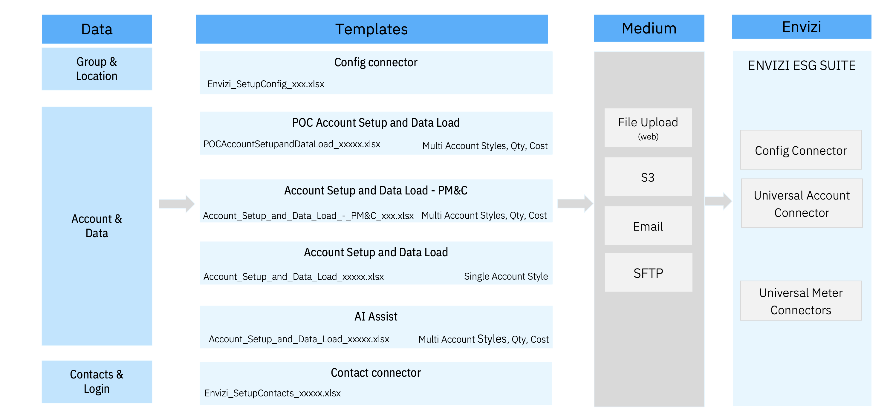

# Envizi Connectors & Templates

### Data Flow Automation

### Envizi connectors

<table>
    <thead>
        <th>Connector Name</th>
        <th>Objects</th>
        <th>File Type</th>
        <th>File Name Prefix</th>
        <th>Sheet Name</th>
        <th>Link</th>
    </thead>
    <tr>
        <td>Config connector</td>
        <td>Groups & Locations</td>
        <td>.xlsx</td>
        <td>Envizi_SetupConfig_xxx.xlsx</td>
        <td>Setup</td>
        <td></td>
        <td><a href="../121-Load-data-using-Universal-Account-Conenctor">Link</a></td>
    </tr>
    <tr>
        <td>POC Account Setup and Data Load</td>
        <td>Accounts & Data</td>
        <td>.xlsx</td>
        <td>POCAccountSetupandDataLoad_xxxxx.xlsx</td>
        <td>Records to load</td>
        <td>Multi Account Styles, PM & C</td>
        <td><a href="../121-Load-data-using-Universal-Account-Conenctor">Link</a></td>
    </tr>
    <tr>
        <td>Account Setup and Data Load - PM&C</td>
        <td>Accounts & Data</td>
        <td>.xlsx, csv</td>
        <td>Account_Setup_and_Data_Load_-_PM&C_xxxxx.xlsx</td>
        <td></td>
        <td>Multi Account Styles, PM & C</td>
        <td><a href="../122-3-Create-Scope3-data-using-AccountConnector">Link</a></td>
    </tr>
    <tr>
        <td>Account Setup and Data Load</td>
        <td>Accounts & Data</td>
        <td>.xlsx, csv</td>
        <td>Account_Setup_and_Data_Load_xxxxx.xlsx</td>
        <td></td>
        <td>Single Account Style, Many fields</td>
        <td><a href="../123-Capture-data-through-Account-Setup-and-Data-Load-Template">Link</a></td>
    </tr>
    <tr>
        <td>AI Assist</td>
        <td>Accounts & Data</td>
        <td>.xlsx</td>
        <td>Account Setup and Data Load - AI Assist-xxxxx.xlsx</td>
        <td>Records to load</td>
        <td></td>
        <td><a href="../124-Loading-Scope-3-Category1-data-using-AI-Assist">Link</a></td>
    </tr>
    <tr>
        <td>Contact connector</td>
        <td>Contacts & Logins</td>
        <td>.xlsx</td>
        <td>Envizi_SetupContacts_xxxxx.xlsx</td>
        <td>Setup</td>
        <td></td>
        <td><a href="../162-Creating-Contacts-and-Users-using-template">Link</a></td>
    </tr>
</table>

### Connector Templates

#### 1. Config connector

#### 2. POC Account Setup and Data Load

#### 3. Account Setup and Data Load - PM&C

This is also called as  `Universal Account Setup and Data Load - PM&C`

#### 4. Account Setup and Data Load

This is also called as  `Universal Account Setup and Data Load`

#### 5. AI Assist

#### 6. Contact connector

