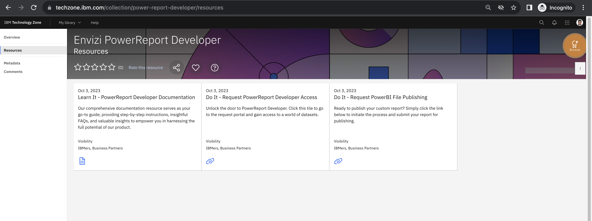

# Envizi PowerReport Developer

Enable IBMers to remotely connect to Envizi client datasets and design and build custom PowerReports on behalf of their clients. This brings much greater levels of flexibility and scalability to Envizi’s reporting layer.

https://techzone.ibm.com/collection/power-report-developer/resources

### 1. Learn It - PowerReport Developer Documentation

Comprehensive documentation resource serves as your go-to `guide`, providing step-by-step instructions, insightful `FAQs`, and valuable insights to empower you in harnessing the full potential of our product.

https://ibm.box.com/shared/static/pxkzie557m9bjf8ybhsa7q0bkcfn0m6w.pdf

### 2. Do It - Request PowerReport Developer Access

Unlock the door to PowerReport Developer. Click this tile to go to the request portal and `gain access to` a world of `datasets`.

https://ibm-envizi-powerreport-dataset-access.ideas.aha.io/

You can signup/signin into the DataSet access request tool.

Create an request to DataSet access.

### 3. Do It - Request PowerBI File Publishing

Once you are ready to publish your custom report, simply click the link below to `initiate the process` and submit your report `for publishing`.

https://ibm-envizi-powerreport-publish.ideas.aha.io/

You can signup/signin into the Powerreport Publish request tool.

Create an request to initiate the  Powerreport Publish process.

## Resources

PowerBI Training: https://yourlearning.ibm.com/activity/PLAN-8FF21DDE262D

Design effective reports in Power BI : https://learn.microsoft.com/en-us/collections/o4dhk4z8xpr8q
